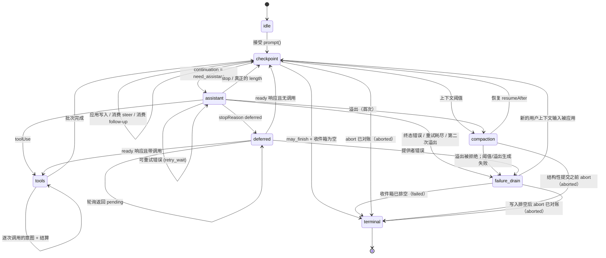

# AgentHarness — 实现规格说明

- [Part 0 — 定位](#part-0--定位)
  - [0.1 这是什么](#01-这是什么)
  - [0.2 系统模型](#02-系统模型)
  - [0.3 三个存储](#03-三个存储)
  - [0.4 实例演算 — 一个 Slack 线程](#04-实例演算--一个-slack-线程)
  - [0.5 实例演算 — 工具执行中途崩溃](#05-实例演算--工具执行中途崩溃)
  - [0.6 非目标](#06-非目标)
  - [0.7 记号与源类型](#07-记号与源类型)
- [Part 1 — 存储](#part-1--存储)
  - [1.1 模型](#11-模型)
  - [1.2 标识](#12-标识)
  - [1.3 寄存器命名空间](#13-寄存器命名空间)
  - [1.4 事务](#14-事务)
  - [1.5 查询](#15-查询)
  - [1.6 用量账本](#16-用量账本)
  - [1.7 后端](#17-后端)
  - [1.8 为什么是「写一次 + 寄存器」](#18-为什么是写一次--寄存器)
- [Part 2 — 会话树](#part-2--会话树)
  - [2.1 条目](#21-条目)
  - [2.2 落位](#22-落位)
  - [2.3 泳道](#23-泳道)
  - [2.4 事实](#24-事实)
  - [2.5 分支查询与上下文](#25-分支查询与上下文)
  - [2.6 分支索引](#26-分支索引)
  - [2.7 Fork](#27-fork)
  - [2.8 会话与仓库边界](#28-会话与仓库边界)
  - [2.9 精确重写](#29-精确重写)
- [Part 3 — 操作状态机](#part-3--操作状态机)
  - [3.1 操作](#31-操作)
  - [3.2 操作状态 — 程序计数器](#32-操作状态--程序计数器)
  - [3.3 泳道状态与当前状态有效性](#33-泳道状态与当前状态有效性)
  - [3.4 原子转移规则](#34-原子转移规则)
  - [3.5 状态图](#35-状态图)
  - [3.6 接纳](#36-接纳)
  - [3.7 Assistant 生成](#37-assistant-生成)
  - [3.8 工具](#38-工具)
  - [3.9 摘要生成 — 压缩摘要与导航摘要](#39-摘要生成--压缩摘要与导航摘要)
  - [3.10 导航](#310-导航)
  - [3.11 收件箱、队列、延后写入](#311-收件箱队列延后写入)
  - [3.12 检查点流程](#312-检查点流程)
  - [3.13 终结事务](#313-终结事务)
- [Part 4 — 执行、恢复、中止、关闭](#part-4--执行恢复中止关闭)
  - [4.1 解释器](#41-解释器)
  - [4.2 副作用边界](#42-副作用边界)
  - [4.3 泳道变更序列线](#43-泳道变更序列线)
  - [4.4 恢复装载](#44-恢复装载)
  - [4.5 崩溃位置与恢复策略](#45-崩溃位置与恢复策略)
  - [4.6 中止](#46-中止)
  - [4.7 关闭 — 一次受控崩溃](#47-关闭--一次受控崩溃)
  - [4.8 故障](#48-故障)
  - [4.9 外部终结](#49-外部终结)
- [Part 5 — 公开接口](#part-5--公开接口)
  - [5.1 泳道接口](#51-泳道接口)
  - [5.2 Harness](#52-harness)
  - [5.3 SessionTree](#53-sessiontree)
  - [5.4 快照与订阅](#54-快照与订阅)
  - [5.5 事件](#55-事件)
  - [5.6 钩子](#56-钩子)
  - [5.7 Agent 循环构建块](#57-agent-循环构建块)
  - [5.8 遥测](#58-遥测)
- [Part 6 — 未来：分区保留策略（Postgres）](#part-6--未来分区保留策略postgres)
- [Part 7 — Schema 演进](#part-7--schema-演进)
  - [7.1 问题](#71-问题)
  - [7.2 为什么本设计缩小了问题规模](#72-为什么本设计缩小了问题规模)
  - [7.3 机制：存储版本 + 打开时迁移](#73-机制存储版本--打开时迁移)
  - [7.4 迁移必须是全函数](#74-迁移必须是全函数)
  - [7.5 三层结构，以策略形式重述](#75-三层结构以策略形式重述)
- [Part 8 — 构建顺序](#part-8--构建顺序)
- [Part 9 — 不变量与测试](#part-9--不变量与测试)
  - [9.1 不变量](#91-不变量)
  - [9.2 竞态目录](#92-竞态目录)
  - [9.3 测试分层](#93-测试分层)
- [附录 A — 术语表](#附录-a--术语表)
- [附录 B — Coding-agent v3 格式兼容性](#附录-b--coding-agent-v3-格式兼容性)
- [附录 C — 待解决问题](#附录-c--待解决问题)

# Part 0 — 定位

## 0.1 这是什么

面向 agent 会话的持久化运行时。它把会话状态和操作状态落盘，使被打断的工作能够恢复，且不重复已经结算过的副作用。

## 0.2 系统模型

### 会话（Session）

一个 session 把相关的 work 归为一组，包含四个部分：

- **条目树。** 条目（entry）是一条消息、一次压缩（compaction）、一个分支摘要，或由应用定义的自定义条目。条目不可变。每个分支就是一条会话线索；共享的树使得分叉、压缩、fork 和并行工作成为可能，同时保留历史。

  ```text
  a ── b ── c ── d
        └── e ── f
  ```

- **事实（Facts）。** 可变的、带命名空间的键值状态。内建项包括会话名与条目标签；应用可以存储自定义事实。
- **泳道（Lanes）。** 指向树中位置的命名游标。每个会话都有 `main`。一条泳道拥有自己的 leaf、模型配置、队列，以及至多一个操作。额外的泳道可支持 Slack 线程、子 agent，以及其他在共享历史之上的并行工作。
- **用量账本。** 该会话的仅追加（append-only）token 与成本事件。

### Harness 与操作

会话层管理持久化数据并暴露类型化的树视图。harness 驱动泳道：接收提示词、执行模型步骤与工具步骤、管理队列、压缩或导航树，并恢复被打断的工作。它还持有 harness 全局的工具与 prompt 资源注册表、用于拦截并转换执行的钩子、用于上报活动与持久化变更的被动事件，以及运行时配置。

一个**操作（operation）**是被接纳的一个泳道工作单位：一次 run、一次压缩或一次导航。它的不可变元数据记录标识、意图与起始点；它的全量当前状态记录阶段（phase）、控制（control）、队列与恢复数据。每次持久化转移都会替换掉当前状态。完成时移除操作状态并记录该泳道的结果。

### 存储

在会话层与 harness 之下，`Storage` 针对三种持久化形态暴露原子事务与查询：不可变条目、可变寄存器（register）、仅追加的用量行。寄存器构成一个可变的、带命名空间的键值存储。事实存放于此；harness 的内部命名空间则持久化待处理内容以及崩溃恢复所需的泳道与操作状态。具体说，`op.meta` 在操作创建时一次性写入其元数据，而 `op.state` 在每次转移后被整体替换为其完整当前状态。终结事务会删除这两者并写入 `lane.lastResult`。事务的任何局部都不可见。

## 0.3 三个存储

Part 1–5 的一切都由以下三条推出。

**1. 三个存储，一条不变量。** 所有持久化内容必然属于下列之一：

```text
entries        会话树 — 写一次、仅追加
registers      当前可变状态 — 带命名空间的类型化单元，覆写或删除
usage ledger   成本历史 — 仅追加的行
```

*每一份载荷要么在条目里，要么在寄存器里，要么在账本里；不存在第三个位置。* 条目就是完整的会话记录 —— 落位信息与载荷在同一行。寄存器直接持有其当前类型化的值；覆写即丢弃旧值，删除即移除该键。那些在树中还没有位置之前就必须持久化的内容（排队输入、延后写入），暂存于 `pending.entry` 寄存器，并在为它落位的那个事务里变成条目。各后端派生的投影 —— 分支索引、全文检索、统计 —— 可以从三个存储重建，不持有任何权威。

**2. 原子事务。** 一个事务是一组条目插入、用量插入与寄存器写入（set 或 delete），要么全部提交要么全部不提交，并严格递增地分配序列号。事务内部不存在崩溃态。这是唯一的写原语。

**3. 持久化的程序计数器。** 每一步之后，harness 都会用一个寄存器 —— `op.state/{operationId}` —— 覆写上该操作的*完整*当前状态。恢复机制不重放日志，也不从「缺了什么」推断位置；它读取该寄存器并对其中内容做分支。该状态是*全量*的 —— 从不依赖前一个状态。较小的捕获值（配置、流选项、重试策略）内联存放；较大且稳定的载荷存放在同级的 `op.*` 寄存器中，或按 id 指代。操作结束时，终结事务删除它的全部寄存器：一个已完成的会话恰好只保留会话内容、账本，以及少量泳道与事实寄存器。没有需要回收的死状态。

**4. 副作用三明治。** 提供者请求与真实工具调用被两次提交包裹：

```
commit:  "即将执行 X；它的输出将使用 id R 与 U"     ← 意图
         执行 X                                    ← 不确定的部分
commit:  输出 + 用量 + 下一个状态                   ← 结算
```

钩子则遵循它们各自的重放契约：结果在其被消费的那个事务里变得持久；若在此之前崩溃，钩子可能被重跑。因此每一次外部副作用都可能在没有持久化结算的情况下发生。提供者/工具意图把这种不确定性显式地摆在恢复策略依赖它的地方；幂等的钩子则把它当作非目标接受。

## 0.4 实例演算 — 一个 Slack 线程

用户在一个已有 400 条历史条目的频道里发帖。应用为该线程创建一条泳道，锚定在频道当前的 leaf 上。条目 id 是 UUIDv7（§1.2）；示例中做了缩写。

```
harness.createLane("slack:1719432.0021", at: "0195c8d1-4a2e-7b31-…")
lane.prompt("what changed in auth last week?")
```

按顺序发生的事情：

1. **接纳。** harness 做校验、运行 `before_run` 钩子，并提交一个事务：用户消息条目、操作的 `op.meta` 寄存器，以及它第一个 `op.state` —— *"我处于一个检查点，我需要一个 assistant 响应。"*
2. **意图。** 在一次内部 ready 状态提交之后，它提交请求意图：*"我即将发起一次提供者请求。响应将是条目 `0195c8d1-53a0-7c44-…`，用量行将是 `0195c8d1-53a0-7d18-…`。"* 两个 id 此刻生成；尚未发送任何东西。
3. **请求。** 流式传输发生。这是唯一不持久的部分。
4. **结算。** 一个事务提交响应条目、它的用量行以及下一个状态：*"响应带有工具调用；这是批次计划，结果 id 已经分配好了。"*
5. 工具调用遵循同样的 意图 → 副作用 → 结算 形态，每对提交对应一次调用。
6. 当模型在没有工具调用的情况下停止时，终结事务删除该操作的寄存器，把结果记录到 `lane.lastResult`，并让泳道回到 idle。

以追踪（trace）形式呈现（id 缩写；每个 `TX[...]` 是一次原子提交）：

```text
TX[ insert entry n1 (user msg), upsert op.meta/O, upsert op.state/O = checkpoint,
    upsert lane.leaf = n1, upsert lane.state = { currentOperationId: O } ]
TX[ upsert op.state/O = assistant ready (config snapshot) ]
TX[ upsert op.state/O = effect_pending (reserves response n2, usage u1) ]
… provider streams …                                  ← 不确定的窗口
TX[ insert entry n2, insert usage u1, upsert lane.leaf = n2,
    upsert op.state/O = tools (result id n3 reserved) ]
TX[ upsert op.tool_args/O:s1:0, upsert op.state/O = call 0 effect_pending ]
… tool runs …
TX[ insert entry n3, upsert lane.leaf = n3, upsert op.state/O = checkpoint ]
… 第二轮：ready · intent · stream · settle (n4, u2) …
TX[ delete op.meta/O, op.state/O, op.tool_args/O:*,
    upsert lane.lastResult = { O, completed, n4 },
    upsert lane.state = { currentOperationId: null } ]
```

在任意两个事务之间杀掉进程并重启。harness 读取该泳道的寄存器，精确看出最后一句被提交的是哪一句，然后继续。如果它死在第 3 步，它知道一次请求可能已经计费、并且可能或不可能产出了输出 —— 这就是整个系统中唯一真正不确定的窗口，而且它有明确声明的策略。

与此同时，同一频道里的第二个线程正在跑它自己的泳道，共享同样的 400 条历史，两者之间没有任何协调。

## 0.5 实例演算 — 工具执行中途崩溃

```
lane.prompt("delete the stale migrations and run the test suite")
```

模型返回两个工具调用。harness 提交批次计划，然后提交 *"call 0 即将执行，使用这些确切参数，并且它自我声明为不可重放"*。工具开始删除文件。进程被杀。

```text
TX[ insert entry n2 (assistant, 2 calls), insert usage u1, upsert lane.leaf = n2,
    upsert op.state/O = tools (result ids n3, n4 reserved) ]
TX[ upsert op.tool_args/O:s1:0, upsert op.state/O = call 0 effect_pending,
                                                    replay: "never" ]
… tool deletes files …  ← 崩溃
```

重启后，harness 读取一个寄存器，发现 `calls[0].status = "effect_pending", replay = "never"`。它不会重跑删除操作。它在副作用开始前就已保留的结果 id 下追加一条合成的错误结果，把该调用标记为完成，然后继续执行 call 1：

```text
TX[ insert entry n3 (synthetic "interrupted" result), upsert lane.leaf = n3,
    upsert op.state/O = call 0 completed ]
```

会话保持一致 —— 每个工具调用都有结果 —— 而且没有任何东西被执行两次。

假如该工具声明的是 `replay: "safe"`（一次读取、一次查询），harness 就会用持久化下来的参数重新执行它。

## 0.6 非目标

- **恰好一次的外部副作用。** 见上文。带有自身副作用的钩子必须幂等，并以操作 id 为键。
- **提供者流恢复。** 局部流只在进程内存活，绝不持久化。一个已结算的响应在任何东西对它做分类之前就被*完整*持久化。
- **多写者。** 每个会话一个进程。服务层据此路由，SQLite 后端通过带栅栏（fenced）的租约（lease）强制执行（§1.7）。那些看起来像多写者的工作负载由泳道覆盖。
- **复制。** 一个会话只存在于一处。
- **持久化的写入历史。** 寄存器只保存当前值：被覆写的寄存器就消失了，没有任何 API 或表暴露写入历史。测试中关于「写入顺序」的断言使用包在 `commit()` 外层的插桩存储装饰器（Part 9）；生产环境的审计属于遥测层（§5.8）。
- **把删除当作运行时特性。** 条目与用量行永不删除：压缩改变的是提供者上下文，而非存储，且终态清理只删除寄存器。注意 `retainedTail` 会把旧消息向前复制进更新的压缩条目，摘要也由旧内容派生，因此压缩同样不是清除。合规级别的「抹掉这个」由管理性的精确重写承担（§2.9），它是唯一被认可的例外。

## 0.7 记号与源类型

- `TX[ a, b, c ]` —— 一次原子提交，按序包含写入 `a`、`b`、`c`。写入词汇为 `insert entry`、`insert usage`、`upsert namespace/key = value` 与 `delete namespace/key`。
- id 均为 UUIDv7（§1.2）。示例对其做了缩写：用短标签 —— `e_*` 条目 id、`u_*` 用量 id、`op_*` 操作 id —— 代替完整 id，前提是时间前缀无关紧要；在前缀重要的地方，示例会展示它（`0195c8d1-4a2e-7b31-…`）。
- `S(next)` —— 用下一个全量操作状态覆写 `op.state/{operationId}` 寄存器。`L(next)` —— 对 `lane.state/{lane}` 做同样的事。
- **must / must not** 是规范性要求。其余内容均为说明。

源类型出处：

- `AgentMessage`、`AgentTool`、`AgentToolResult`、`QueueMode`、`ThinkingLevel`：`packages/agent/src/types.ts`。
- `AgentEventSink`：`packages/agent/src/agent-loop.ts`。
- `Skill`、`PromptTemplate`、`AgentHarnessResources`（下文写作 `Resources`）、`AgentHarnessTool`、`AgentHarnessStreamOptions`、`AgentHarnessStreamOptionsPatch`：`packages/agent/src/harness/types.ts`。
- `Model`、`Models`、`Usage`、`RetryPolicy`、`StopReason`、`AssistantMessage`、`ImageContent`、provider messages、stream options、deferred handles：`packages/ai`。
- `CompactionSettings`、`CompactionPreparation`、`CompactResult`、`BranchPreparation`、`BranchSummaryResult`：`packages/agent/src/harness/compaction/`。除非本文档显式改动，现有的 preparation 与 split-turn 算法仍是实现起点。
- `TelemetryContext` 与类型化 schema 辅助工具：`packages/telemetry`；agent 自有的 schema 仍位于 `packages/agent/src/harness/telemetry.ts`。
- 用于持久化自定义消息注册的 `TSchema`：`typebox`。

公开的 `QueueMode` 保持为 `"all" | "one-at-a-time"`。公开的 `RetryPolicy` 保持 pi-ai 的形态 `{ enabled, maxRetries, baseDelayMs }`；操作状态存储其归一化后的等价形式 `{ maxAttempts, baseDelayMs }`。`maxRetries` 与 `baseDelayMs` 必须是有限的、非负的 safe integer，且 `maxRetries + 1` 必须仍在安全范围内；禁用重试时归一化为一次尝试。指数退避与 `notBefore` 算术在 `Number.MAX_SAFE_INTEGER` 处饱和。公开的 `CompactionSettings` 保持为 `{ enabled, reserveTokens, keepRecentTokens }`；两个 token 数必须是有限的、非负的 safe integer。构造器与 setter 会在发布之前拒绝无效设置。本设计在 `AgentHarnessStreamOptions` 及其 patch 类型上新增 `deferred?: boolean | { window?: "15m" | "1h" | "24h" }`；结构性请求一律强制它为 false。

```ts
type SettledAssistantMessage = AssistantMessage & {
  stopReason: Exclude<StopReason, "pending">;
};

// 提供者分发在请求时通过 Models 解析持久的 { provider, modelId } 标识，
// 同时应用鉴权。注册表项缺失或被替换会使请求以带内错误失败，如同未知工具。
```

---

# Part 1 — 存储

存储层对 agent、泳道、会话一无所知。它存储条目与用量行、更新寄存器，并回答一小组固定的查询。Part 2–4 完全构建在其之上。

## 1.1 模型

```ts
type JsonValue = null | boolean | number | string | JsonValue[] | { [k: string]: JsonValue };

/** 写一次。完整的会话记录：落位信息与载荷在同一行。只在一个事务中创建，
    之后永不修改或删除。继承该基类的四个具体条目类型定义于 §2.1。 */
interface EntryBase {
  id: string;                // UUIDv7（§1.2）
  parentId: string | null;
  seq: number;               // 提交时由存储层分配
  timestamp: number;         // Unix 毫秒，提交时由存储层分配
  type: EntryType;
  customType?: string;       // 当 type === "custom" 时
  // ...按条目类型内联的载荷字段（§2.1）
}

type EntryType = "message" | "compaction" | "branch_summary" | "custom";

/** 唯一可变的存储。一个带命名空间的键，直接持有其当前类型化的值。
    覆写即替换该值；删除即移除该键。 */
interface Register<N extends RegisterNamespace = RegisterNamespace> {
  namespace: N;
  key: string;
  value: RegisterValues[N];
  seq: number;               // 最后一次设置该寄存器的写入 seq
}

/** 仅追加的成本账本行。永不修改，永不删除（§1.6）。 */
interface UsageRow {
  id: string;                // UUIDv7（§1.2）
  seq: number;               // 提交时由存储层分配
  usage: Usage;
  entryId?: string;          // 该成本所属的条目（若有）
  adjustment: boolean;       // true = 调用方提供的对账，而非提供者上报
  details?: JsonValue;
}
```

## 1.2 标识

所有 id —— 条目 id、用量 id，以及每一个被保留的 id —— 都是来自该会话 id 生成器的 **UUIDv7**（§2.8）；legacy 导入会重新生成以符合规范（附录 B）。前 48 位是生成时刻，因此每个引用都自带描述信息且可按时间排序。付出的代价：id 会泄露创建时间。（未来可能的分区 Postgres 后端会建立在这个前缀之上 —— 见参考性的 Part 6。）

生成规则：

1. id 在**保留时**用 `now()` 生成。直接落位的条目在同一事务内落位；assistant/工具的 id 相对落位最多滞后一次请求的时长。
2. **工具结果的 id 继承其 assistant id 的时间戳**（`idGenerator.next(timestampMs?)`，随机尾部重新生成），因此即便跨越午夜边界，一次调用及其结果组在 id 序上仍是时间内聚的。
3. 合成结算写在已经保留的 id 之下（§4.5）—— 没有特例。

**不透明载荷** —— 自定义条目的 `data`、`details`、`fact.custom` 的值、消息文本、钩子的 `resumeData` —— 可以内嵌条目 id。harness 从不跟踪这些引用，它们可能失效；请复制内容，不要去引用它。

**绝对规则。** 在一个会话内，条目与用量行永不删除 —— 精确重写（§2.9）是唯一被认可的例外。父节点缺失永远是损坏（corruption）。

## 1.3 寄存器命名空间

```ts
interface RegisterValues {
  "lane.leaf":       string | null;                // 条目 id；null = 泳道位于根
  "lane.config":     LaneConfiguration;            // §2.3
  "lane.state":      LaneState;                    // §3.3
  "lane.lastResult": LaneLastResult;               // §3.13
  "op.meta":         Operation;                    // §3.1
  "op.state":        OperationState;               // §3.2 — 程序计数器
  "op.tool_args":    Record<string, JsonValue>;    // 有效工具参数（§3.8）
  "op.preparation":  DurableStructuralPreparation; // §3.9
  "pending.entry":   PendingEntry;                 // §2.2
  "fact.name":       string;
  "fact.label":      string;
  "fact.custom":     JsonValue;                    // JSON null 是合法值
}
type RegisterNamespace = keyof RegisterValues;

/** 未落位的内容：在落位事务写入完整条目并删除此寄存器之前，
    它是当前的可变状态（§2.2）。 */
interface PendingEntry {
  type: "message" | "custom";
  customType?: string;
  payload?: JsonValue;       // 将成为条目载荷的内容；
                             // 缺失 = 一个没有 data 的自定义条目
}

interface DurableFileOperations {
  read: string[]; written: string[]; edited: string[];
}
type DurableStructuralPreparation =
  | { kind: "compaction"; messagesToSummarize: AgentMessage[];
      turnPrefixMessages: AgentMessage[]; retainedTail: AgentMessage[];
      isSplitTurn: boolean; tokensBefore: number; previousSummary?: string;
      fileOps: DurableFileOperations; settings: CompactionSettings }
  | { kind: "branch_summary"; messages: AgentMessage[];
      fileOps: DurableFileOperations; totalTokens: number };
```

| 命名空间 | 键 | 值 | 含义 |
|---|---|---|---|
| `lane.leaf` | 泳道名 | 条目 id 或 `null` | 该泳道下一次在哪里追加 |
| `lane.config` | 泳道名 | `LaneConfiguration` | 全量泳道配置 |
| `lane.state` | 泳道名 | `LaneState`（§3.3） | `currentOperationId`、`pendingNextRun` |
| `lane.lastResult` | 泳道名 | `LaneLastResult`（§3.13） | 该泳道最近一次操作的终结结果 |
| `op.meta` | 操作 id | `Operation`（§3.1） | 接纳数据；写一次，永不覆写 |
| `op.state` | 操作 id | `OperationState`（§3.2） | 全量操作状态 — **程序计数器** |
| `op.tool_args` | `{opId}:{stepId}:{sourceIndex}` | 有效参数 | 在工具放行时一次性写入（§3.8） |
| `op.preparation` | `{opId}:{taskId}` | `DurableStructuralPreparation` | 在决策钩子之前一次性写入（§3.9） |
| `pending.entry` | 保留的条目 id | `PendingEntry` | 等待落位的排队内容（§2.2） |
| `fact.name` | `""` | string | 会话名 |
| `fact.label` | 条目 id | string | 条目标签 |
| `fact.custom` | 应用键 | `JsonValue` | 应用状态 |

这就是完整集合。从键的形态能看出两种生命周期：

```text
lane.*  fact.*     与会话同生命周期；事实只由应用显式操作删除
op.*               与操作同生命周期；由终结事务删除（§3.13）
pending.entry      存活到其内容被落位或被取消
```

- `op.meta` 与 `op.preparation` 的键恰好写一次；`op.tool_args` 每个键写一次，并按产生它的 step 编键，因此批次之间永不冲突。三者都不晚于终结事务被删除；操作期间被覆写的只有 `op.state`。
- 属于操作的 `pending.entry` 寄存器若在结束时仍未被消费（剩余的收件箱条目以及被 abort 排空的条目），由终结事务删除 —— 已消费条目的寄存器在它所属的落位事务中消亡；属于泳道的（`pendingNextRun`）比操作更长寿，在被消费或取消时消亡（§3.11）。
- `lane.lastResult` 只由终结事务写入，并被该泳道上下一个终结事务覆写 —— 每条泳道一个有界寄存器，永久如此。恢复过程从不读取它；它的存在是为了让一个接纳了操作、随后崩溃、再次打开的应用仍能得知该操作的结果（§3.13）。
- 删除一个事实即移除它的寄存器。在 `fact.custom` 中存入 JSON `null` 是另一种合法状态；不存在墓碑（tombstone）。
- 取消不留痕迹：`cancelQueued` 的分类为 pending → `cancelled`、条目已存在 → `already_consumed`、否则 → `not_found`（§3.11）。重试丢失的取消请求时，客户端把 `not_found` 视为成功。

## 1.4 事务

```ts
/** 映射式可辨识联合：命名空间决定值的类型。 */
type RegisterSetWrite = {
  [N in RegisterNamespace]: { kind: "register"; op: "set"; namespace: N;
                              key: string; value: RegisterValues[N] }
}[RegisterNamespace];

type Write =
  | { kind: "entry"; entry: Omit<Entry, "seq" | "timestamp"> }
  | { kind: "usage"; row: Omit<UsageRow, "seq"> }
  | RegisterSetWrite
  | { kind: "register"; op: "delete"; namespace: RegisterNamespace; key: string };

interface Transaction { writes: Write[] }

interface CommitResult { firstSeq: number; seqs: number[]; timestamp: number }
```

规则：

1. 事务**要么全部提交要么全部不提交**。不存在「部分写入已存在、其余不存在」的可观测状态。
2. 写入按给定顺序获得**严格递增**的 `seq`；允许有空洞，无论事务内还是事务之间。`seq` 在整个会话范围内跨所有泳道、所有写入类型单调递增。寄存器 `set` 会用其分配到的 `seq` 为该寄存器盖章。
3. 事务内按顺序应用写入：一个条目可以把同一事务中更早创建的条目作为父节点；寄存器值可以引用同一事务中更早创建的条目 id 或用量 id。落位事务同时插入完整条目并删除其 `pending.entry` 寄存器（§2.2）—— 从不存在两者同时存在的时刻。
4. 条目与用量共享同一个会话级 id 命名空间。用任何已存在的 id 写入这两类中的任意一种都是**损坏**，不是更新。
5. 对同一 `(namespace, key)` 的寄存器 `set` 会替换当前值；`delete` 移除该键；后续 `set` 会重新创建它。不保留任何历史。对不存在的键执行 `delete` 是 no-op，因此像清除一个未设置的标签这样的公开删除操作依然合法。
6. 同一会话上的事务是**串行化**的。只有一个写者、一个队列。

Session 会在进入存储层之前校验完整事务，包括 JSON 序列化与运行时 schema。一次已被接纳却失败提交会令 harness **进入故障态**：所有副作用停止、所有调用被拒绝，进程必须重启。绝不容忍部分应用的事务。

## 1.5 查询

一个 `Storage` 实例服务一个会话。仓库的发现与生命周期不在该接口之内（§2.8）。

```ts
interface Storage {
  commit(tx: Transaction): Promise<CommitResult>;

  getEntries(ids: string[]): Promise<ReadonlyMap<string, Entry>>;

  getRegister<N extends RegisterNamespace>(namespace: N, key: string):
    Promise<Register<N> | undefined>;
  /** keyPrefix 是作用于 (namespace, key) 的索引化前缀列举；
      终态清理的 op.* 前缀扫描使用它（§3.13）。 */
  listRegisters<N extends RegisterNamespace>(namespace: N, keyPrefix?: string):
    Promise<Register<N>[]>;

  scanBranch(q: BranchScan): Promise<Entry[]>;            // §2.5
  scanBranchStructure(q: BranchScan): Promise<EntryStructure[]>;
  scanEntries(q: EntryScan): Promise<Entry[]>;            // 会话级树清单
  scanUsage(q: UsageScan): Promise<UsageRow[]>;           // 按 seq 区间读取账本（§1.6）
  getStats(): Promise<SessionStats>;                      // 维护式投影（§1.6）

  close(): Promise<void>;
}

/** 不含载荷字段的落位元数据。 */
type EntryStructure = Pick<Entry, "id" | "parentId" | "seq" | "timestamp" | "type" | "customType">;

interface EntryScan {
  type?: EntryType; customType?: string;
  fromSeq?: number; toSeq?: number;
  order?: "asc" | "desc"; limit?: number;
}

interface UsageScan {
  fromSeq?: number; toSeq?: number;
  order?: "asc" | "desc"; limit?: number;
}
```

刻意不提供跨命名空间的寄存器扫描，也不提供持久化的写入日志。恢复、事实、fork 与执行都严格沿着精确的 id 与键推进；条目清单一律用 `scanEntries`；账本读取用 `scanUsage`；总量用 stats 投影（§1.6）；测试中的顺序断言用插桩存储装饰器包裹 `commit()`（Part 9）；生产环境审计归属遥测（§5.8）。

恢复与执行路径的读取必须由索引驱动且有界。它们不得通过缺失值推断状态，而且也不存在可折叠的寄存器历史。精确解引用是允许的：一个当前状态可以指代一组有界的条目与寄存器，一次性批量取出，无需依赖顺序的归约。公开的清单与调试 API 可以有意读取比热路径更多的内容；它们的 `limit`/分页行为在 `SessionTree` 层显式定义。

`close()` 是幂等的。它封存接纳、拒绝之后对该实例的读取/提交、排空封存前已被接纳的提交，然后释放资源与写者认领。持久化数据需通过仓库重新打开。

## 1.6 用量账本

每一次已结算的提供者尝试都写入一行 `UsageRow` —— 成功的、失败的、重试的、合成的尝试皆然，包括那些所属操作随后被 abort 的尝试。结算事务一起写入响应条目与其用量行（§3.7）；合成结算在保留的用量 id 下写入零用量。行是仅追加的：终态清理会删除一个操作的寄存器，但绝不删除它的账本行，因此无论编配状态发生什么，计费信息都留存下来。

```jsonc
{ "id": "u_7", "seq": 815, "entryId": "e_51", "adjustment": false,
  "usage": { "input": 12000, "output": 431, "cost": { ... } } }
```

- `entryId` 指代该成本所属的条目（若有）。结构性（摘要）尝试若在产出条目之前失败，以及独立对账行，都没有它。
- `adjustment: true` 标记这是调用方提供的对账（`recordUsage`，§5.1），而非提供者上报。format-3 导入会写一行聚合对账（附录 B）。
- 提供者尝试的用量 id 是在意图提交时生成的 UUIDv7（§1.2），因此结算恰写在它意图所承诺的那个 id 下。对账行、工具上报的用量行、钩子提供的压缩/导航用量行（§3.9、§3.10）以及导入聚合，都在提交时生成 id；没有任何东西为它们做保留。
- `getStats()` 是建立在账本与 message 条目计数之上的维护式投影 —— `messageCount` 只统计 `message` 条目，不含压缩、摘要或自定义条目。每次提交后它都等于账本求和；一致性测试套件会断言这一点（Part 9）。单行数据在提交时通过 `usage` 事件抵达应用（§5.5），`scanUsage`（§1.5）按 seq 区间读回它们 —— 持久化了自己已应用的的最大事件 `seq` 的消费者，停机后可以用 `scanUsage({ fromSeq })` 追上。恢复过程从不读取账本。

## 1.7 后端

同一模型目前有三种编码 —— Memory、JSONL、SQLite —— 三者都通过同一套一致性测试套件（Part 9）。每个后端都会记录会话的 `storageVersion`（Part 7）：JSONL 的 header 字段，或 SQLite 的目录列。Memory 会话永远处于当前版本。可能出现的第四种后端 —— 分区 Postgres —— 在 Part 6 中作了说明性勾勒；此处没有任何东西依赖它。

### Memory

```ts
entries:   Map<string, Entry>
registers: Map<string, Register>       // key: `${namespace}\u0000${key}`
usage:     Map<string, UsageRow>
children:  Map<string, string[]>       // parentId → 条目 id 列表，用于树遍历
```

一个队列串行化提交。提交先校验写入并应用到临时的事务态，然后一起发布到各 map。寄存器删除即 map 删除。读取即 map 查找；`scanBranch` 沿 `parentId` 遍历并在内存中过滤。这里没有日志：Memory 恰好只持有活跃状态，别无其他。

### JSONL

文件不是状态；它是上述 Memory map 的**重放配方**。一次 `commit()` 对应一行物理记录。存储层先分配序号/时间戳字段，然后把一次提交里的一个写入编码成一个 JSON 对象行，多个写入编码成一行**数组行**。

```jsonl
{"v":4,"kind":"header","id":"s_1","storageVersion":1,"createdAt":1700000000000,"cwd":"..."}
[{"kind":"entry","seq":101,"timestamp":1700000000000,"id":"e_50","parentId":"e_41","type":"message","message":{"role":"user","content":[...]}},
 {"kind":"register","op":"set","seq":102,"namespace":"op.meta","key":"op_9","value":{...}},
 {"kind":"register","op":"set","seq":103,"namespace":"op.state","key":"op_9","value":{...}},
 {"kind":"register","op":"set","seq":104,"namespace":"lane.leaf","key":"main","value":"e_50"},
 {"kind":"register","op":"set","seq":105,"namespace":"lane.state","key":"main","value":{...}}]
{"kind":"usage","seq":110,"id":"u_7","entryId":"e_51","adjustment":false,"usage":{...}}
{"kind":"register","op":"delete","seq":131,"namespace":"op.state","key":"op_9"}
```

- 这就是 format 4。源码树中现有的、不兼容的 format-4 代码尚未完成，将被就地替换；不需要为它做迁移。coding-agent 的 format 3 继续受支持（附录 B）。
- 打开时按序把各行重放进 Memory map：条目与用量行累积；后到的寄存器 `set` 覆写该键，`delete` 移除该键。这是*解码*，不是恢复逻辑。打开过程会校验持久化的序号单调性 —— 严格递增、允许空洞（§1.4）—— 以及时间戳，且绝不重新生成已提交的时间戳。此后所有查询都在内存中运行。
- **撕裂的最后一行整体丢弃**，包括数组中的每一个元素，并在接纳新写入之前被截断。这正是本后端「事务内部没有前缀」成立的依据。
- 畸形的*中间*行，或完整但无效的事务，都是损坏。唯一例外：来自 schema 迁移之前的、已被取代的旧形态寄存器行，在重放时会被宽松解码为带键的原始 JSON（Part 7）；压缩会将它们退休。
- 持久性级别是进程崩溃级：一个已 resolve 的 `commit()` 能在进程死亡后存活。不承诺 fsync。
- 可选优化：为每个条目保留 `(offset, length)` 并惰性加载载荷，只让结构与寄存器常驻内存。仅在性能分析确实要求时才这么做。

**快照压缩。** 在 SQLite 中，寄存器 `set` 是原地 upsert —— 一次 30 轮的 run 留下 1 行 `op.state`，然后归零。在 JSONL 中每次 `set` 都是追加，因此同一次 run 会追加约 10 条完整的 `op.state` 行，而当终态 `delete` 行落地时它们全都已死：即使逻辑状态不增长，文件也会随*写入历史*增长。解法是把文件重写为 `header + 当前条目 + 当前寄存器 + 用量行`，通过临时文件 + 原子 rename 完成；存活的行保留其原始 `seq` 值，被丢弃的行留下的空洞是合法的（§1.4），因此压缩不需要任何重编号机制。就一次四条目的 run 而言：

```text
压缩前：  约 10 条事务行、约 27 个写入 —— op.state 的各个版本、
          工具参数、pending 载荷，全部自终态行起就已失效
压缩后：  header + 4 条条目行 + 2 条用量行 + 4 条泳道寄存器行
```

何时压缩：打开时若死字节比例越过阈值；可选地在终结事务之后；schema 迁移之后必然执行（Part 7）。两次压缩之间，常规运行是仅追加的、每次提交 O(1)。有一个值得点明的后果：被删除的 pending 载荷与被取代的状态版本**会滞留为字节**，直到压缩发生 —— 逻辑删除是即时的，物理删除是延后的。对「被取消的敏感内容需要尽快物理清除」的部署，应在终结边界处积极压缩。

### SQLite

**每个会话一个数据库文件。** 该文件就是会话，恰如一个 JSONL 文件就是会话。损坏被限制在单个会话内，删除就是 unlink 一个文件，而 SQLite 的「一个文件一个写者」规则在本设计中与「一个会话一个写者」规则天然吻合。

```sql
entries(id TEXT PRIMARY KEY, parent_id TEXT, seq INTEGER, type TEXT,
        custom_type TEXT, timestamp INTEGER, payload TEXT) WITHOUT ROWID;
CREATE INDEX ix_entry_parent ON entries(parent_id);
CREATE INDEX ix_entry_seq ON entries(seq, type);

registers(namespace TEXT, key TEXT, seq INTEGER, value TEXT,
          PRIMARY KEY (namespace, key));

usage_ledger(id TEXT PRIMARY KEY, seq INTEGER, entry_id TEXT, adjustment INTEGER,
             usage TEXT, details TEXT) WITHOUT ROWID;
CREATE INDEX ix_usage_seq ON usage_ledger(seq);

-- 私有的分支索引（§2.6）。不是寄存器；其他后端没有对应物。
branch_entries(branch_id TEXT, entry_id TEXT, entry_seq INTEGER, entry_type TEXT,
               PRIMARY KEY (branch_id, entry_id)) WITHOUT ROWID;
-- 有序扫描。entry_seq 必须紧跟 branch_id，否则 ORDER BY 需要临时 b-tree；
-- entry_id 与 entry_type 排在后面，以便索引覆盖只读 id 的查询。
CREATE INDEX ix_be_seq  ON branch_entries(branch_id, entry_seq, entry_id, entry_type);
-- 按类型过滤的扫描。
CREATE INDEX ix_be_type ON branch_entries(branch_id, entry_type, entry_seq, entry_id);
CREATE INDEX ix_be_entry ON branch_entries(entry_id);
branch_meta(branch_id TEXT PRIMARY KEY, tip_entry_id TEXT, tip_seq INTEGER,
            base_branch_id TEXT, base_seq INTEGER);
CREATE UNIQUE INDEX ix_bm_tip ON branch_meta(tip_entry_id);

-- 各一行即可：文件就是会话。
session(created_at, parent_session_id, storage_version, metadata,
        message_count, usage_payload, next_seq);
writer_lease(owner_id TEXT, fence INTEGER, expires_at_ms INTEGER);
```

一次 `commit()` 就是一个 SQL 事务：插入条目、插入账本行、upsert 或删除寄存器、维护分支索引、递增 `session_stats`。绝不 UPDATE 或 DELETE 条目行或账本行；可变性仅限于寄存器、分支索引（`branch_meta` 的 tip 与 base）、统计、序列、会话目录行以及租约。

**每个事务必须以 `BEGIN IMMEDIATE` 开头。** 一个 deferred 的 `BEGIN` 如果先读后写，会取一个读快照，随后必须升级到写锁；若期间有别的写者提交了，SQLite 会让这次升级失败 —— 而 `busy_timeout` **救不了**它，因为再多的等待也无法刷新一个过期快照。唯一的恢复手段是回滚并完整重试。

每个事务都是这个形态，而非只有少数几个是。分配序列区间会先读会话行的 `next_seq` 再写回它，因此系统执行的每个事务里都存在「读先于写」。分支创建（§2.6）提供了第二个例子：先读取最近的压缩条目再插入。`BEGIN IMMEDIATE` 一开始就取得写锁，避免了不可恢复的过期快照升级，所以在这里不存在 deferred `BEGIN` 是正确选择的情形。

**`writer_lease` 强制单写者规则。** WAL 乐意让两个进程交替写同一个文件，而这恰是本设计禁止的交错 —— 因此「每会话一个文件」并不能免除租约的必要性。带栅栏的所有权加过期时间：`open()` 取得认领，存储层在追加时以及空闲时续租，close 在队列排空后停止续租，并只删除与自己匹配的 `(owner_id, fence)` 对 —— 于是一个过期持有者无法释放继任者的认领。这让「一个进程拥有一个会话」成为被强制的属性，而不是一个依赖服务层去遵守的约定。Memory 与 JSONL 没有对应机制，依赖进程级所有权；一个被打开两次的 JSONL 会话就是损坏且不被察觉的。

原子性本身不需要特殊处理。多写事务通过文件格式实现 all-or-none：WAL 帧只有在提交记录落地后才可见，因此并发读者要么看不到事务的任何写入，要么看到全部。

`scanBranch` 的每个物理分段使用一个 JOIN；§2.6 负责组合分段区间：

```sql
SELECT e.id, e.parent_id, e.seq, e.type, e.custom_type, e.timestamp, e.payload
FROM branch_entries b
CROSS JOIN entries e ON e.id = b.entry_id
WHERE b.branch_id = ? AND b.entry_seq > ? AND b.entry_seq <= ?
ORDER BY b.entry_seq;
```

`CROSS JOIN` 是承重的：它强制 `branch_entries` 成为外层循环。放任优化器自行决定时，它可能从 `entries` 驱动、扫描全表、再通过临时 b-tree 排序。在测试中断言执行计划：

```
SEARCH b USING COVERING INDEX ix_be_seq (branch_id=? AND entry_seq>?)
SEARCH e USING PRIMARY KEY (id=?)
```

任何包含 `USE TEMP B-TREE FOR ORDER BY` 或包含对 `entries` 扫描的计划都是回归。

`scanBranchStructure` 是同一条查询去掉载荷列。`getEntries` 是以 `e.id IN (...)` 为主键的查找。

因为文件就是会话，精确重写（§2.9）与 fork 都是文件级操作：构建一个全新数据库（`VACUUM INTO`，或在单个读快照上做行拷贝），若是重写则原子地把它交换到旧路径之上 —— 与 JSONL 的做法同形。

## 1.8 为什么是「写一次 + 寄存器」

- **恢复就是一次读取。** 每条泳道五次寄存器点查，然后精确 id 解引用（§4.4）。根本不存在归约器，也就没有归约器的 bug。
- **崩溃态可枚举。** 只发生在事务之间，绝不在事务内部。
- **清理就是删除，不是回收。** 一次 30 轮的 run 覆写一个 `op.state` 寄存器约 30 次，然后删除它。留下的恰是会话内容、账本，以及少量泳道与事实寄存器 —— 没有死状态值、没有历史行、没有需要垃圾回收的东西。（JSONL 把*物理*回收延后给快照压缩；逻辑状态完全一致。）
- **没有「靠重写来修复」。** 恢复追加条目、只覆写它自己拥有的寄存器，且使用常规执行会提交的同一批转移；中途打断它再重跑一次，结果相同。
- **并发极其简单。** 读者永远看不到局部状态；没有任何东西需要加锁。
- **唯一一处刻意的双写。** 排队内容被序列化两次：入队时写进它的 `pending.entry` 寄存器，落位时写进它的条目。只有排队条目付出这个代价 —— assistant 与工具的结算，也就是热路径，其条目只写一次。作为交换，每个队列项就是一个 id，取消直接删内容，且任何载荷都不会存在而无归属。

---

# Part 2 — 会话树

## 2.1 条目

一个**条目（entry）**就是完整存储的那一行（§1.1）：落位字段与载荷在一起。`getEntries` 与各 scan 返回的东西正是当初提交的内容 —— 没有物化步骤，也没有 join。

```ts
interface MessageEntry       extends EntryBase { type: "message"; message: AgentMessage;
                                                 terminate?: true }
interface CompactionEntry    extends EntryBase { type: "compaction"; summary: string;
                                                 retainedTail: AgentMessage[]; tokensBefore: number;
                                                 details?: JsonValue; usage?: Usage; fromHook: boolean }
/** fromId 是被摘要那个分支在导航前的 leaf：即产生它的操作的 sourceLeafId（§3.10）。 */
interface BranchSummaryEntry extends EntryBase { type: "branch_summary"; fromId: string;
                                                 summary: string; details?: JsonValue;
                                                 usage?: Usage; fromHook: boolean }
interface CustomEntry        extends EntryBase { type: "custom"; customType: string; data?: JsonValue }

type Entry = MessageEntry | CompactionEntry | BranchSummaryEntry | CustomEntry;
```

规则：

- `type` 与 `customType` 是结构性字段：分支查询按其过滤，分支索引会把它们反范式化（§2.6）。`customType` 只在自定义条目上被设置；载荷字段永不驱动结构。
- assistant 条目总是包含一个 `SettledAssistantMessage`。写入前拒绝 `pending`。
- 工具结果条目携带 `terminate?: true`。这是 `ToolResultMessage` 没有对应字段的编配状态。
- 每个压缩与分支摘要都带 `fromHook`：钩子产出为 `true`，生成的为 `false`。
- 每次压缩都存储一份完整的 `retainedTail`（为空时为 `[]`）。**上下文构造从不越过压缩点向前读。** 这正是一次压缩能成为自包含检查点、而非指向历史的指针的原因。
- 自定义条目可以不带 `data`。条目要么能按其类型的运行时 schema 解码，要么就是损坏。
- 载荷是内联的，因此两个条目永不共享存储内容；不存在去重层。

## 2.2 落位

树的中心规则：

> 一个**条目**在落位的那一刻被完整地创建。在落位*之前*就已持久的内容属于当前可变状态，暂存于 `pending.entry` 寄存器；落位事务写入条目并删除该寄存器。二者此后都不再被修改。

三种情形，都是机械化的：

**生而落位** —— assistant 响应、工具结果、对空闲泳道的直接追加。内容与落位同时到达；一个事务：

```
TX[ insert e_a4 = { parent: e_q1, type: "message", message: <assistant 响应> },
    upsert lane.leaf/main = "e_a4" ]
```

**先有内容，后落位** —— 排队输入（`steer`、`followUp`、`nextRun`）与延后的树写入。条目 id 在入队时生成，同时充当寄存器键；队列状态只用这一个 id 引用内容。两个事务，可能相隔很远：

```
t0  TX[ upsert pending.entry/e_q1 = { type: "message", payload: <200KB 消息> },
        S(next){ ...inbox.steer += "e_q1" } ]

t1  TX[ insert e_q1 = { parent: e_a3, type: "message", message: <取自寄存器> },
        delete pending.entry/e_q1,
        upsert lane.leaf/main = "e_q1",
        S(next){ ...inbox.steer -= "e_q1" } ]
```

寄存器死于落位该条目的那个事务。在 `t1` 之前崩溃：该项仍在队列中。在其之后崩溃：它已落位且寄存器已消失。**不存在第三种状态** —— 在落位或取消之前，每个提交边界上寄存器与条目恰好只存在其一，绝不同时存在，也绝不同时不存在。取消是另一个出口：`cancelQueued` 删除寄存器，内容就此消失，从未触及过树（§3.11）。

**内容尚不存在时先保留 id** —— assistant 响应与工具结果。被保留的 id 只是 `op.state` 里一个普通生成出的字符串；在结算插入完整条目之前，既没有寄存器也没有数据行。保留一个 id 不产生任何成本。

这就是**两种保留体制**：结算家族的 id（响应、工具结果、用量行）是操作状态里的字符串；排队内容的 id 是 `pending.entry` 寄存器。「保留的 id 只是个字符串」这句话只对第一个家族成立。

可以放心依赖的推论：

- pending 项对**树查询不可见**（没有条目），但在**快照中可见**：拥有它的状态列出其 id，载荷从其寄存器解引用而来。
- 「这个落位了吗？」由拥有它的队列列表以及寄存器是否存在来回答 —— 绝不靠条目缺失来判断。
- 这次双写是本模型唯一刻意的冗余（§1.8）。SQLite 与 Postgres 可以在落位事务内用 `INSERT … SELECT` 从寄存器行实现落位；在 JSONL 中两份拷贝都会作为字节留存到快照压缩（§1.7）。只有排队条目付这个代价；结算从不付。

## 2.3 泳道

一条已配置的泳道是三个寄存器 —— 加上首个操作结束后的 `lane.lastResult`（§3.13）。全新的或从 v3 归一化而来的 `main`，在 harness 首次附着之前可以暂时缺少 `lane.config`：

```
lane.leaf/{name}    = 条目 id 或 null
lane.config/{name}  = LaneConfiguration      // 仅未配置的 main 会缺失
lane.state/{name}   = LaneState
```

```ts
interface LaneConfiguration {
  model: { provider: string; modelId: string };
  thinkingLevel: ThinkingLevel;
  activeToolNames: string[];
}
```

- 泳道的 leaf 只有两种移动方式：该泳道追加一个条目（leaf 变成该条目），或该泳道导航（leaf 跳到一个已存在的条目）。
- `LaneConfiguration` 是**全量**的。setter 覆写整个寄存器；它绝不是补丁，也绝不是树条目。
- 创建泳道不会从其锚点复制任何树内容、历史或配置：

```
TX[ upsert lane.config/{name} = <初始配置>,
    upsert lane.leaf/{name}   = anchorEntryId,
    upsert lane.state/{name}  = { currentOperationId: null, pendingNextRun: [] } ]
```

- 泳道永不被删除或重命名。名字是永久的应用键。
- `main` 在每个会话中都存在。
- 两条泳道位于同一 leaf 时，只需各自下一次追加即自然分叉。

## 2.4 事实

会话作用域、最新写入生效、不属于树。

```
fact.name/""          = string
fact.label/{entryId}  = string
fact.custom/{key}     = JsonValue
```

把事实设置为 `undefined` 会删除其寄存器 —— 真删除，不是墓碑；删除未设置的事实是 no-op（§1.4）。JSON `null` 是合法的自定义值，直接存储，并且因为寄存器本身存在与否而可与「已删除」区分。内建命名空间与自定义命名空间永不重叠。事实写入立即提交，且永不移动任何 leaf。

## 2.5 分支查询与上下文

```ts
interface BranchScan {
  start?: string;               // 在 Storage 层为必填；Session 的树视图
                                // 默认取该视图所在泳道的 leaf
  stopAtType?: EntryType;       // 扫描在第一次命中后结束（含该条）
  stopAtId?: string;
  type?: EntryType;
  customType?: string;
  order?: "newestFirst" | "oldestFirst";   // 默认 newestFirst
  limit?: number;
  cursor?: EntryCursor;
}
type EntryCursor = { seq: number };
```

语义：从 `start` 向根取路径，排序（默认 `newestFirst`），在第一个 `stopAt` 命中处**含端点**停止，按 `type`/`customType` 过滤，应用排他的 cursor，最后应用 `limit`。对 `newestFirst`，cursor 保留 `seq < cursor.seq`；对 `oldestFirst`，保留 `seq > cursor.seq`。`stopAt` 条目只有同时通过过滤时才会返回。

**上下文投影** —— 一次提供者请求如何构造：

1. `scanBranch({ start: leaf, order: "newestFirst", stopAtType: "compaction" })`。
2. 反转为 oldest-first。若某次压缩终止了扫描，上下文就是：它的 `summary`，然后它的 `retainedTail`，再其后的每个条目。**更早的内容一律不读。**
3. 丢弃 stop reason 为 `error`、`aborted` 或 `deferred` 的 assistant 响应。保留真正因输出上限产生的 `length`。
4. 让自定义条目经过 `entryProjectors`。未被投影的自定义条目绝不进入上下文。
5. 运行 `transform_context`，然后 `toProviderMessages`。

溢出的响应不需要专门的省略规则：它以 stop reason `error` 提交（§3.7），因此像其他 error 一样被规则 3 丢弃，也会被任何做同样过滤的下游 `transformMessages` 丢弃。

**仅追加上下文不变量。** 在一条泳道的各次请求之间，提供者上下文只能在尾部增长。在上一次请求尾部之前插入内容会使提供者的 KV 缓存失效，并成倍放大成本。这*正是*运行中写入要延后到检查点的原因 —— 在那里它们追加在尾部。压缩是唯一一次刻意失效缓存的行为，用它换得一个更小的上下文。

## 2.6 分支索引

Memory 与 JSONL 在内存中沿父指针遍历。SQLite 维护一个私有的分段分支缓存，使分叉追加不必复制无界的根前缀。

`branch_entries` 存储一个分段中物理存在的条目。`branch_meta` 存储其 tip 以及可选的 `{ baseBranchId, baseSeq }`。一个分段在逻辑上包含：它自己的 `baseSeq` 之上的行，加上被引用的 base 前缀截至 `baseSeq` 的部分。

追加：

1. 若某个分支 tip 等于泳道的 leaf，追加一行并移动该 tip。
2. 否则解析出一个真正覆盖该 leaf 的分支，通过完整的分段链找到该 leaf 之下（含）最近的压缩条目，只把该压缩之后直到 leaf 的行复制过来，并把更早的前缀设为新分段的 base。
3. 追加新条目，并让它成为新分段的 tip。

读取时先看最新分段。若请求区间跨越 `baseSeq`，则沿 base 链继续，并把上界收紧到该边界。合并各分段结果为请求所要求的顺序之后，再做过滤/limit。

两条正确性规则是强制的：

- base 分支必须在它自己的逻辑区间内覆盖该 leaf；仅在某个祖先中包含该 leaf 是不够的。
- 查找最近压缩条目必须遍历 base 链；只检查最新的物理分段可能漏掉它。

缓存必须保持：

- 沿分段链走到底得到精确的根路径，无空洞、无重复；
- 包含同一条目的所有链在该条目之下完全一致；
- 运行时读取永不回退到全表扫描或父指针遍历；
- 陈旧分支仍是有效的缓存历史；
- 只有显式的 repair 操作才会从条目重建缓存。

测试断言这些不变量以及所要求的查询计划。没有任何挂钟时间阈值是规范性要求。

## 2.7 Fork

fork 是针对单个来源会话的一致快照所执行的仓库操作。它复制被选中的条目、最新事实、泳道 leaf 与全量配置；绝不复制 `op.*`、`pending.entry`、`lane.lastResult` 寄存器或账本行 —— 目标泳道以一个全新的空 `LaneState` 起步。

```ts
type ForkOptions =
  | { scope?: "branch"; entryId?: string; position?: "before" | "at" }
  | { scope: "tree" };
```

- Memory 与 JSONL 通过在源存储队列上排一个任务来获得该快照。SQLite 使用一个读事务。
- branch 作用域复制一条路径，只创建目标的 `main`。tree 作用域复制整棵树以及每个泳道 leaf/配置。
- 目标是 idle 的，其 token/成本账本从零开始。条目本地的展示用量仍保留在被复制的条目上。
- 事实跟随所选作用域：name/custom 事实总是复制；label 只在它指向的目标被复制时复制，除非 tree 作用域复制了全部目标。
- 任何消息都可以作为 fork 点。构造请求时会修复孤立的工具调用。
- 被复制的条目保留其 id。
- 目标的元数据记录 `parentSessionId`。

只有全新/未配置 `main` 的来源 —— 新的 format 4 或只读归一化的 v3 —— 可能没有任何配置。此时两种 fork 作用域都会创建一个未配置的目标 `main`，由 harness 首次附着时正常写入种子配置。被 fork 复制的每个已配置 format-4 泳道都保留其当前的全量配置。

## 2.8 会话与仓库边界

`Storage` 有意只面向单个会话。`Session` 提供类型化校验、泳道绑定的视图，以及类型化的条目/寄存器解码。`SessionRepo` 负责发现与存储实例的生命周期：

```ts
interface SessionMetadata {
  id: string;
  createdAt: number;
  /** 当前存储 schema 版本（Part 7）。 */
  storageVersion: number;      // 新建的 format-4 会话从 1 开始
  cwd?: string;                // 工作目录，若应用记录了的话
  parentSessionId?: string;
  /** 仅当 v3 的父路径无法解析为某个可用的 header id 时。 */
  legacyParentSessionPath?: string;
}

interface SessionCodecOptions {
  /** 内建的 provider-message role 默认已注册。 */
  customMessageSchemas?: Record<string, TSchema>;  // 以自定义 `role` 为键
}

interface SessionRepo<M extends SessionMetadata = SessionMetadata,
                      C extends { id?: string; parentSessionId?: string } =
                        { id?: string; parentSessionId?: string },
                      L = void> {
  create(options: C): Promise<Session<M>>;
  open(metadata: M): Promise<Session<M>>;
  list(options?: L): Promise<M[]>;
  delete(metadata: M): Promise<void>;
  fork(source: M, options: ForkOptions & C): Promise<Session<M>>;
}

interface Session<M extends SessionMetadata = SessionMetadata> extends SessionTree {
  readonly metadata: M;
  /** 生成 UUIDv7 id；传入时间戳则生成 follower id（§1.2）。 */
  readonly idGenerator: { next(timestampMs?: number): string };
  view(lane: string): SessionTree;

  /** 包内使用的 harness 存储接口；校验后委托给 Storage。 */
  commit(tx: Transaction): Promise<CommitResult>;
  getEntries(ids: string[]): Promise<ReadonlyMap<string, Entry>>;
  getRegister<N extends RegisterNamespace>(namespace: N, key: string):
    Promise<Register<N> | undefined>;
  listRegisters<N extends RegisterNamespace>(namespace: N, keyPrefix?: string):
    Promise<Register<N>[]>;

  close(): Promise<void>;
}
```

仓库构造器接受 `SessionCodecOptions`。每个通过 declaration merging 扩展的自定义 `AgentMessage` 必须有字符串 `role` 和一个已注册的运行时 schema；未知的自定义 role 会在持久化之前以及解码时被拒绝。新的仓库会话会创建 leaf 为 null、`LaneState` 为空的 `main`，但不带配置；harness 首次附着时写入它的种子配置。

`open()` 把存储的 `storageVersion` 与当前二进制的版本比较：相等则继续；较旧则在返回之前于写者租约之下执行链式迁移（Part 7）；较新则拒绝打开。旧的 coding-agent v3 JSONL 会话通过同一仓库打开，并在加载时归一化（附录 B —— 那里的「v3」指的是 legacy JSONL 会话格式，不是本文档）。

仓库实现会把 `fork(source, ...)` 解析到源的已序列化快照边界：活跃的 Memory/JSONL 存储把快照与提交一起排入队列；非活跃的 JSONL 文件作为一段不可变前缀读取；SQLite 使用该会话文件的单个读快照。仓库可为此维护一张按 session id 索引的活跃存储登记表。这属于仓库侧的协调，不是单会话 `Storage` 契约的一部分。

仓库如何组织它的会话是仓库自己的选择，只受存储后端约束：JSONL 与 SQLite 存储都是每会话一个文件，所以它们的仓库是基于文件的；Postgres 存储可以把所有会话放在一个数据库中。

### 搜索

搜索是**构建在仓库之上的独立服务**，拥有自己的存储。依赖关系是单向的：该服务消费 `repo.list()` 与只读的会话打开；仓库对搜索一无所知，不暴露任何搜索方法，也没有任何一致性测试覆盖这部分。需要搜索的应用自行构造该服务并直接查询它：

```ts
const search = createSqliteSearchService({ repo, dbPath });    // 参考实现
await search.sync();                                           // 追平游标
events.on("entry_added", (e) => search.notify(e.sessionId));   // 可选的新鲜度提示

const hits = await search.searchSessions({ text: "auth migration", limit: 10 });
```

```ts
interface SessionSearchService {
  /** 按最佳匹配排序的会话。必需。 */
  searchSessions(query: SearchQuery): Promise<SessionSearchHit[]>;
  /** 按匹配度排序的条目。可选能力。 */
  searchEntries?(query: SearchQuery): Promise<EntrySearchHit[]>;

  sync(): Promise<void>;              // 枚举会话，追平所有游标
  notify(sessionId: string): void;    // 新鲜度提示；防抖的单会话拉取
  remove(sessionId: string): Promise<void>;
  close(): Promise<void>;
}

interface SearchQuery { text: string; limit?: number }  // limit 以该方法的返回单元计数

interface SessionSearchHit {
  sessionId: string;
  score?: number;
  top?: { entryId: string; snippet?: string; timestamp: number };  // 最佳匹配，用于展示
}

interface EntrySearchHit {
  sessionId: string; entryId: string; timestamp: number;
  snippet?: string; score?: number;
}
```

生命周期归应用所有：启动或定时执行 `sync()`，需要新鲜度时把 `notify()` 接到它的事件流上，与 `repo.delete()` 一起调用 `remove()`（或交给下一次 `sync()`，它会与 `repo.list()` 对账）。命中结果携带 `sessionId`；调用方用其已持有的仓库去 join 元数据。

**索引是拉取式的；事件只是提示。** 服务为每个会话维护一个持久游标 —— 它已索引的最大条目 `seq`。`sync()` 通过仓库枚举会话（旧的、新的、以及靠拷贝到达的文件都一样），对每个会话读 `scanEntries({ fromSeq: cursor + 1 })`，按 `(sessionId, entryId)` 幂等地索引 message 条目文本，然后推进游标。批次中途崩溃只会把少数行重新索引成同一状态；一个面对多年存量会话部署的服务从零开始，用同一个循环追平。`notify()` 从不携带内容 —— 它只是一记戳，触发对单个会话的防抖拉取；丢失的一记戳会被下一轮清扫补上。该索引是一个可重建的投影，权威为零：索引失败永不影响 harness 或提交。

两条机械说明。读取一个正被其他进程写作的会话是合法的 —— 写者租约只对写者设卡，而 WAL 提供跨进程的快照读 —— 但清扫轮可以跳过被租约持有的会话作为优化，因为 `notify()` 会覆盖这些热会话。精确重写（§2.9）会替换一个会话的存储并可能重编号 seq，因此游标以 `(sessionId, storeGeneration)` 为键；重写会在元数据中递增一个代际计数器，不匹配即触发该会话的全量重建索引。

参考实现是一个独立的 SQLite 数据库 —— 一张建在 `(session_id, entry_id, text)` 上的 FTS5 表加一张游标表 —— 并且无需改动即可工作于 JSONL 会话文件之上。多个进程可以在常规纪律下共享它（WAL、`busy_timeout`、`BEGIN IMMEDIATE`、幂等行、单调推进游标）；写者之间串行。

**待解决问题 —— 元数据过滤。** coding-agent 的 resume 流程按 `cwd` 过滤会话；其他仓库根本没有 cwd 这个概念。仓库已经通过 `L` options 泛型（`list(options?: L)`）来表达实现特定的列举能力，但 `SearchQuery` 是刻意保持通用的 —— 仓库特定的过滤条件如何抵达索引？候选方案留待利益相关方拍板：

```ts
// (a) 类型化的 filter 透传 —— 服务对某个过滤类型泛化
await search.searchSessions({ text: "auth", filter: { cwd: "/repo" } });

// (b) 先经仓库自身的列举做限定；传入候选 id 集合
const local = await repo.list({ cwd: "/repo" });
await search.searchSessions({ text: "auth", within: local.map((m) => m.id) });

// (c) 在应用里做后过滤 —— 破坏排序：limit 在过滤之前就已生效
const all = await search.searchSessions({ text: "auth", limit: 10 });
const hits = all.filter((h) => byId.get(h.sessionId)?.cwd === "/repo");

// (d) 在 sync 时索引选定的元数据字段；在索引中原生过滤
createSqliteSearchService({ repo, dbPath, metadataFields: ["cwd"] });
await search.searchSessions({ text: "auth", where: { cwd: "/repo" } });
```

(a) 保持一次往返，但让服务对每个仓库的过滤词汇泛化；(b) 无需改动即可与任何仓库组合，但可能要把巨大的 id 集合塞进查询；(c) 如所示是不可靠的 —— 在 `limit` 之后过滤会丢结果；(d) 是索引最擅长的事，但把服务耦合到 sync 时选定的元数据字段上，字段变化时需要重新 `sync`。

## 2.9 精确重写

条目与用量行永不删除（§1.2）。唯一被认可的例外是**精确重写**：一个管理性的仓库操作，它在一致快照之上把保留集合 —— 条目、用量行、事实、泳道寄存器 —— 拷贝进一个全新的会话存储（与 fork 做的完全一样，§2.8），然后原子地替换掉旧存储。它的 keep-predicate 能表达任何运行时机制都不允许表达的东西：合规级抹除（包括被向前复制进 `retainedTail` 与摘要中的内容）、剪除被放弃的分支、重新生成 legacy 格式的 id（附录 B）。它是位于 harness 之上的工具 —— 没有任何 harness 接口暴露它，也没有任何核心规则依赖它。

# Part 3 — 操作状态机

## 3.1 操作

```ts
interface Operation {
  operationId: string;
  lane: string;
  sourceLeafId: string | null;
  startedAt: number;
  intent:
    | { kind: "run"; promptEntryIds: string[];
        systemPromptOverride?: string; resumeData?: Record<string, JsonValue> }
    | { kind: "compaction"; customInstructions?: string }
    | { kind: "navigation"; targetId: string | null; summarize: boolean;
        label?: string; customInstructions?: string };
}
```

接纳数据存放在 `op.meta/{operationId}` 寄存器中：接纳时一次性写入，永不覆写，并由终结事务删除（§3.13）。`sourceLeafId` 是该操作开始*之前*泳道的 leaf；操作自身追加的条目都在它之后。`promptEntryIds` 指代调用方已归一化的 prompt 条目，它们在接纳事务中生而落位（§3.6）。

## 3.2 操作状态 — 程序计数器

`op.state/{operationId}` 直接持有一个全量 `OperationState`。每次转移都覆写整个寄存器；终结事务删除它（§3.13）。这个联合类型没有「已完成」成员 —— 已结束的操作根本没有状态，其结果存放在 `lane.lastResult` 中。

```ts
type OperationState = RunState | CompactionState | NavigationState;

type Control =
  | { status: "running" }
  | { status: "cancel_requested"; requestedAt: number;
      /** 被排空的队列 id。它们的 pending.entry 寄存器在排空后仍然存活，
          只由终结事务删除（§3.11、§3.13）。 */
      drainedSteer: string[]; drainedFollowUp: string[] };

interface RunState {
  kind: "run";
  control: Control;
  /** 接纳时原子捕获；setter 影响的是后续操作。 */
  settings: {
    compaction: CompactionSettings;
    steeringMode: QueueMode;
    followUpMode: QueueMode;
    toolExecution: "sequential" | "parallel";
  };
  phase: RunPhase;
  inbox: Inbox;
  /** 本操作中最新的已结算 assistant 生成/取回响应。 */
  latestAssistantEntryId: string | null;
}

interface CheckpointPhase {
  kind: "checkpoint";
  continuation: Continuation;
  /** 下一个生成步骤的持久化关联源。 */
  triggerEntryId: string;
  /** 阈值压缩在每个 trigger 边界至多尝试一次。 */
  thresholdCheckedTriggerEntryId?: string;
  /** 一次-at-a-time 排空后，先生成再消费下一个排队输入。 */
  skipInboxOnce?: boolean;
}

type RunPhase =
  | CheckpointPhase
  | { kind: "assistant"; generation: Generation }
  | { kind: "tools"; batch: ToolBatch }
  | { kind: "compaction"; reason: "threshold" | "overflow";
      structural: StructuralDecision; resumeAfter: CheckpointPhase }
  | { kind: "deferred"; deferred: Deferred }
  | { kind: "failure_drain"; error: OperationError; provenance:
      | { kind: "response"; entryId: string }
      | { kind: "structural"; taskId: string } };

type Continuation =
  | { kind: "need_assistant"; overflowRecoveryUsed: boolean }
  | { kind: "may_finish"; includeFinalAssistant: boolean };

interface Inbox {
  /** 保留的条目 id。载荷 —— 以及写入类条目的类型与 customType ——
      存放在各自 id 的 pending.entry 寄存器中（§1.3、§2.2）。 */
  steer: string[];
  followUp: string[];
  writes: string[];
}

interface OperationError { code: string; message: string; details?: JsonValue }
```

一个队列项就是一个条目 id；关于它的其他一切 —— 载荷、写入类型、`customType` —— 都从其 `pending.entry` 寄存器解引用得到。

`latestAssistantEntryId` 与每次 assistant 生成或延后取回响应的结算事务同时更新。它让 finish 与 resume 无需分支扫描即可构造结果/事件。只要工具工作仍活跃，工具批次就保留其产生者的 turn id。

任何追加了会话输入或工具结果、且还需要一次 assistant 的转移，都会写入一个 `need_assistant(false)` 的检查点，并把追加的那个条目作为 `triggerEntryId`。`may_finish` 检查点会把导致该边界的那个条目设为 `triggerEntryId`：`stop`/真正 `length` 结算时是已结算的响应（§3.7），全 terminate 的工具批次时是最新的结果条目（§3.8）—— 于是阈值去重（§3.12）与恢复校验（§3.3）总能指到一个存在的条目。未被投影的自定义写入保留当前检查点，包括 trigger 与溢出标志。进入阈值压缩时，先把检查点复制到 `resumeAfter` 并设 `thresholdCheckedTriggerEntryId = triggerEntryId`；因此拒绝、preparation 为空、成功、崩溃都无法在同一个边界上重复检查。

### 生成

```ts
interface NormalizedRetryPolicy { maxAttempts: number; baseDelayMs: number }

interface GenerationContext {
  stepId: string;
  triggerEntryId: string;
  /** 步骤开始时泳道配置的内联快照。 */
  configuration: LaneConfiguration;
  streamOptions: AgentHarnessStreamOptions;
  retryPolicy: NormalizedRetryPolicy;
  /** 从产生它的检查点的 need_assistant continuation 复制而来，
      使得崩溃恢复后才分类的结算仍知道溢出恢复是否已用尽（§3.7、§3.9）。 */
  overflowRecoveryUsed: boolean;
}

type Generation =
  | { status: "ready"; context: GenerationContext; nextAttempt: number }
  | { status: "effect_pending"; context: GenerationContext; attempt: number;
      responseEntryId: string; usageId: string;
      intendedOutputLimit: number; contextWindow: number }
  | { status: "retry_wait"; context: GenerationContext; nextAttempt: number;
      notBefore: number; errorMessage: string };
```

context 把配置、流选项与重试策略**内联**快照下来；`LaneConfiguration` 很小。因此恢复过程无需解析任何东西就能报告到底缺了什么（§4.4）。对每次尝试，`before_request` 都从 generation `ready` 开始执行（重试等待到期时先回到 `ready`）。它产出的精选补丁与 context 中捕获的基础 stream options 组合，随后计算 `intendedOutputLimit` 与 `contextWindow`，并在分发之前持久化进 `effect_pending` 意图。意图之前的崩溃可能重跑该钩子。harness 自有的 `before_payload`/`after_response` 回调只在意图之后挂载，且无法通过 stream options 替换。

### 工具批次

```ts
interface ToolBatch {
  assistantEntryId: string;
  /** 产生它的 generation/fetch 快照；active tool names 取自这里。 */
  configuration: LaneConfiguration;
  /** 产生它的 assistant step id；恢复出的工具事件用它作为 turnId。 */
  turnId: string;
  calls: ToolCall[];
}

type ToolCall =
  | { status: "planned"; sourceIndex: number; resultEntryId: string }
  | { status: "effect_pending"; sourceIndex: number; resultEntryId: string;
      replay: "never" | "safe" }
  | { status: "completed"; sourceIndex: number; resultEntryId: string;
      terminate: boolean };
```

源调用由 `assistantEntryId` 加 `sourceIndex` 确定；较大的有效参数只存一份，放在 `op.tool_args/{operationId}:{stepId}:{sourceIndex}` 寄存器里 —— 产生者的 `stepId` 用于区分不同批次的 turn —— 在放行时写入（§3.8），并由这个确定性键定位 —— 状态里不带逐调用的参数引用。无条件持久化它们，因为改动参数的可能不只是 `before_tool`，`prepareArguments` 也会。并行调用可以同时处于 effect-pending；结果条目按源顺序提交。

### 延后（Deferred）

```ts
type Deferred =
  | { status: "suspended"; stepId: string; sourceEntryId: string; poll: number;
      configuration: LaneConfiguration; streamOptions: AgentHarnessStreamOptions }
  | { status: "effect_pending"; stepId: string; sourceEntryId: string; poll: number;
      responseEntryId: string; usageId: string;
      configuration: LaneConfiguration; streamOptions: AgentHarnessStreamOptions };
```

一次 `resume()` 至多执行一次 `fetchDeferred(handle, { wait: 0 })`。suspended 状态下的 `poll` 是已完成的轮询次数；一次全新的意图使用 `poll + 1`，而这个从 1 开始计数值就是 `before_request.attempt` 与轮询 turn-id 后缀。一次轮询从原始 generation 复制的基础 stream options 出发，强制 `deferred:false`，运行 `before_request`，挂载 `before_payload`/`after_response`，然后像 assistant 生成一样提交它的新意图并分发。当前的全局流设置对它无影响。没有轮询重试上限、退避或内部循环。处于 pending 的响应必须拥有一个完全相等的 handle，并成为下一个 source。不匹配的 pending handle 会被归一化为一条持久的 `error` 响应，说明不匹配原因；响应、用量、`latestAssistantEntryId` 与以 response 为 provenance 的 `failure_drain` 原子提交。

完整转移表 —— 每一行都是一次 `commit()`；分类顺序（§3.7）适用于每一次轮询结算，取消最先：

| 起始 | 触发 | 事务 | 目标 |
|---|---|---|---|
| assistant `effect_pending` | 结算分类为 `deferred` 且 handle 有效 | §3.7 的 deferred 行 | suspended，`poll: 0`，`sourceEntryId: R` |
| suspended，poll *k* | `resume()`：该轮询的 `before_request` 结算提交了它的意图，消耗掉本次 resume 唯一的轮询许可 | 先生成 R′ 与 U′，然后 `TX[ S(deferred{effect_pending, poll k+1, responseEntryId R′, usageId U′}) ]` | effect_pending，poll *k*+1 |
| effect_pending，poll *k*+1 | fetch 返回 **pending** 且 handle 完全相等 | `TX[ insert response entry R′, upsert lane.leaf = R′, insert usage U′, S(latestAssistantEntryId=R′, deferred{suspended, sourceEntryId R′, poll k+1}) ]` —— 该 pending 响应成为下一个 source，操作重新挂起；本次调用不再轮询第二次 | suspended，poll *k*+1 |
| effect_pending | fetch 返回 **pending** 但 handle 不匹配 | 归一化为一条说明不匹配原因的持久 `error` 响应：`TX[ insert normalized response R′, upsert lane.leaf = R′, insert usage U′, S(latestAssistantEntryId=R′, failure_drain{error, provenance:response R′}) ]` | failure_drain |
| effect_pending | fetch 返回 **ready** 且带工具调用 | `TX[ insert response R′, upsert lane.leaf = R′, insert usage U′, S(latestAssistantEntryId=R′, tools{plan with reserved result ids}) ]` —— 结果 id 作为 R′ 的 follower 生成（§1.2） | tools |
| effect_pending | fetch 返回 **ready** 且无工具调用 | `TX[ insert response R′, upsert lane.leaf = R′, insert usage U′, S(latestAssistantEntryId=R′, checkpoint{may_finish, includeFinalAssistant:true}) ]` | checkpoint |
| effect_pending | fetch 结算为提供者 `error` | `TX[ insert response R′, upsert lane.leaf = R′, insert usage U′, S(latestAssistantEntryId=R′, failure_drain{error, provenance:response R′}) ]` —— 轮询没有重试路径 | failure_drain |
| effect_pending，已恢复，running control | 崩溃使该轮询结果未知；下一次 `resume()` 取代它 | 生成全新的 R″/U″，并在**同一个** poll 序号上提交一个全新意图 —— 结果未知的轮询从未完成，因此 `poll` 不自增；旧的保留 id 字符串被放弃，永不成形 | effect_pending，poll *k*+1 |
| effect_pending，cancelled control | 对账，无论存活还是恢复而来（§4.5、§4.6） | 在**已存在**的保留 id 下做合成结算：`TX[ insert synthetic aborted response R′, upsert lane.leaf = R′, insert zero usage U′, S(latestAssistantEntryId=R′, cancelled checkpoint{may_finish}) ]` | cancelled checkpoint → aborted finish |
| suspended，cancelled control | 对账 | 不发起 fetch；尽力而为的 `cancel_deferred` 指向最新的 source（§4.6），操作通过 aborted 的终结事务收尾 | terminal |

### 结构性工作

```ts
type StructuralDecision = { taskId: string } & (
  | { status: "deciding" }
  | { status: "generating"; generation: SummaryGeneration }
);

interface SummaryContext {
  taskId: string;
  resultEntryId: string;
  kind: "compaction" | "branch_summary";
  configuration: LaneConfiguration;
  streamOptions: AgentHarnessStreamOptions;
  retryPolicy: NormalizedRetryPolicy;
  reason?: "manual" | "threshold" | "overflow";
}

type SummaryGeneration =
  | { status: "ready"; context: SummaryContext; nextAttempt: number }
  | { status: "effect_pending"; context: SummaryContext; attempt: number;
      /** 当前嵌套请求的意图；两次请求之间缺失。 */
      request?: { index: number; usageId: string };
      usageIds: string[] }
  | { status: "retry_wait"; context: SummaryContext; nextAttempt: number;
      notBefore: number; errorMessage: string };

interface CompactionState {
  kind: "compaction";
  control: Control;
  customInstructions?: string;
  structural: StructuralDecision;
}

type NavigationState =
  | { kind: "navigation"; control: Control; targetId: string | null; label?: string;
      summarize: false; phase: { kind: "ready_to_commit" } }
  | { kind: "navigation"; control: Control; targetId: string; label?: string;
      customInstructions?: string; summarize: true;
      phase: { kind: "summary"; structural: StructuralDecision } };
```

结构性 preparation 由保留的 source leaf 与设置快照构建，做归一化（`Set<string>` 的文件操作字段变成有序数组），并在决策钩子之前一次性写入 `op.preparation/{operationId}:{taskId}` 寄存器，与 `deciding` 状态处于同一事务（§3.9）。状态里只带 `taskId`；确定性键定位寄存器，钩子/生成器把数组还原成源的 preparation 类型。重新打开时绝不会用当前设置重建它，因此提供者看到的摘要输入与钩子当初批准的完全一致。

一次结构性尝试可能使用现有的压缩实现发起一或两次提供者请求。它的请求回调先提交 `request:{index,usageId}`，然后通过一个嵌套的 Effects action 执行那次提供者请求，再原子地写入用量并清空/推进 request 字段。中间内容只在进程内存活；任何恢复出来的 `effect_pending` 尝试都被视为整体未知，并按捕获的策略另起一次编号更后的尝试，而不是继续第二次请求。持久的 `generating` 状态可防止它的决策钩子被重跑。

## 3.3 泳道状态与当前状态有效性

```ts
interface LaneState {
  currentOperationId: string | null;
  /** 保留的条目 id；载荷在 pending.entry 寄存器中（§2.2）。 */
  pendingNextRun: string[];
}
```

恢复装载只校验当前泳道与操作寄存器，以及它们直接指代的条目/寄存器；不存在可供审计的历史，历史也确实不存在。必需的检查：

- `lane.state/{lane}` 持有的是一个 `LaneState`；当它指代操作 O 时，`op.meta/O` 持有属于该泳道的一个 `Operation`，且 `op.state/O` 持有一个与 O 的 intent kind 兼容的 `OperationState`；
- 当前状态或 `op.meta` 指代的每个条目 id —— trigger、latest assistant、批次 assistant、deferred source、已完成的结果、prompt 条目、非 null 的 `sourceLeafId`、导航 intent 中非 null 的 `targetId`、泳道 leaf —— 都能解析到一个存在的、类型符合的条目；
- 被保留的响应/结果/用量 id 若已成形，则包含预期的种类与标识；未成形的保留 id 解析为无，这正是结算前的预期条件，绝非错误；
- `inbox.*`、`control.drained*`、`pendingNextRun` 中的每个 id 都有一个带有效载荷的 `pending.entry` 寄存器；每个 effect-pending 调用都有它的 `op.tool_args` 寄存器；每个结构性决策都有它的 `op.preparation` 寄存器；
- 工具源索引完整、有序、唯一、在范围内，且使用唯一的结果 id；已完成的结果条目与其源调用相匹配；
- 取消、导航 source/target、结构性 source 的各种组合都满足状态的判别字段。

运行时 schema 在发布之前校验每一个解码出的寄存器值。`lane.lastResult` 在其公开读取路径上校验 —— outcome/error/`runCompletion` 的组合对该操作种类必须合法，且一个 completed 的 run 只有在 `runCompletion: "terminated_tools"` 时才可以省略 final assistant —— 但它永远不是恢复输入（§3.13）。这些有界检查会拒掉已损坏或被导入的状态，而 TypeScript 的转移函数本不可能产生这样的状态。

## 3.4 原子转移规则

> 在内存中算出下一个全量状态，然后原子地提交使该状态成立所需的每一个条目插入、用量插入与寄存器写入。

一个写入全量 `LaneState` 的事务会在泳道变更序列线内重读最新的寄存器值，只修改该转移所拥有（own）的字段。特别地，终结事务清空 `currentOperationId` 的同时保留并发接纳的 `pendingNextRun`。条件转移用寄存器 `seq` 来标识它所扩展的那份状态 —— `op.state` 的 seq、`lane.state` 的 seq，以及当某转移会快照配置时，期望的 `lane.config` seq（§4.1）—— 从不用某个值的 id；CAS 令牌变了，线性化点没变。下面每条边都恰好是一次 `commit()`。

## 3.5 状态图



`terminal` 不是一个状态。它就是终结事务（§3.13）：它提交之后，该操作根本不再有 `op.state` 寄存器。

独立操作：

```
compaction:  deciding ──钩子拒绝───────────→ terminal TX (declined)
                      ──钩子提供结果────→ terminal TX (completed)
                      ──钩子选择生成────→ generating ──→ terminal TX (completed|failed)

navigation:  ready_to_commit ───────────────────→ terminal TX (completed)
             summary.deciding ──钩子拒绝───→ terminal TX (declined；不移动)
                              ──→ generating ───→ terminal TX (completed|failed)
```

被拒绝的带摘要导航什么都不移动：leaf 仍留在 source 上，终结事务记录 outcome `declined`。在任何结构性提交之前 abort 同样以 `aborted` 收尾且不做移动（§4.6）。

## 3.6 接纳

| 起始 | 触发 | 事务 |
|---|---|---|
| idle 泳道 | `before_run` 之后的 `prompt()` | `TX[ insert entries for captured nextRun items (payloads from their pending.entry registers) and the new messages (caller prompt, hook injections) in order, delete the captured pending.entry registers, upsert lane.leaf = newest entry, upsert op.meta/O, S(run{captured settings, checkpoint need_assistant(false), trigger = newest entry, skipInboxOnce, empty inbox}), L({currentOperationId: O, captured ids removed from pendingNextRun}) ]` |
| 已预留的 idle 泳道 | preparation 非空的 `compact()` | `TX[ upsert op.preparation/O:{taskId} = P, upsert op.meta/O, S(compaction{deciding, taskId}), L({currentOperationId: O}) ]` |
| idle 泳道 | 校验后的非摘要 `navigateTree()` | `TX[ upsert op.meta/O, S(navigation{ready_to_commit}), L ]` |
| 已预留的 idle 泳道 | 带 preparation 的摘要 `navigateTree()` | `TX[ upsert op.preparation/O:{taskId} = P, upsert op.meta/O, S(navigation{summary.deciding, taskId}), L ]` |

被捕获的 `nextRun` 项的载荷已在 `pending.entry` 寄存器中；接纳时从这些载荷插入条目、删除寄存器、并从 `pendingNextRun` 中移除这些 id —— 这就是那次刻意双写的落位半边（§1.8）。被延后捕获的项保留它入队时生成的 id（§1.2）。

手动压缩先分配它的操作 id 并取一个进程内的泳道接纳预留，然后读取 preparation。带摘要的导航在收集/构建分支 preparation 期间使用同样的预留；不带摘要的导航无需预留，因为校验与接纳共用同一个泳道线任务。预留期间，竞争的操作会收到指明该临时 id/种类的 `LaneBusy`，空闲树写入则等待；`nextRun` 与配置变更仍可提交，因为它们不移动 leaf。空的压缩 preparation 会释放预留，不做任何操作写入并返回 `NothingToCompact`。非空的 preparation 只有在源 leaf 未变的预留之上才会被接纳。进程死亡会丢掉预留并让泳道保持 idle。

接纳前的拒绝**什么都不写**：`LaneBusy`、`NothingToCompact`、`InvalidNavigation`（目标就是当前 leaf、在根目标上打标签、从根做摘要、或 summarize 搭配 null target）、`UnknownTarget`（非 null 的目标不存在）、`MissingIdentities`（model、provider 或某个 active tool name 解析不到），以及当接纳将追加零个条目时的 `InvalidMessage` —— 一次归一化后为空、既无钩子注入也无捕获 `nextRun` 项的 prompt，没有「最新条目」可作为检查点的 trigger。`prompt` 在 `before_run` 之前就分配操作 id，从而让钩子的幂等键保持稳定。钩子仍在接纳之前运行；若并发调用者抢到了泳道，它的输出与临时 id 都会被丢弃，操作根本不存在。

**接纳必须观察到 `currentOperationId === null`。** 由于接纳位于泳道变更序列线上，这是校验，而不是 compare-and-swap。

## 3.7 Assistant 生成

| 起始 | 触发 | 事务 | 目标 |
|---|---|---|---|
| checkpoint `need_assistant` | drive | 条件性地把当前泳道配置、流选项与归一化后的重试策略内联快照进 context，于 `TX[ S(assistant{ready, nextAttempt:1}) ]` | ready |
| assistant `ready` | `before_request` 聚合完成 | 先生成 R 与 U，然后 `TX[ S(assistant{effect_pending, attempt=nextAttempt, responseEntryId R, usageId U, intendedOutputLimit, contextWindow}) ]` | effect_pending |
| effect_pending | 结算时带工具调用 | `TX[ insert response entry R, upsert lane.leaf = R, insert usage U, S(latestAssistantEntryId=R, tools{plan with reserved result ids}) ]` | tools |
| effect_pending | 可重试错误，仍有尝试次数 | `TX[ insert response entry R, upsert lane.leaf = R, insert usage U, S(latestAssistantEntryId=R, assistant{retry_wait, nextAttempt k+1, notBefore}) ]` | retry_wait |
| effect_pending | 首次溢出，preparation 非空 | `TX[ insert response entry R **normalized to error**, upsert lane.leaf = R, insert usage U, upsert op.preparation/O:{taskId} = P, S(latestAssistantEntryId=R, compaction{reason:overflow, structural:{deciding, taskId}, resumeAfter:{checkpoint, prior trigger, need_assistant(true)}}) ]` | compaction |
| effect_pending | 首次溢出，preparation 为空 | `TX[ insert normalized response entry R, upsert lane.leaf = R, insert usage U, S(latestAssistantEntryId=R, failure_drain{error, provenance:response R}) ]` | failure_drain |
| effect_pending | `stopReason: "deferred"` | `TX[ insert response entry R, upsert lane.leaf = R, insert usage U, S(latestAssistantEntryId=R, deferred{suspended, sourceEntryId R, poll 0, configuration/options copied}) ]` | deferred |
| effect_pending | `stop` 或真正的 `length` | `TX[ insert response entry R, upsert lane.leaf = R, insert usage U, S(latestAssistantEntryId=R, checkpoint{may_finish, includeFinalAssistant:true}) ]` | checkpoint |
| effect_pending | 终态错误、重试耗尽、或第二次溢出 | `TX[ insert response entry R, upsert lane.leaf = R, insert usage U, S(latestAssistantEntryId=R, failure_drain{error, provenance:response R}) ]` | failure_drain |
| retry_wait | `notBefore` 到期 | `TX[ S(assistant{ready, nextAttempt:k+1}) ]` | ready |

**绝不存在「有响应但无用量」或「有响应和用量但没有决策」的持久状态。** 三者要么一起落地，要么都不落地。`R` 与 `U` 在意图时生成，在结算插入完整行之前只是状态里的字符串（§2.2）。一个计划工具的结算会把每个 `resultEntryId` 生成为 `R` 的 follower，继承它的 48 位时间戳（§1.2），于是 assistant 与它的结果在构造上就构成一个 id 时间内聚的组。

### 分类顺序

纯函数，在结算事务之前于内存中计算。第一个命中的规则生效。

| 条件 | 结果 |
|---|---|
| `control.status === "cancel_requested"` | 把 stop reason 归一化为 `aborted`；在 cancelled control 下提交 `checkpoint{may_finish, includeFinalAssistant:true}`，然后对账写入/收尾 |
| 溢出：适配器上报的，或 `error` 且其消息匹配上下文上限模式，或 `length` 且输出低于 `intendedOutputLimit` | **把 stop reason 归一化为 `error`**；压缩（首次）或 `failure_drain`（第二次） |
| `deferred` 且 handle 有效 | deferred suspended |
| 可重试 `error`，仍有尝试次数 / 否则 | retry_wait / failure_drain |
| `toolUse`，或一个被接纳且带调用的响应 | tools |
| `stop` 或真正的输出上限 `length` | checkpoint `may_finish` |

有两处归一化发生在提交时，且都是刻意的。被取消的响应以 `aborted` 提交。被判定为溢出的响应以 `error` 提交。两种情况下原始 stop reason 都被覆盖，而原因以人类可读的形式保留在 `errorMessage` 中。

由于提交的响应是 `error`，§2.5 规则 3 会自动把它从上下文中丢弃 —— 压缩与操作状态都不引用它，因此不存在专门的省略规则。这个响应作为持久历史留在树里，因为确实发生过一次提供者请求并且已经计费。

**溢出检测是启发式的，就必须按启发式来标注它。** 三个来源，可靠性依次下降：

1. **适配器上报。** 能在结算时算出 `usage.input + usage.cacheRead > contextWindow` 的提供者适配器，设置 `stopReason: "error"` 并给出匹配上下文上限模式的消息。这不需要新增 stop reason，也不改动任何适配器的 stop-reason 映射 —— 这一点很重要，因为那些映射遇到未知值通常会抛错。这样做的适配器还应同时要求输出量可忽略，以免一个只是踩到计数器的实质性回答被丢弃。
2. **错误消息匹配。** 提供者通常以 HTTP 错误返回上下文上限失败，到达时是带消息的 `error`。匹配它就是字符串匹配，无论在哪儿做都很脆弱。
3. **`length` 低于 `intendedOutputLimit`。** 只在 harness 侧。适配器不得应用这条规则，因为它无法区分「请求过大」与「响应在思考中途被截断」—— 而两者需要相反的处理，因为真正的截断必须留在上下文里。

溢出检查先于可重试错误，因此一次过大的请求会去压缩而不是原样重试。

**`aborted` 不是分类输入。** 它意味着 harness 自己的 abort 信号被触发（§4.6），而 `abort()` 会在发出信号之前先提交 `control` —— 因此一个已结算的 `aborted` 响应必然有 `control.status === "cancel_requested"`，会被第一行捕获。`aborted` 响应配 `control.status === "running"` 是不可达的，属于损坏（Part 9）。

溢出判定永远不会产出一个工具计划。一个*真正的* `length` 若带工具调用，会产出完整计划、不执行任何调用、并为每个调用追加一条 `isError: true` 的结果，说明截断可能破坏了参数 —— 这些结果随后又需要一次 assistant turn。

## 3.8 工具

| 起始 | 触发 | 事务 | 目标 |
|---|---|---|---|
| call *i* `planned` | 放行通过（`before_tool`、查找、参数校验） | `TX[ upsert op.tool_args/O:{stepId}:{i} = effective args, S(call i = effect_pending, replay) ]` | dispatch |
| call *i* `effect_pending` | 副作用结算完成，`after_tool` 已应用 | `TX[ insert result entry, upsert lane.leaf, insert tool usage row (if reported), S(call i = completed, terminate) ]` | tools 或 checkpoint |
| call *i* `planned` | 未知工具 / 参数无效 / `before_tool` 阻塞或抛错 / control 已取消 | `TX[ insert synthetic error result entry, upsert lane.leaf, S(call i = completed, terminate from an intentional block, otherwise false) ]` | tools |
| 所有 call 均 completed | — | 折叠进最后一次结算，该结算同时删除本批次的 `op.tool_args/{O}:{stepId}:*` 寄存器 | checkpoint |

批次完成时的转移是：

- **每个**已完成的 call 都是 `terminate: true` → `checkpoint{may_finish, includeFinalAssistant: false}`
- 否则 → `checkpoint{need_assistant(overflowRecoveryUsed: false)}`

`terminate` 的存在是为了让工具无需再来一次提供者 turn 就能结束本次 run。动机场景是替代结构化输出的「提交最终结果」工具：模型调用它，harness 提交结果，run 就以这些工具结果作为其最终条目收尾 —— 于是 `run_end` 不带 `finalMessage`。没有这个机制，每个这样的 run 都要多付一次模型 turn，而它唯一的工作就是说「停」。

模式：

- **顺序**（配置项，或任一被调用的工具声明 `executionMode: "sequential"`）：clear → intent → execute → finalize → commit，一次一个调用。
- **并行**（默认）：放行与意图提交按源顺序发生；分发不等待较早的调用；副作用并发结算；phase 3、结果消息生命周期、结果提交都按源顺序等待并定稿。

被阻塞与无效的调用跳过意图提交与副作用，但仍在其源位置提交一条结果。它们的 `op.tool_args` 寄存器永不写入。

内部按 `sourceIndex` 跟踪调用。钩子、事件与工具 context 看到的是提供者 `toolCallId` 与工具名 —— 绝不是那个索引。

## 3.9 摘要生成 — 压缩摘要与导航摘要

两种操作都通过同一套 `deciding → generating → result` 机制生成摘要，这就是它们放在一起规定的原因。差异维度：

| | 压缩 | 导航 |
|---|---|---|
| **独立操作** | `lane.compact()` — reason 为 `manual` | `lane.navigateTree(target)` |
| **run 内部的一个阶段** | reason 为 `threshold`、`overflow` | — |

| reason | 谁发起 | 钩子拒绝时 |
|---|---|---|
| `manual` | 调用方 | 操作以 `declined` 结束 |
| `threshold` | 检查点上的上下文大小检查 | 回到存下的 `resumeAfter` |
| `overflow` | 一次放不下的请求 | `failure_drain` |

「自动压缩」指的就是 run 内的那几行：`threshold` 与 `overflow`。非空的 preparation 与向 `deciding` 的转移一起提交（`upsert op.preparation/O:{taskId}` 加上结构性状态，对 threshold 还包括被标记的 `resumeAfter`）。返回 `undefined` 的 preparation 永远不会创建 `StructuralDecision`：threshold 原子地把检查点标记为已检查并继续；overflow 原子地进入以 response 为 provenance 的 `failure_drain`，使用那条归一化后的溢出响应。两条路径都不发出结构性生命周期事件。独立的空 preparation 在接纳之前就被拒绝。

| 起始 | 触发 | 事务 |
|---|---|---|
| deciding | 钩子拒绝 | 独立操作：终结事务（§3.13），outcome 为 `declined` · threshold：`TX[ S(restore marked resumeAfter) ]` · overflow：`TX[ S(failure_drain{error, provenance:structural taskId}) ]` |
| deciding | 钩子提供压缩结果 | 独立：`TX[ insert hook usage row?, insert compaction entry, upsert lane.leaf, terminal writes (§3.13) ]`；run 内：同样的结果发布写入加上 `S(resumeAfter)` |
| deciding | 钩子提供导航摘要 | 使用 §3.10 的最终事务，带上钩子提供的用量/结果 |
| deciding | 钩子选择生成 | 条件性地把当前配置/策略内联快照进 `TX[ S(generating{ready}) ]` —— **决策钩子再也不会运行第二次** |
| generating ready / 重试到期 | drive | `TX[ S(effect_pending, attempt k) ]` |
| generating effect_pending | 一次嵌套请求返回 | `TX[ insert usage row under request.usageId, S(effect_pending, request cleared, usageIds += id) ]`；在第二次请求之前先提交另一个请求意图 |
| generating effect_pending | 可重试的尝试结果 | 用量已经持久；`TX[ S(retry_wait) ]` |
| generating effect_pending | 终态或尝试耗尽 | 独立：终结事务（§3.13），outcome 为 `failed` · run 内：`TX[ S(failure_drain{provenance:structural taskId}) ]` |
| generating effect_pending | 压缩成功 | 独立：`TX[ insert result entry, upsert lane.leaf, terminal writes (§3.13) ]`；run 内：结果发布写入加上 `S(resumeAfter)` |

结构性的提供者流是内部的：它们**不**发出公开的 assistant-message 生命周期。现有的摘要生成器保留，但它的一次/两次请求回调使用 §3.2 与 §4.2 中嵌套的 请求意图/副作用/用量 边界。中间内容不持久；在最终事务之前崩溃会让整次尝试成为未知，编号更后的尝试只在捕获的重试策略之下才会开始。失败尝试的用量无论如何都留在账本里 —— 终态清理只删寄存器，从不删账本行（§1.6）。

### 实例演算 — 溢出

`e_40` 是一个正在等待 assistant turn 的工具结果。请求放不下。

```
… e_38 ── e_39 ── e_40                     phase: assistant, effect_pending
                                           continuation 曾是 need_assistant(false)
```

**1. 结算。** 分类判定为溢出。针对「本来会成为的分支」构建 preparation；由于已知响应被归一化为 `error`，常规投影会把它排除。随后响应与 preparation 一起提交：

```
TX[ insert e_41 = { …assistant 响应, stopReason: "error",
                    errorMessage: "context window exceeded: …" },
    upsert lane.leaf/main = "e_41", insert usage u_41,
    upsert op.preparation/op_9:t_1 = <结构性 preparation>,
    S(compaction{ reason: overflow,
                  structural: { deciding, taskId: "t_1" },
                  resumeAfter: { checkpoint, triggerEntryId: "e_40",
                                 continuation: need_assistant(true) } }) ]

… e_38 ── e_39 ── e_40 ── e_41
```

**2. 压缩。** 持久的 preparation 按 §2.5 的常规规则构建。`e_41` 是一条 `error` 响应，因此规则 3 把它丢掉了 —— 从摘要输入和从 `retainedTail` 中都同样丢掉，没有特例：

```
… e_40 ── e_41 ── e_42 (compaction)
                  retainedTail: [e_39, e_40]        ← 依规则 3，e_41 不在其中
```

尾部结束于 `e_40`，一个工具结果，这正是「即将请求一次 assistant turn」所应有的形态。

**3. 恢复。** `resumeAfter` 还原出 `need_assistant(overflowRecoveryUsed: true)`。此刻上下文是 摘要 + 尾部 + `e_42` 之后的一切，很小：

```
… e_41 ── e_42 ── e_43        对 e_40 的答复
   ✗ (error，超出上下文)
```

`e_41` 作为持久历史永久留在树里 —— 请求确实发出并且计费了。如果重试*再次*溢出，`overflowRecoveryUsed` 已是 `true`，于是 run 走向 `failure_drain` 而不是无限循环压缩。消费新的用户输入会向树追加内容并把该标志重置为 `false`。

## 3.10 导航

不带摘要与带摘要两者都在**一个**事务里收尾 —— 导航的终结事务（§3.13），其结果发布写入内联在其中：

```
TX[ insert hook-reported usage row (只针对钩子提供的摘要),
    upsert lane.leaf = target,
    insert summary entry with its display usage snapshot (当 summarize 时；
      parent 是 target；fromId = 该操作的 sourceLeafId —— 导航前的源 leaf),
    upsert lane.leaf = summary entry (当 summarize 时),
    upsert fact.label (当带 label 时),
    delete the operation's op.* registers,
    upsert lane.lastResult = { kind: "navigation", outcome: "completed", leafId },
    L({ currentOperationId: null }) ]
```

写入在事务内按序应用。由提供者生成的用量已在 §3.9 中按请求逐次写入，此处不再重复；摘要载荷只是给它自己那次产出尝试的用量做一个展示用快照。摘要条目显式地把 target 指为父节点，紧随其后的寄存器写入让这个摘要成为已完成的泳道 leaf。崩溃时要么看到一次仍在其源位置、完全未动的导航，要么看到一次彻底完成的导航。**既不存在「已备好摘要的状态」，也不存在「移动之后的恢复状态」。** 在该事务之前 abort 会以 aborted 的终结事务收尾且不追加条目；在其之后 abort 意味着操作已经完成。

## 3.11 收件箱、队列、延后写入

每一次排队接纳都会生成该项的条目 id（§1.2），并把它的载荷一次性写入 `pending.entry/{id}`；队列列表只携带 id。

| 公开输入 | 何时被接纳 | 事务 |
|---|---|---|
| `nextRun(msg)` | 任何状态，包括 idle | `TX[ upsert pending.entry/{id} = payload, L(pendingNextRun += id) ]` —— 永不启动 run |
| `steer(msg)` | control 为 running 的开放 run —— 包括 deferred 挂起期间；在 `cancel_requested` 下 → `NoActiveRun` | `TX[ upsert pending.entry/{id} = payload, S(inbox.steer += id) ]` |
| `followUp(msg)` | control 为 running 的开放 run —— 包括 deferred 挂起期间；在 `cancel_requested` 下 → `NoActiveRun` | `TX[ upsert pending.entry/{id} = payload, S(inbox.followUp += id) ]` |
| 树写入，run 活跃 | 包括 suspended 与正在取消 | `TX[ upsert pending.entry/{id} = payload, S(inbox.writes += id) ]` —— 能在 abort 后存活 |
| 树写入，泳道 idle | idle | `TX[ insert entry, upsert lane.leaf ]` |
| 树写入，结构性操作开启 | — | 等待该操作结束后重新评估 |
| `cancelQueued(id)` | 该项仍是 pending | `TX[ S or L with the id removed, delete pending.entry/{id} ]` |
| 检查点消费输入 | 符合条件 | `TX[ insert entries from the register payloads, delete their pending.entry registers, upsert lane.leaf, S(ids removed, continuation → need_assistant(false), triggerEntryId = newest entry, skipInboxOnce = true) ]` |
| 第一次 `abort()` | run 活跃 | `TX[ S(control = cancel_requested, requestedAt, drainedSteer, drainedFollowUp, steer/followUp emptied) ]` —— 被排空的 pending.entry 寄存器**不会**被删除 |
| finish | 收件箱为空，无必需的 continuation | 终结事务（§3.13） |

`cancelQueued` 的分类，按序：该 id 仍作为 pending 存在于某个队列列表 → 移除它并在同一事务中删除它的 `pending.entry` 寄存器；内容就此消失，从未触及过树，调用返回 `cancelled`。该 id 下存在条目 → `already_consumed`。两者皆无 → `not_found` —— 此前已被取消、被 abort 清掉、或从未存在。重试一个丢失的取消请求时，客户端把 `not_found` 视为成功。这里不存在处置（disposition）寄存器，这里的一切也永不作为恢复输入。

第一次 `abort()` 把 steer/follow-up 的 id 移入 `control.drainedSteer`/`control.drainedFollowUp`，但不删除它们任何 `pending.entry` 寄存器：`AbortResult` 以及崩溃后的 `SuspendedOperation.aborting` 要从这些寄存器解引用出被排空的载荷。它们在终结事务中消亡（§3.13），绝不会更早。延后写入留在 `inbox.writes` 中，并在对账期间应用。

由于接纳、取消、消费、abort、finish 全部在泳道变更序列线上串行化，每个竞态恰好只有两种可能的历史，并且**没有任何一项可能在持久状态中「既是 pending 又已应用」**：在每个提交边界，一个排队 id 要么拥有它的寄存器（pending 或 drained），要么拥有它的条目（consumed），要么两者皆无（cancelled）—— 绝不会同时拥有两者。

## 3.12 检查点流程

顺序很重要。在每个队列排空点，`"all"` 按接纳顺序消费当前所有符合条件的项；`"one-at-a-time"` 只消费最旧的那个，其余保持 pending。任何会投影的排空都会把 `skipInboxOnce` 持久化；在下一次通过时，规划器跳过步骤 1–2、启动生成，并在 ready 状态转移中清除该标志。因此崩溃不会把 one-at-a-time 变成一次全量排空。

1. 除非 `skipInboxOnce`，原子地应用被接纳的延后写入。
2. 除非 `skipInboxOnce`，按 steering 模式原子地消费符合条件的 steer 输入。
3. 仅当 `thresholdCheckedTriggerEntryId !== triggerEntryId` 时运行阈值压缩，并在 `resumeAfter` 中保留那个已标记的检查点。
4. 若 continuation 是 `need_assistant`，启动生成并清除 `skipInboxOnce`。
5. 当 assistant 与工具的 continuation 都耗尽后，原子地消费符合条件的 follow-up。
6. 若 continuation 是 `may_finish` 且收件箱为空，调用 `before_run_end`。
7. 条件性地收尾 —— 终结事务（§3.13）。

被消费的 steer/follow-up 以及会投影的消息写入进入 `need_assistant(false)`，把 `triggerEntryId` 设为最新追加的条目，并置 `skipInboxOnce`。工具结果同样处理，除非每个结果都 terminate。未被投影的自定义写入会被追加并从收件箱移除，但保留此前的 continuation、失败 provenance 与溢出标志。在 cancelled control 之下，每个延后写入都被追加并移除，且不改变 phase/continuation、不启动任何工作；对账在写入排空之后以 aborted 的终结事务收尾。

`before_run_end` 可以返回一个 follow-up。它**仅当** control 仍为 running 且操作仍停在同一个收尾边界时才提交；否则这个过期的钩子结果被丢弃。该 follow-up 生而落位 —— 它的条目与 `need_assistant` 状态一起提交，没有 pending 寄存器。

`failure_drain` 按同样的顺序先应用被接纳的写入，再应用符合条件的 steer 与 follow-up 输入。会投影的用户上下文输入原子地进入 `checkpoint{need_assistant(false)}` 并清除失败状态。未投影的自定义写入不会。若没有这样的输入，它以 failed 收尾，既不调用 `before_run_end`，也不发起另一次提供者请求。

## 3.13 终结事务

不存在「已完成状态」。操作以「不再存在」的方式结束：一个**终结事务**删除该操作拥有的每个寄存器，把结果记录进 `lane.lastResult`，并清除泳道的 `currentOperationId`。它提交之后，该操作留下的唯一持久痕迹就是它产出的会话条目与账本行。

结果在提交前于内存中由最终的操作状态算出 —— 与调用方 promise 所 resolve 的值相同。真正落盘的是它的寄存器形态：

```ts
type LaneLastResult = {
  operationId: string;
  kind: "run" | "compaction" | "navigation";
  leafId: string | null;
  /** 最新的已结算 assistant，当结果包含它时（仅 run）。 */
  finalAssistantEntryId?: string;
} & (
  | { outcome: "failed"; error: OperationError; runCompletion?: never }
  | { outcome: "completed"; error?: never;
      runCompletion?: "assistant" | "terminated_tools" }
  | { outcome: "declined" | "aborted"; error?: never; runCompletion?: never }
);
```

一次正常 run 收尾会复制 `RunState.latestAssistantEntryId`，并在 `may_finish.includeFinalAssistant` 为 true 时记录 `runCompletion: "assistant"`。一个全部 terminate 的工具批次记录 `runCompletion: "terminated_tools"` 并省略 final assistant。failed 与 aborted 的 run 结果在最新已结算 assistant 非 null 时包含它，否则省略该字段。结构性操作省略 `runCompletion` 与 final assistant。只有终结性转移会构造 `LaneLastResult`。

每个终结事务，对每种操作种类、每种结果，都是同一个形态：

```
TX[ <result-publication writes，当该终态转移同时发布内容时：
     §3.9 的独立摘要条目与 leaf 移动、§3.10 的导航写入>,
    delete op.meta/{O},
    delete op.state/{O},
    delete op.tool_args/{O}:*        防御性的前缀扫描 —— 带 keyPrefix 的
                                     listRegisters（§1.5）；批次完成时其实已经
                                     原子地删过这些（§3.8），
    delete op.preparation/{O}:*      前缀扫描；run 内的压缩会在 resume 之后
                                     留下它的 preparation，
    delete pending.entry/{id}        对该操作拥有的每个 pending id，
    upsert lane.lastResult/{lane} = <computed result>,
    L({ currentOperationId: null }) ]
```

属于操作的 pending id 是剩余的 `inbox.steer ∪ inbox.followUp ∪ inbox.writes` 加上 `control.drainedSteer ∪ control.drainedFollowUp` —— 那些在 abort 排空后存活下来的寄存器在这里消亡（§3.11）。**绝不是 `lane.state.pendingNextRun`**：那些寄存器属于泳道，比操作更长寿，只在被消费或被取消时消亡。账本行永不被删除（§1.6）。这个 `L` 写入会在泳道变更序列线上重读最新的 `LaneState`，只清除 `currentOperationId`，保留并发接纳的 `pendingNextRun`（§3.4）。

以 §0.4 那种形态的 completed run 为例 —— prompt `e_50`、工具调用 `e_51`/`e_52`、最终答复 `e_53`：

```
TX[ delete op.meta/op_9,
    delete op.state/op_9,
    delete op.tool_args/op_9:s_1:0,   ← 通常在批次完成时就已经消失
    upsert lane.lastResult/main = { operationId: "op_9", kind: "run",
                                    outcome: "completed", leafId: "e_53",
                                    finalAssistantEntryId: "e_53",
                                    runCompletion: "assistant" },
    upsert lane.state/main = { currentOperationId: null, pendingNextRun: [] } ]
```

此后，会话中恰有：会话条目、账本行，以及该泳道的寄存器（`lane.leaf`、`lane.config`、`lane.state`、`lane.lastResult`）。这次 run 的大约 10 个 `op.state` 版本、它的 tool-args 寄存器、以及任何 pending 载荷，都只是作为寄存器覆写存在过，如今已消失 —— 没有东西需要回收（§1.8）。

**观察契约。** 一个终结结果可被观察两次：一次通过存活的调用方 promise（以及对应的 `run_end`/`compaction_end`/`navigation_end` 事件），它携带完整的内存结果；此后通过 `lane.lastResult`，直到同一泳道上下一个终结事务覆写它。`lane.lastResult` 只由终结事务写入 —— 每条泳道一个有界寄存器，永久如此。恢复过程从不读取它：装载时，只要 `currentOperationId: null`，无论该寄存器内容如何，泳道都视为 idle。它的存在是为了让一个接纳了操作、失去进程、重新打开的应用仍能回答「`op_9` 后来怎么了？」—— 包括那些光靠树无法重建的结果：结构性失败的错误、`declined`，以及一个已移动的 leaf 究竟属于 `aborted` 还是 `completed` 的歧义。

本节承载的不变量（在 Part 9 中重述）：`op.*` 寄存器与属于操作的 `pending.entry` 寄存器存在，**当且仅当**其操作处于开启状态，因为终结事务与清除 `currentOperationId` 在同一原子步骤中删除它们。不存在需要观察或修复的「部分清理」状态。

# Part 4 — 执行、恢复、中止、关闭

## 4.1 解释器

运行时基于全量持久状态加一个很小的进程内调度器来做规划。状态所点名的条目与稳定寄存器值会在规划前批量载入。驱动器同时把当前的设置修订号快照进 `RuntimeSnapshot`；这一步不发起任何提供者请求。提供者与工具在**分发时刻**由注册表解析，用的是状态中捕获的持久标识 —— 条目缺失或被替换会让那次分发以带内错误失败（合成错误结算），与未知工具完全一致。当一个工具批次首次成为当前批次时，驱动器只解析一次 `toolContext`，并把它保留在 `DriveState.toolBatches` 中，供该批次内每个顺序/并行调用使用。此后 `nextAction` 对这些输入是纯函数。

```ts
interface CurrentOperation {
  operation: Operation;
  state: OperationState;
  /** 载入时的寄存器 seq；条件性提交会比较这些值（§3.4）。 */
  operationStateSeq: number;
  laneState: LaneState;
  laneStateSeq: number;
  leafId: string | null;
  configuration: LaneConfiguration;
  configurationSeq: number;
}

type EffectKey = string; // 由持久的 step/attempt 或 assistant/sourceIndex 确定性导出

interface LiveEffect { plan: EffectPlan; promise: Promise<EffectOutput> }

interface DriveState {
  deferredPollsRemaining: 0 | 1;
  running: Map<EffectKey, LiveEffect>;
  /** 每个存活或恢复出来的批次对应一个 context/工具定义快照。 */
  /** toolContext 每批次只解析一次；key 为 assistantEntryId。 */
  toolBatches: Map<string, unknown>;
  /** 进程内的尽力而为尝试；重新打开时可能再次尝试。 */
  deferredCancellations: Set<string>;
}

type EffectPlan = { telemetryContext: TelemetryContext } & (
  | { kind: "assistant"; key: EffectKey;
      generation: Extract<Generation, { status: "effect_pending" }>;
      streamOptions: AgentHarnessStreamOptions }
  | { kind: "summary"; key: EffectKey;
      generation: Extract<SummaryGeneration, { status: "effect_pending" }> }
  | { kind: "tool"; key: EffectKey; assistantEntryId: string;
      sourceIndex: number;
      /** 完整的 op.tool_args 寄存器键：{opId}:{stepId}:{sourceIndex}（§3.8）。 */
      argsKey: string }
  | { kind: "deferred"; key: EffectKey;
      deferred: Extract<Deferred, { status: "effect_pending" }>;
      streamOptions: AgentHarnessStreamOptions }
  | { kind: "cancel_deferred"; key: EffectKey; sourceEntryId: string;
      handle: DeferredHandle }
  | { kind: "hook"; key: EffectKey; name: keyof HookMap; event: unknown }
);

type SummaryAttemptOutcome =
  | { kind: "success"; result: CompactResult | BranchSummaryResult }
  | { kind: "retry" | "failure"; error: OperationError };

type EffectOutput =
  | { kind: "not_started"; key: EffectKey }
  | { kind: "assistant" | "deferred"; key: EffectKey;
      message: SettledAssistantMessage }
  | { kind: "summary"; key: EffectKey; outcome: SummaryAttemptOutcome }
  | { kind: "tool_raw"; key: EffectKey;
      result: AgentToolResult<unknown>; isError: boolean }
  | { kind: "hook"; key: EffectKey; result: unknown }
  | { kind: "cancel_deferred"; key: EffectKey };

type SettlementOutput = Exclude<EffectOutput, { kind: "tool_raw" }> |
  { kind: "tool"; key: EffectKey; result: AgentToolResult<unknown>;
    isError: boolean; terminate: boolean };

interface SettlementResult {
  current: CurrentOperation;
  /** 由成功的意图前钩子准备好的、可立即执行的进程内分发。 */
  dispatch?: EffectPlan;
  /** 在持久状态仍可安全分发时，标识解析失败。 */
  suspend?: OperationResult;
  /** 轮询意图已提交；消耗本次 resume 调用唯一的那张许可。 */
  consumeDeferredPoll?: true;
}

interface RuntimeSnapshot {
  settingsRevision: number;
  streamOptions: AgentHarnessStreamOptions;
  retryPolicy: NormalizedRetryPolicy;
}

type PlannerInputs = {
  /** 精确的进程内计划；绝不仅凭持久 id 重建一个存活的计划。 */
  running: ReadonlyMap<EffectKey, EffectPlan>;
  deferredPollsRemaining: 0 | 1;
  deferredCancellations: ReadonlySet<string>;
  /** 条目，加上载入的 op.tool_args/op.preparation/pending.entry 寄存器值 ——
      每键只写一次或在被消费前保持稳定，因此可作为不可变的规划输入。
      以条目 id 或寄存器键为键。 */
  loaded: ReadonlyMap<string, Entry | Register>;
  runtime: RuntimeSnapshot;
  context?: AgentMessage[];
  now: number;
};

type OperationResult = RunOutcome | CompactionOutcome | NavigationOutcome;

type Action =
  | { kind: "transition"; next: OperationState; telemetryContext: TelemetryContext;
      /** 当本转移会快照当前可变的请求状态时必需。 */
      expectedConfigurationSeq?: number;
      expectedSettingsRevision?: number }
  | { kind: "dispatch"; intent?: OperationState; effect: EffectPlan;
      consumeDeferredPoll?: true }
  | { kind: "await_effect"; key: EffectKey }
  | { kind: "wait"; until: number; telemetryContext: TelemetryContext }
  | { kind: "suspend"; result: OperationResult }
  | { kind: "finish"; result: OperationResult };

async function drive(current: CurrentOperation, live: DriveState): Promise<OperationResult> {
  while (true) {
    const inputs = await loadPlannerInputs(current, live); // 有界的条目/寄存器读取
    const action = nextAction(current.state, inputs);       // 纯函数且穷尽

    switch (action.kind) {
      case "transition": {
        const committed = await commitTransitionIfCurrent(
          current, action.next, action.telemetryContext,
          action.expectedConfigurationSeq, action.expectedSettingsRevision);
        current = committed ?? await reloadCurrent(current.operation.operationId);
        break;
      }

      case "dispatch": {
        if (action.intent) {
          const committed = await commitTransitionIfCurrent(
            current, action.intent, action.effect.telemetryContext);
          if (!committed) {
            current = await reloadCurrent(current.operation.operationId);
            break;                         // 有泳道变更抢先了；不要分发
          }
          current = committed;
        }
        if (action.consumeDeferredPoll) live.deferredPollsRemaining = 0;
        if (action.effect.kind === "cancel_deferred")
          live.deferredCancellations.add(action.effect.sourceEntryId);
        live.running.set(action.effect.key,
          { plan: action.effect, promise: fx.run(action.effect) });
        break;                             // 允许按源顺序的并行分发
      }

      case "await_effect": {
        const liveEffect = live.running.get(action.key);
        if (!liveEffect) throw new Error("planned effect is not running");
        const { plan } = liveEffect;
        const output = await liveEffect.promise;
        live.running.delete(action.key);
        if (plan.kind === "cancel_deferred") {
          current = await reloadCurrent(current.operation.operationId); // 无持久写入
          break;
        }
        let settlement: SettlementOutput;
        if (output.kind === "tool_raw") {
          if (plan.kind !== "tool") throw new Error("tool output/plan mismatch");
          settlement = await fx.finalizeTool(plan, output); // 按源顺序的 after_tool
        } else {
          settlement = output; // not_started 无需钩子即可合成结算
        }
        const settled = await commitEffectSettlement(
          current, plan, settlement, plan.telemetryContext);
        current = settled.current;
        if (settled.suspend) return settled.suspend;
        if (settled.consumeDeferredPoll) live.deferredPollsRemaining = 0;
        if (settled.dispatch)
          live.running.set(settled.dispatch.key,
            { plan: settled.dispatch, promise: fx.run(settled.dispatch) });
        break;
      }

      case "wait":
        await fx.sleep(
          Math.max(0, action.until - Date.now()), action.telemetryContext);
        current = await reloadCurrent(current.operation.operationId);
        break;

      case "finish":
        current = await fx.commitTerminal(current, action.result) ?? current;
        return action.result;

      case "suspend":
        return action.result;
    }
  }
}
```

意图/普通转移要求 `op.state` 寄存器仍带有它期望的 `operationStateSeq`；否则它返回 `undefined`，循环会在不分发的情况下重新规划。如果一次条件性提交或 `reloadCurrent` 反而发现该操作的寄存器已消失 —— 它已不再是本泳道的当前操作 —— 这次 drive 就通过外部终结（§4.9）停止。一次成功的 `before_request`/`before_tool` 钩子结算会原子地提交副作用意图（以及有效的 `op.tool_args` 寄存器）并返回完整的进程内分发计划；drive 立刻安装该 promise。剩下那段仅存在于进程中的空隙若崩溃，保守地按普通的「副作用结果未知」情形处理。一个创建 generation/summary `ready` 状态的转移还会提供它读到的 `lane.config` 寄存器 seq 与 harness 设置修订号；设置/泳道的提交要求两者仍然匹配，从而给出 setter-first 或 step-start-first 两种顺序。由此产生的 context 会内联持久化捕获到的配置、归一化重试策略与基础流选项。就在常规的外部执行真正开始之前，`fx.run` 会再一次进入泳道变更序列线：取消优先则返回 `not_started`，启动优先则注册存活的副作用/控制器，使随后的 abort 能给它发信号。随后分发按捕获的持久标识从注册表解析提供者或工具；解析失败以带内方式结算。因此不会有副作用落在「意图之后」的空隙里却又不属于两种串行顺序之一。结算会重新载入最新的总状态，确认同一个副作用键仍处于 pending，把输出合并进该状态，并应用当前的取消控制。于是 steer/写入的接纳、abort、以及其他并行工具的意图都无法抹掉一个存活的结果，也无法覆盖更新的收件箱/control 状态。

并行工具调用按源顺序把 phase two 分发进 `DriveState.running`。规划器可以在较早的 promise 仍在执行时分发较晚的调用，但只对第一个未完成的源位置发出 `await_effect`。随后那个原始结果会经过按源顺序的 `fx.finalizeTool`/`after_tool` 再进入结算。较晚完成的原始 promise 在未轮到它之前保持在进程内。重启之后 `running` 为空，因此持久的 `effect_pending` 会遵循恢复策略，而不会被误认为存活的副作用。

恢复规则：

- cancelled control 之下的 `not_started`：assistant/fetch 在保留 id 下以 `aborted` 结算；工具按其计划好的 aborted 结果结算且不跑 `after_tool`；丢弃尚未提交的钩子决策；丢弃尚未提交的结构性工作并以 aborted 收尾；丢弃一个过期的 deferred-cancel action 且不做结算；
- ready 的 generation/summary 与被清理过的 tools 在 `dispatch` 之前提交 `effect_pending`；
- 恢复出来的 generation/summary pending 若无存活键，按捕获的重试策略推进，或在上限处做合成结算；
- 恢复出来的 tools 只有在持久化的声明与当前的声明都是 `safe` 时才重放，否则以「被中断」结算；
- 恢复出来的 deferred 正常挂起，直到应用的 `resume()` 用一个全新的轮询意图取代它；cancelled control 则改为在已保留的响应/用量 id 下合成 `aborted` 后再收尾；
- 通过它的 `before_request` 结算提交一个 deferred 意图会返回 `consumeDeferredPoll:true`；drive 在安装分发之前清掉本次调用唯一的许可，因此一个 pending 响应会重新挂起而不是再轮询一次；
- 重试等待跨过 `fx.sleep`，它对手动 drive 可见，并在之后重新载入取消状态；
- 结构性决策钩子从 `deciding` 运行；它们所属的消费事务要么完成该结构、要么记录 `generating`，因此只有提交前的崩溃才会重跑它们。

一次全新操作的 drive 以零张轮询许可开始；`resume()` 以一张开始。修复类工作与轮询无关的工作不消耗它。

## 4.2 副作用边界

每一次操作过程的提交、提供者请求、工具调用、钩子调用与定时器，都恰好穿过一个被注入的 `Effects`（`fx`）方法。过程函数收到的是 `fx`、它们的遥测上下文，以及一个只读的运行时视图 —— 绝不是 `Session`、`Models`、工具注册表或钩子运行器本身。未设闸的泳道接口提交 —— 接纳、队列/配置调用、事实、泳道创建、idle 写入 —— 使用同一条泳道变更序列线，并直接使用类型化的 `Session` 事务 API。

```ts
type SummaryRequestOutput =
  | { kind: "response"; message: SettledAssistantMessage }
  | { kind: "not_started" };

interface Effects {
  commitTransition(current: CurrentOperation, next: OperationState,
                   telemetry: TelemetryContext,
                   expectedConfigurationSeq?: number,
                   expectedSettingsRevision?: number):
    Promise<CurrentOperation | undefined>;
  commitEffectSettlement(current: CurrentOperation, plan: EffectPlan,
                         output: SettlementOutput, telemetry: TelemetryContext):
    Promise<SettlementResult>;
  /** 终结事务（§3.13）：寄存器删除、lane.lastResult、
      lane.state 清除 —— 以及该结果携带的任何最终条目/标签写入
      （§3.10）。条件为 op.state 仍在预期 seq 上存在；
      undefined = 先被外部终结（§4.9）。转移提交以同样方式从状态差异
      推导它们的条目/用量写入。 */
  commitTerminal(current: CurrentOperation, result: OperationResult):
    Promise<CurrentOperation | undefined>;
  /** 对按源顺序选出的原始 phase-two 结果运行 after_tool。 */
  finalizeTool(plan: Extract<EffectPlan, { kind: "tool" }>,
               output: Extract<EffectOutput, { kind: "tool_raw" }>):
    Promise<Extract<SettlementOutput, { kind: "tool" }>>;
  /** 复合的摘要计划对每次提供者请求递归使用它。 */
  runSummaryRequest(plan: { taskId: string; attempt: number; requestIndex: number;
                            usageId: string; configuration: LaneConfiguration;
                            messages: AgentMessage[];
                            telemetryContext: TelemetryContext }):
    Promise<SummaryRequestOutput>;
  settleSummaryRequest(current: CurrentOperation,
                       plan: { taskId: string; attempt: number; requestIndex: number;
                               usageId: string },
                       response: SettledAssistantMessage,
                       telemetry: TelemetryContext): Promise<CurrentOperation>;
  /** 执行前在泳道变更序列线上重新校验并登记副作用启动。 */
  run(plan: EffectPlan): Promise<EffectOutput>;
  sleep(delayMs: number, telemetry: TelemetryContext): Promise<void>;
}
```

§4.1 中出现的提交辅助方法委托给这些方法。可预期的提供者、工具、结构性、deferred-cancel 失败都以带内的 `EffectOutput` 变体返回；`run` 只有在 close、harness 故障或不变量缺陷时才 reject。`cancel_deferred` 是对常规 启动/结算 的显式例外：它的启动检查要求同一个开放的、已取消的操作，以及由 `abort()` 登记过的进程内目标（持久 phase 可能已经推进），使用一个只关于 close 的信号而非已被拉下的操作信号，并且它的 await 结果绕过 `commitEffectSettlement`，不做任何持久写入。自动副作用直接执行；手动副作用对同样的调用设闸。被动事件监听器的投递属于观察，不是解释器的副作用：它在发布之后被隔离并包上遥测，但绝不会被手动 drive 停住。当 harness 信号被拉下时 `sleep` 会提前 resolve，随后循环重新载入取消控制。对于 split-turn 的摘要工作，请求意图的 `commitTransition`、`runSummaryRequest`、用量/状态的 `settleSummaryRequest` 是三个不同的、被设闸的嵌套 action。`runSummaryRequest` 执行与 `run` 相同的串行化启动检查；abort 优先则返回 `not_started`，不留任何用量，并让外层摘要计划返回它自己的 `not_started` 结算，后者会在 cancelled control 下丢弃结构性工作。外层摘要编配 action 只是进程内的组合；手动 drive 与崩溃测试仍会在每个嵌套边界之间停下。这些方法构成完整的过程崩溃点目录；未设闸的公开变更则是 Part 9 中的竞态边界。

**提供者信号归 harness 所有。** `fx` 提供传给每个提供者请求的 `AbortSignal`。调用方无法提供自己的：`signal` 在所有公开接口上都从选项类型中缺席（§5.2），并且 harness 会在分发前剥掉 `streamOptions` 补丁里的任何 signal。只有 `abort()` 与 `close()` 能拉下它。这正是 §4.6 那条保证成立的基础。

**手动 drive。** 配置 `drive: "manual"` 时，harness 会在每个副作用之前停住，并一次暴露一个 JSON-safe 的 action：

```ts
peekAction(): Promise<ActionInfo | undefined>;      // 稳定、无副作用
executeAction(): Promise<ActionInfo | undefined>;   // 只放行一个
runToCompletion(): Promise<void>;
```

泳道接口调用 —— 包括操作接纳、`steer`、`abort`、配置 setter、树写入 —— 保持**不设闸**，这样测试就能驱动任意竞态的两种顺序。在手动模式下，`before_run` 处理函数会在接纳之前停住；若没有处理函数，接纳立即提交，第一个停住的 action 就是本次 run 的第一个过程转移。该闸门是可重入的：嵌套的 `fx` 调用（尤其是流内部的请求钩子）独立停住，驱动者在父 action 继续之前先放行它们。当有 action 停住时执行 close 会把它以未执行状态 reject；持久状态恰好是已提交的前缀。

由构造保证、并由测试断言：一个以手动模式驱动的操作，在停住期间执行零次存储写入、零次提供者或工具调用。

## 4.3 泳道变更序列线

泳道上每个依赖状态的变更都被线性化：校验、至多一次原子提交、内存更新，全部在下一次变更开始之前完成。提供者、工具、钩子与重试工作从不占用这条线。

在此串行化的有：操作接纳、入队与取消、队列消费、延后写入的接纳与应用、abort、泳道配置 setter、finish、泳道创建。harness 全局的 流/重试/压缩/队列 设置使用第二条变更序列线，配一个单调递增的进程内修订号。操作接纳与 generation/summary 的启动通过「先取设置线、再取泳道线」并按两个期望令牌做条件性提交来完成设置快照；全局 setter 只取设置线。没有代码以反序获取这两条线。

推论：任意两个公开调用之间的竞态恰好有**两种**可能的持久历史，两者都必须测试（Part 9）。

## 4.4 恢复装载

恢复就是对寄存器做点查。没有历史、没有折叠、没有日志重放、没有树遍历。每条泳道：

```ts
async function restore(lane: string): Promise<
  { kind: "idle"; lane: string } | { kind: "suspended"; current: CurrentOperation }
> {
  const config = await storage.getRegister("lane.config", lane);
  const state  = await storage.getRegister("lane.state", lane);
  const leaf   = await storage.getRegister("lane.leaf", lane);

  const opId = state.value.currentOperationId;
  const meta    = opId ? await storage.getRegister("op.meta", opId) : undefined;
  const opState = opId ? await storage.getRegister("op.state", opId) : undefined;

  // idle 泳道同样要校验：leaf 是否存在，以及每个 pendingNextRun
  // id 的 pending.entry 寄存器（§3.3）。只有操作相关的检查
  // 才以「操作处于开启状态」为条件。
  const entryIds     = directEntryIds(opState?.value, meta?.value, state.value, leaf.value);
  const registerKeys = directRegisterKeys(opState?.value, state.value);
  const [entries, registers] = await Promise.all([
    storage.getEntries(entryIds), getRegisters(registerKeys),
  ]);
  validateCurrent({ config, state, leaf, meta, opState }, entries, registers); // §3.3

  if (!opId) {
    // 若应用想对账崩溃前的结果，lane.lastResult 就在那里；
    // restore 自身从不读它。
    return { kind: "idle", lane };
  }

  return { kind: "suspended", current: {
    operation: meta.value, state: opState.value,
    operationStateSeq: opState.seq,
    laneState: state.value, laneStateSeq: state.seq,
    leafId: leaf.value,
    configuration: config.value, configurationSeq: config.seq,
  } };
}
```

五次寄存器点查：三个泳道寄存器，然后 —— 仅当有操作开启时 —— `op.meta` 与 `op.state`。`op.state` **就是**程序计数器：解释器挑选下一个 action 所需的一切，要么在它里面，要么能从它出发按精确条目 id 或确定性寄存器键到达。

**有界的装载与校验。** 从载入的状态出发，收集它直接点名的东西并一次性批量取回：

- **条目：** `triggerEntryId`、`latestAssistantEntryId`、`batch.assistantEntryId`、deferred 的 `sourceEntryId`、已完成的 `resultEntryId` 列表、泳道 leaf，以及来自 `op.meta` 的 —— `meta.value` 是装载输入，不只是「存在性检查」—— `promptEntryIds`、非 null 的 `sourceLeafId`、导航 intent 中非 null 的 `targetId`；
- **寄存器：** effect-pending 调用的 `op.tool_args/…`、结构性工作的 `op.preparation/…`、`inbox.*`/`control.drained*`/`pendingNextRun` 中每个 id 的 `pending.entry/…`。

然后对恰好这个集合执行 §3.3 的有界校验：被点名的每个东西都存在且形态正确；*已经*成形的保留 id 包含它意图所承诺的内容；工具调用索引完整且唯一。配置、流选项与重试策略完全不需要任何查找 —— 它们就内联在状态自身里。

装载绝不做的事：读寄存器历史（不存在）、折叠任何东西、扫表、构造提供者上下文、探测缺失的 planned 条目、审计已完成的操作、或从「什么缺失」推断状态。

装载为了校验已经把直接点名的条目与寄存器取回来了。驱动器复用/缓存它们，只惰性构建下一个 action 所需的派生提供者上下文或额外的分支投影；`nextAction` 自身只对标量与传入的 loaded map 做分支（§4.1）。

### 实例演算 — 在不确定窗口中崩溃

进程在 assistant 意图之后、流式传输中途死去（§3.7 的 `effect_pending` 行；也就是 §0.4 那次 run）。重新打开：

```
lane.state/main -> { currentOperationId: "op_9" }
op.meta/op_9    -> { intent: run, sourceLeafId: "e_41" }
op.state/op_9   -> { phase: assistant effect_pending, attempt: 1,
                     responseEntryId: "e_51", usageId: "u_7",
                     context: { configuration: { model: {...}, ... },
                                retryPolicy: { maxAttempts: 3, ... } } }

getEntries(["e_50"]) -> 存在 ✓        已落位的 prompt
getEntries(["e_51"]) -> 不存在        已保留、未结算 —— 符合预期
```

harness 在不启动任何副作用的情况下完成装载，并把该操作报告为 suspended。当应用调用 `resume()` 时，解释器看到 `effect_pending` 却没有存活键（进程内的 `running` map 随进程一起死了），于是应用 §4.5 的不确定窗口策略 —— 全部依据捕获的状态本身：

- attempt 1 < `maxAttempts` 3 → 在**捕获的**配置与策略之下另起一次编号为 2 的尝试，即使用户昨天就换了模型；
- 已到上限 → 合成一个错误响应：插入条目 `e_51` `{ stopReason: "error", … }`、插入零用量 `u_7`、进入 failure drain —— 用的正是意图里保留的那些 id；
- control 是 `cancel_requested` → 改为在 `e_51` 下合成 `aborted`，且绝不重试。

工具的情形同形（只有当捕获的**且**当前的声明都是 `safe` 时才重放，否则在保留的结果 id 下追加一条合成 `interrupted` 结果）；deferred 的情形也同形（等待应用下一次 `resume()`；每次轮询都保留全新的 id）。

### 各后端

- **Memory：** map 就是状态；什么都不用做。
- **JSONL：** 把文件重放进 条目/寄存器/用量 的 map —— 那是*解码*，不是恢复逻辑（§1.7）；撕裂的最后一行整体丢弃。解码之后，装载就是同样的寄存器读取。
- **SQLite**（以及未来的 Postgres）：字面上就是上面那些点查。

### 标识缺失

接纳会解析已配置的标识，若有任何缺失，则在写入之前返回 `Err(MissingIdentities)`。在那之后，分发信任环境：提供者与工具在使用时按其捕获的持久标识查找，查不到的以带内错误结算 —— 与未知工具是同一套契约。若解析失败而持久状态仍处于可安全分发的位置（`ready`、`planned`，或两次摘要请求之间），被接纳的调用以 `Ok({kind:"suspended", reason:"missing_identities", ...})` 结束，而不是白白烧掉一次尝试；状态不变，操作仍然开着。后续 `resume()` 的预检查在同样条件下返回 `Err(MissingIdentities)`。把缺失的部分注册上不会自动 drive。由于捕获的配置是内联的，装载能精确报告缺什么而无需解析任何东西。恢复出来的 `effect_pending` 走「副作用结果未知」的恢复路径，而不是声称副作用从未启动。合成结算、用量修复、队列应用、finish、以及非重放类对账都不需要任何标识。

## 4.5 崩溃位置与恢复策略

原子事务内部没有前缀，因此对任何「重复会敏感」的副作用而言，持久位置恰好只有下列几种：

| 崩溃点 | 持久化了什么 | 恢复 |
|---|---|---|
| 意图提交之前 | 上一个状态 | 照常规划该副作用，就像什么都没发生 |
| 意图之后、分发之前 | `effect_pending`；该副作用没运行，或者你无法判断 | 应用下面的策略 |
| 副作用期间或之后、结算之前 | `effect_pending`；结果未知 | 同上 |
| 结算提交之后 | 输出 + 用量 + 下一个状态 | 继续；绝不重复结算 |
| 队列应用提交之前 / 之后 | 该项完全处于 pending / 条目已存在且其寄存器已消失 | 稍后应用 / 绝不应用两次 |
| 最终结构性提交之前 | 源 leaf 完好，生成的工作尚未提交 | 按当前状态与策略重新计算 |
| 最终结构性提交之后 | 移动 + 摘要条目 + 标签 + 用量 + 终态清理 | 完成 |
| 第一次 abort 提交之后 | 取消与排空的 id 已持久；被排空的载荷仍在其 pending 寄存器中 | 不启动任何新的常规副作用；对账 |
| 终结提交之后 | 操作寄存器已删除、`lane.lastResult` 已写入、`currentOperationId` 为 null | 该泳道是 idle |

**整个系统中唯一的不确定区间是：意图已持久、结算尚不存在。** 三条策略覆盖它：

| 恢复出的状态 | 策略 |
|---|---|
| generation `effect_pending` | 仅当**捕获的**重试策略允许时，才另起编号更后的尝试。否则在已保留的响应 id 下持久化一条合成错误。若取消已持久，则改为在该 id 下持久化合成的 `aborted`，且绝不重试。 |
| tool `effect_pending` | 仅当存储的声明**且**当前工具声明都说 `safe` 时，才用持久化的 `op.tool_args` 参数重新执行。否则在保留的结果 id 下追加一条合成的 `interrupted` 错误。 |
| deferred `effect_pending` | running control 下，等待应用下一次 `resume()`，它会保留全新的 poll/响应/用量 id；cancelled control 下，把已保留的响应/用量 id 合成结算为 `aborted`。没有上限。 |

## 4.6 中止

abort 不是一个阶段。它是 `control`。

- **第一次 `abort()`**：一次提交设置 `control = cancel_requested`、记录 `requestedAt`、把确切被排空的 steer 与 follow-up id 移入 `control.drained*`，并且完全不改动 `phase`。被排空各项的 `pending.entry` 寄存器**不会**被删除：`AbortResult` 与崩溃后的 `SuspendedOperation.aborting` 要从它们解引用出确切的载荷，它们存活到终结事务（§3.11、§3.13）。提交之后，harness 拉下信号并取消尚未放行的被设闸副作用。该调用在标记持久化后即可 resolve；对账在后台运行（自动 drive）或停住在它的下一个 action（手动 drive）。
- 操作仍开启时的**后续 `abort()`**：不追加任何东西、不发信号、返回同样的排空载荷。终态之后：`NoActiveOperation`。
- **取消之后仍然允许的**：结算已经发起意图的副作用、写它们的用量、应用被接纳的延后写入、提交配置变更、完成取消流程。
- **禁止的**：启动任何新的提供者请求、工具、决策钩子或重试。
- **副作用之后的钩子**：abort 与一个尚未启动的 `after_response`/`after_tool` 在副作用启动检查上串行化。abort 优先会跳过该钩子；assistant/fetch 结算使用原始响应，然后再把它归一化为 `aborted`，而存活的工具保留其原始结果并置 `terminate:false`。钩子优先则让它跑完并使用其转换后的值。已经在运行的钩子不会被强制打断。
- **逐输出的对账**：planned 的工具调用得到一条 aborted 错误结果；恢复出来、已启动的调用得到 `interrupted`；存活的、已启动的调用按上文保留其定稿或原始结果；取消之后到达的 assistant 或 fetch 结算会以保留的响应 id 存储、stop reason 为 `aborted`，并进入 cancelled 的检查点状态。

**信号所有权让 `aborted` 不含歧义。** 提供者实现必须当且仅当「传给它们的那个 signal 被拉下」时设置 `stopReason: "aborted"`，而该信号归 harness 独占（§4.2）。由于 `abort()` 在拉下信号之前先提交 `control`，一个已结算的 `aborted` 响应必然已有取消持久化。超时、传输故障、畸形流、提供者侧拒绝都以 `error` 结算并走常规重试路径 —— 这是正确的，因为那些本该重试，而用户中止不该。`aborted` 响应配 `control.status === "running"` 是不可达的；若真出现了，会话就是损坏（Part 9）。

在一个 deferred source 上，`abort()` 的泳道任务会把最新已持久化的 handle 登记为一个进程内取消目标，并立即在 `DriveState.running` 中安装 `EffectPlan{kind:"cancel_deferred"}`，即使 drive 正在 await 一个存活的 fetch。它是唯一被允许在 cancelled control 下启动的外部 action；即便 fetch 结算推进了持久 phase 它依然有效；穿过常规的设闸投递与 `pi.ai.request`；用捕获的标识调用 `Models.cancelDeferred`；把成功/失败转换为带内输出；并且从不写操作状态。取消对账会在终结收尾之前 await/移除这个存活计划。失败仅作遥测，绝不阻塞收尾。`deferredCancellations` 避免在同一进程内重复。对账期间崩溃/重新打开可能重试。提供者标识缺失会跳过取消但不跳过持久对账。

不存在什么「通用的 assistant 收尾」。harness 绝不为了制造一个收尾而发起一次请求或追加一条 assistant 消息。因此在步骤之间、工具工作期间、或挂起状态下 abort，完全可以不产生任何 abort 专属的 assistant 事件。

对结构性操作，提交点决定这场竞态：标记先提交则丢弃内存中已生成的工作并以 `aborted` 收尾；若结构性提交抢先了，过程会完成那个已经提交的压缩或导航并以 `completed` 收尾。

## 4.7 关闭 — 一次受控崩溃

**close 不是 abort。** close 什么都不写：不写取消、不写终态、不写结算。

```
close()
  → 停止接纳新工作
  → 拉下信号，使进行中的提供者请求与合作式工具停下
  → 以未执行状态 reject 停住的 manual action 与未 resolve 的本地 promise
  → 让存储已接纳的提交排空
  → 关闭存储，释放写者租约（§1.7）
```

harness 全局的接纳屏障把 close 与每个操作、每次接口提交线性化。先取得接纳的提交允许跑完，close 等它；先封存接纳的 close 会让该提交进不了存储。封存之后被切断的流在本地以 `aborted` 结算，但它的结算事务永不被接纳。因此持久状态恰好停在 `effect_pending`，与进程死亡后一模一样。

所以 close 不需要自己的恢复机制：重新打开时会看到 `effect_pending` 并应用 §4.5 的策略 —— 在捕获的重试策略之下另起编号更后的尝试，或在上限处合成错误。开启中的操作保持开启且可恢复。

这同时让「aborted 蕴含 cancelled」这条不变量（Part 9）保持为真。close 拉下的是与 abort 相同的信号，但已封存的接纳屏障阻止那个在本地被 aborted 的响应带着 running control 提交。

## 4.8 故障

一次失败的存储提交会让整个 harness 进入故障态。故障的 harness 停止所有副作用，并以 `HarnessFault` 拒绝挂起与未来的调用；它绝不是一个 `Err` 结果。在故障关闭观察之前获得的快照里会出现 `faulted: true`。原因修复之后，重新打开会依据寄存器恢复每条泳道。close 同样以 `HarnessClosed` 拒绝已被接纳的本地操作 promise；尚未被接纳的调用返回 `Err(Closed)`。那些没有 `Result` 通道的接口 —— 返回 `Promise<void>` 的配置与事实 setter、返回 id 字符串的 `SessionTree` 追加 —— 在 close 之时及之后以 `HarnessClosed` reject。提供者、工具与已隔离的钩子失败仍是每泳道、带内的。来自可信确定性应用计算的抛出/reject（`systemPrompt`、`toolContext`、`toProviderMessages`、或某个 `entryProjector`）属于应用缺陷，会使 harness 故障；它绝不会作为未声明的操作错误逃逸出来。`AgentTool.prepareArguments` 是被刻意排除在外的例外，由工具流水线作为合成工具错误处理。

## 4.9 外部终结

一个操作可能从它自己 drive 的外部结束：管理性的强制终止工具 —— 或未来任何修复器（Part 6）—— 可能在存活 drive 仍把该操作握在内存中时提交终结事务（§3.13），带或不带在保留 id 之下的合成结算。drive 发现这件事的方式只有一种：某次条件性提交或 `reloadCurrent` 发现该操作已不再是其泳道的当前操作 —— 它的寄存器不见了。

规则是：**drive 停下。** 它拉下该操作的信号使进行中的副作用取消，丢弃每个内存中的结果而不写入 —— 已经没有寄存器能拥有某次结算 —— 发出该操作的结束事件，并用 `lane.lastResult` 来 resolve 存活调用方的 promise（该结果由终结事务写入；如有 `finalAssistantEntryId` 则解引用它以重建 `finalMessage`）。

在当前发布的后端上，终结者要么在进程内 —— 一个管理接口，像其他任务一样在泳道变更序列线上提交 —— 要么是一个先 close/崩溃后接管写者租约的独立进程。每个终结事务，包括 drive 自己的，都以「`op.state` 仍在预期 seq 上存在」为条件，这正是让不变量 21（每个操作至多一次终结事务）在竞态下成立的东西。它绝不重建寄存器、绝不提交一个与之竞争的终结事务、也绝不把「缺失」当作损坏：`op.*` 寄存器不存在且 `currentOperationId` 为空，就是终结之后的常规形态（§3.13）。

一个 suspended 的操作不需要 drive 来停下。终结者的终结事务让泳道留在 idle；之后的 `resume()` 会发现 `currentOperationId: null` 并返回 `NothingToResume`，应用从 `getLastResult()` 读取结果（§5.1）—— 与任何崩溃后结果的对账路径相同。

# Part 5 — 公开接口

## 5.1 泳道接口

预期的拒绝通过 `Result.err` 返回。被接纳的操作返回 `Result.ok`，包括 failed、aborted 与 suspended 结果。存储故障、工作中途的 close、以及不变量缺陷会 reject promise。

```ts
interface AgentLane {
  readonly name: string;
  getLeafId(): Promise<string | null>;
  /** 该泳道最近的终结结果（§3.13）；在第一次终结事务之前为 undefined。
      恢复过程绝不查询它。 */
  getLastResult(): Promise<LaneLastResult | undefined>;

  prompt(text: string, images?: ImageContent[]): Promise<RunResult>;
  prompt(message: AgentMessage | AgentMessage[]): Promise<RunResult>;
  skill(name: string, additionalInstructions?: string): Promise<RunResult>;
  promptFromTemplate(name: string, args?: string[]): Promise<RunResult>;
  compact(options?: { customInstructions?: string }): Promise<CompactionResult>;
  navigateTree(targetId: string | null, options?: NavigateOptions): Promise<NavigationResult>;
  resume(): Promise<ResumeResult>;
  abort(): Promise<AbortResult>;

  steer(message: string | AgentMessage, images?: ImageContent[]): Promise<QueueResult>;
  followUp(message: string | AgentMessage, images?: ImageContent[]): Promise<QueueResult>;
  nextRun(message: string | AgentMessage, images?: ImageContent[]): Promise<NextRunResult>;
  cancelQueued(entryId: string): Promise<CancelQueuedResult>;

  recordUsage(usage: Usage, options?: { entryId?: string; details?: JsonValue }):
    Promise<RecordUsageResult>;
  waitForIdle(): Promise<void>;
  runWhenIdle(callback: () => void | Promise<void>): Promise<void>;

  peekAction(): Promise<ActionInfo | undefined>;
  executeAction(): Promise<ActionInfo | undefined>;
  runToCompletion(): Promise<void>;

  /** 当持久的 provider/model 标识未注册时为 undefined。 */
  getModel(): Promise<Model | undefined>;
  setModel(model: Model): Promise<void>;
  getThinkingLevel(): Promise<ThinkingLevel>; setThinkingLevel(l: ThinkingLevel): Promise<void>;
  getActiveTools(): Promise<string[]>;        setActiveTools(names: string[]): Promise<void>;

  session: SessionTree;
  watch(): Promise<WatchHandle<LaneSnapshot>>;
}

interface NavigateOptions { summarize?: boolean; label?: string; customInstructions?: string }
interface ActionInfo { kind: string; description: string; details?: JsonValue }
interface WatchHandle<T> { snapshot: T; start(listener: EventListener): void; unsubscribe(): void }
```

skill/template 的展开发生在存储之前。Prompt intent 只指名调用方归一化后的消息，不含被捕获的 `nextRun` 与钩子注入。

`getLastResult()` 就是崩溃后的对账路径：一个接纳了操作、失去进程、重新打开的应用，读取 `lane.lastResult` 寄存器以获得它的 promise 从未送达的结果（§3.13）。它也是调用方得知某个被外部终结的操作的结果的途径（§4.9）。

`waitForIdle()` 在泳道变更序列线上登记，并在所有更早被接纳的泳道任务都已结算、`currentOperationId` 为 null、且没有任何进程内操作/接纳预留被持有时 resolve。之后的操作可以在它 resolve 之后立即启动。多个等待者一起 resolve；close/fault 会 reject 挂起的等待者。

`runWhenIdle(callback)` 依同一规则等待，然后为这个 callback 取一个进程内的泳道接纳预留。该预留在返回或抛出时释放；callback 的 rejection 会向外传播。callback 不得在同一泳道上调用会改变状态的方法，那会死锁在自己的预留之后。close 会拒绝尚未启动的 callback，并等待已在运行的 callback —— 后者无法被强制打断。

### 结果与错误

```ts
type Result<T, E> = { ok: true; value: T } | { ok: false; error: E };
type Tagged<Tag extends string, P extends object = Record<never, never>> =
  Error & { readonly _tag: Tag } & Readonly<P>;

type OptionalFinalAssistant =
  | { finalEntryId: string; finalMessage: AssistantMessage }
  | { finalEntryId?: never; finalMessage?: never };

type MissingIdentitySuspension = {
  kind: "suspended"; reason: "missing_identities";
  missing: { tools: string[]; models: string[] };
};

type RunOutcome =
  | ({ kind: "completed"; leafId: string } & OptionalFinalAssistant)
  | ({ kind: "aborted"; leafId: string } & OptionalFinalAssistant)
  | ({ kind: "failed"; leafId: string; error: OperationError } & OptionalFinalAssistant)
  | { kind: "suspended"; reason: "deferred"; leafId: string;
      finalEntryId: string; deferred: DeferredHandle }
  | (MissingIdentitySuspension & { leafId: string });

type CompactionOutcome =
  | { kind: "completed"; leafId: string; entry: CompactionEntry }
  | { kind: "declined" | "aborted"; leafId: string }
  | { kind: "failed"; leafId: string; error: OperationError }
  | (MissingIdentitySuspension & { leafId: string });

type NavigationOutcome =
  | { kind: "completed"; oldLeafId: string | null; newLeafId: string | null;
      summaryEntry?: BranchSummaryEntry }
  | { kind: "declined" | "aborted"; leafId: string | null }
  | { kind: "failed"; leafId: string | null; error: OperationError }
  | (MissingIdentitySuspension & { leafId: string | null });

type ResumeOutcome =
  | ({ operation: "run"; runId: string } & RunOutcome)
  | ({ operation: "compaction"; runId: string } & CompactionOutcome)
  | ({ operation: "navigation"; runId: string } & NavigationOutcome);
```

一个 completed 的 run 在所有已定稿的工具结果都 terminate 时可以省略 final assistant 字段。这两个字段总是同时存在或同时缺失。

预期错误使用 `harness/result.ts` 中现有的 `TaggedError` 实现：

| tag | 除 `message` 之外的字段 |
|---|---|
| `LaneBusy` | `lane`、`operationId`、`operationKind` |
| `MissingIdentities` | `lane`、`tools`、`models` |
| `NoActiveRun`、`NoActiveOperation`、`NothingToResume`、`NothingToCompact` | `lane` |
| `InvalidMessage`、`InvalidNavigation` | `lane`、`reason` |
| `UnknownSkill`、`UnknownTemplate` | `name` |
| `UnknownTarget` | `targetId` |
| `LaneExists`、`InvalidLane` | `lane`（`InvalidLane` 还带 `reason`） |
| `Closed` | 无 |

```ts
type RunResult = Result<{ runId: string } & RunOutcome,
  LaneBusy | MissingIdentities | InvalidMessage | UnknownSkill | UnknownTemplate | Closed>;
type CompactionResult = Result<{ runId: string } & CompactionOutcome,
  LaneBusy | MissingIdentities | NothingToCompact | Closed>;
type NavigationResult = Result<{ runId: string } & NavigationOutcome,
  LaneBusy | MissingIdentities | InvalidNavigation | UnknownTarget | Closed>;
type ResumeResult = Result<ResumeOutcome,
  LaneBusy | NothingToResume | MissingIdentities | Closed>;
type QueueResult = Result<{ entryId: string }, NoActiveRun | InvalidMessage | Closed>;
type NextRunResult = Result<{ entryId: string }, InvalidMessage | Closed>;
type CancelQueuedResult = Result<
  { kind: "cancelled" | "already_consumed" | "not_found" }, Closed>;
type AbortResult = Result<{ runId: string; steer: AgentMessage[]; followUp: AgentMessage[] },
  NoActiveOperation | Closed>;
type RecordUsageResult = Result<{ usageId: string }, Closed>;

class HarnessFault extends Error {
  readonly cause: unknown;
  constructor(message: string, cause: unknown) { super(message); this.cause = cause; }
}
class HarnessClosed extends Error {}
```

`cancelQueued` 没有「未知队列项」错误：一个既非 pending 也未成形的 id 返回 `not_found`（§3.11）—— 此前已取消、被 abort 清掉、或从未存在 —— 而重试丢失取消请求的客户端把它当作成功。`AbortResult` 的 steer/follow-up 载荷从被排空各项仍存活的 `pending.entry` 寄存器解引用而来（§4.6）。`recordUsage` 在提交时生成它的账本行 id（§1.6）并返回它。

`runId` 就是操作的持久 `operationId`；公开名字为兼容性而保留。`HarnessFault` 与 `HarnessClosed` 会 reject promise；它们不是带标签的预期错误，也不是这些联合类型的成员。

## 5.2 Harness

```ts
class AgentHarness<TContext extends object | undefined = object | undefined>
  implements AgentLane {
  /** 需要时初始化未配置的 main，然后恢复每条泳道，
      但不启动提供者、工具、钩子或定时器副作用。每个有开启操作的泳道
      对应一个 suspension 描述符。 */
  static create<TContext extends object | undefined>(options: AgentHarnessOptions<TContext>): Promise<{
    harness: AgentHarness<TContext>;
    suspended: SuspendedOperation[];
  }>;

  lane(name: string): Promise<AgentLane | undefined>;      // 查找，绝不创建
  createLane(name: string, at: string | null): Promise<Result<AgentLane, LaneExists | InvalidLane | UnknownTarget | Closed>>;
  lanes(): Promise<LaneInfo[]>;                            // 总是包含 "main"

  // harness 全局。工具实现是代码，无法持久化；active names
  // 存在于每条泳道的配置里。setTools 只替换注册表。
  getTools(): Promise<AgentHarnessTool<TContext>[]>;
  setTools(t: AgentHarnessTool<TContext>[]): Promise<void>;
  getResources(): Promise<Resources>;            setResources(r: Resources): Promise<void>;
  getStreamOptions(): Promise<AgentHarnessStreamOptions>;
  setStreamOptions(o: AgentHarnessStreamOptions): Promise<void>;
  getRetryPolicy(): Promise<RetryPolicy>;        setRetryPolicy(p: RetryPolicy): Promise<void>;
  getCompactionSettings(): Promise<CompactionSettings>;
                                                 setCompactionSettings(s: CompactionSettings): Promise<void>;
  getSteeringMode(): Promise<QueueMode>;         setSteeringMode(m: QueueMode): Promise<void>;
  getFollowUpMode(): Promise<QueueMode>;         setFollowUpMode(m: QueueMode): Promise<void>;

  watchSession(): Promise<{ snapshot: SessionSnapshot;
                            start: (l: EventListener) => void; unsubscribe: () => void }>;

  hooks: Hooks;
  events: Events;

  /** 干净地分离（§4.7）。开启中的操作仍可恢复。 */
  close(): Promise<void>;
}

interface LaneInfo {
  name: string;
  leafId: string | null;
  operation: null | { id: string; kind: "run" | "compaction" | "navigation";
                      status: "running" | "suspended" | "aborting" };
}

interface SuspendedOperation {
  lane: string; operationId: string;
  kind: "run" | "compaction" | "navigation";
  reason: "crash" | "deferred" | "missing_identities";
  startedAt: number;
  prompt?: AgentMessage[];
  deferred?: DeferredHandle;
  /** 载荷从被排空各项仍存活的 pending.entry 寄存器解引用而来（§4.6）。 */
  aborting?: { steer: AgentMessage[]; followUp: AgentMessage[] };
  missing: { tools: string[]; models: string[] };
}

// QueueMode、RetryPolicy、CompactionSettings 使用 §0.7 中列出的源类型。
```

### 选项

```ts
/** AgentHarnessStreamOptions 是 §0.7 中那个精选的源类型。它不包含
    signal 与提供者生命周期回调，那些归 harness 所有。 */
interface AgentHarnessOptions<TContext extends object | undefined = object | undefined> {
  session: Session;
  models: Models;

  // 在 create() 时捕获的不可变泳道种子。当会话首次被附着时初始化 main，
  // 并由该 harness 之后创建的每条泳道使用。对一个已有配置的泳道
  // 绝不作为回退。
  model: Model;
  thinkingLevel?: ThinkingLevel;          // 默认 "off"
  activeToolNames?: string[];             // 默认：初始工具名

  tools?: AgentHarnessTool<TContext>[];
  toolContext?: TContext | (() => TContext | Promise<TContext>);
  systemPrompt?: string | ((ctx: TContext) => string | Promise<string>);  // 每次请求
  resources?: Resources;                  // skills、prompt templates

  streamOptions?: AgentHarnessStreamOptions;
  retry?: RetryPolicy;
  compaction?: CompactionSettings;
  steeringMode?: QueueMode;
  followUpMode?: QueueMode;
  toolExecution?: "sequential" | "parallel";   // 默认 parallel
  drive?: "automatic" | "manual";              // 默认 automatic

  toProviderMessages?: (m: AgentMessage[]) => Message[] | Promise<Message[]>;
  entryProjectors?: Record<string, EntryProjector>;
  /** 现有的类型化遥测契约；默认为 no-op。 */
  telemetryContext?: TelemetryContext;
}

type Resources = AgentHarnessResources<Skill, PromptTemplate>;
type EntryProjector = (entry: CustomEntry) =>
  AgentMessage[] | undefined | Promise<AgentMessage[] | undefined>;
```

`create()` 把三个种子字段拷进一个不可变的 `LaneConfiguration`，其中 model 以 `{ provider, modelId }` 存储。在装载之前，对一个全新的或归一化-v3 的 `main`，它会把该种子作为第一条 `lane.config` 提交。已存在的泳道只使用它们自己的当前配置；种子永不覆盖它们。format-4 会话中没有配置的泳道属于损坏。

`createLane(name, at)` 原子地写入它的寄存器与当初捕获的那份种子，无视其后的变更。setter 只替换其所属泳道的寄存器值。重新打开时的选项可以为新泳道提供种子，但若不通过 setter 就无法改动已存在的泳道。应用通过 `setStreamOptions({ deferred: ... })` 或初始 `streamOptions` 选择启用 deferred 生成；`before_request` 可以按尝试对同一个精选字段打补丁。

初始、替换、以及被钩子打补丁的流选项，在发布之前都会被归一化为脱离引用关系的 JSON-safe 值，因为 ready 状态会把它们持久化。函数、symbol、bigint 值、循环引用、非有限数字、以及元数据中不受支持的原型，会在不改掉现有设置的情况下拒绝构造器/setter；无效的钩子补丁会被隔离为 `handler_error` 并忽略，不改变操作状态。补丁的删除语义先于这一校验应用。

`systemPrompt`、`toolContext`、`toProviderMessages`、`entryProjectors` 是确定性/幂等的计算回调，崩溃后可能重复执行；有副作用的拦截应放在钩子里。`before_run` 收到 `systemPrompt` 的一次预览求值。钩子覆盖值在 `Operation` 中被固定；若没有覆盖，该回调会在每次提供者请求时重新求值。

## 5.3 SessionTree

```ts
interface SessionTree {
  getLeafId(): Promise<string | null>;
  getEntry(id: string): Promise<Entry | undefined>;
  getStats(): Promise<SessionStats>;

  // 全局事实。最新写入生效；不按分支作用域。undefined 会删除该寄存器；
  // JSON null 是合法的自定义值。自定义键不可能与 name 或 labels 冲突。
  getName(): Promise<string | undefined>;
  setName(name: string | undefined): Promise<void>;
  getLabel(targetId: string): Promise<string | undefined>;
  setLabel(targetId: string, label: string | undefined): Promise<void>;
  getCustomFact(key: string): Promise<JsonValue | undefined>;
  setCustomFact(key: string, value: JsonValue | undefined): Promise<void>;

  /** 会话范围、所有分支、按 seq 顺序。 */
  findEntries(query?: EntryQuery): Promise<Entry[]>;
  findEntry(query?: EntryQuery): Promise<Entry | undefined>;

  /** 分支作用域：从 start 向根的路径（§2.5）。 */
  findEntriesOnBranch(query?: BranchScan): Promise<Entry[]>;
  findEntryOnBranch(query?: BranchScan): Promise<Entry | undefined>;

  // 写入在持久接纳时 resolve；返回的 id 就是条目 id，
  // 当写入被延后时它是一个保留 id。
  appendMessage(message: AgentMessage): Promise<string>;
  appendCustomEntry(customType: string, data?: JsonValue): Promise<string>;
}

interface EntryQuery { type?: EntryType; customType?: string;
                       order?: "asc" | "desc"; limit?: number; cursor?: EntryCursor }
interface SessionStats { messageCount: number; usage: Usage }
```

全局查询先过滤，然后应用排他的 cursor，最后应用 `limit`；默认顺序是 `"desc"`。降序 cursor 保留 `seq < cursor.seq`，升序 cursor 保留 `seq > cursor.seq`。

有用的模式：有效的扩展状态是 `findEntryOnBranch({ type: "custom", customType })`；一个集合是 `findEntriesOnBranch(...)`；一份全局清单是 `findEntries(...)`。注意扩展状态查找**没有** `stopAt`，因此会走过压缩点 —— 这恰恰是 §2.6 选择分段而非截断的原因。

`SessionTree` 没有导航能力；移动一条泳道是泳道上的 `navigateTree()`。查找方法与 `getEntry` 只返回已提交的条目：延后的写入在应用之前在这里不可见，但会以其保留 id 出现在快照中。

## 5.4 快照与订阅

```ts
const { snapshot, start, unsubscribe } = await lane.watch();
await send(client, { kind: "snapshot", snapshot });   // 先把快照发到线上
start((event) => send(client, event));                // 按序冲刷缓冲，然后转实时
```

`watch()` 原子地做快照并开始缓冲。`start(listener)` 按序冲刷，然后投递实时事件；每个事件到达一次、顺序正确，不需要序号也没有注册竞态。`unsubscribe()` 丢弃该 watcher 及其缓冲。从未 start 的 watcher 会无界缓冲。

```ts
interface QueuedItem { entryId: string; message: AgentMessage }

interface LaneSnapshot {
  lane: string;
  transcript: Entry[];       // 该泳道的上下文窗口加上它的压缩条目
  leafId: string | null;

  operation: null | {
    id: string;
    kind: "run" | "compaction" | "navigation";
    status: "running" | "suspended" | "aborting";
    startedAt: number;
    suspended?: SuspendedOperation;
    streamingMessage?: AssistantMessage;     // 从 message_start 到条目提交
    runningTools: { toolCallId: string; toolName: string; args: unknown;
                    partialResult?: AgentToolResult<unknown> }[];
    retry?: { attempt: number; maxAttempts: number; nextAttemptAt: number };
  };

  queues: { steer: QueuedItem[]; followUp: QueuedItem[]; nextRun: QueuedItem[] };
  pendingWrites: { entryId: string; type: EntryType; customType?: string;
                   message?: AgentMessage; data?: JsonValue }[];
  faulted: boolean;
}

interface SessionSnapshot {
  lanes: (LaneInfo & { suspended?: SuspendedOperation })[];
  faulted: boolean;
}
```

`operation.status` 由持久状态加一个进程内的挂起标记推导：deferred、恢复而来的、或缺少标识的挂起为 `suspended`；当 `control.status === "cancel_requested"` 时为 `aborting`；否则为 `running`。缺少标识的标记保存确切的 `SuspendedOperation`，在本进程中直到一次成功的 resume 尝试或 abort 之前都存活，并在重新打开后被重建为 `reason:"crash"`。它改变快照，但绝不改变持久恢复状态。`queues` 与 `pendingWrites` 由 `inbox` 与 `pendingNextRun` 推导，内容从各 id 的 `pending.entry` 寄存器解引用；被 abort 排空的项只通过 `AbortResult` 与 `SuspendedOperation.aborting` 暴露，绝不表现为「仍在队列中」。`streamingMessage` 与 `runningTools` 是叠加在其上的进程内附加信息。

规则：

- 配置**不**在快照里。getter 返回当前值；`config_update` 事件告诉 UI 何时该重读。真相来源只有一个。
- `streamingMessage` 不是 `transcript` 的一部分。`message_end` 用最终的钩子后取值替换它，但不清除它；对应的 `entry_added` 确认追加、把条目加入 `transcript`、并清除草稿。
- 直接消息与已定稿的工具结果使用同样的即时 `message_start` → `message_end` 生命周期，并且只在 `entry_added` 时进入 `transcript`。它们从不填充 `streamingMessage`。
- 一个 `aborting` 快照只报告实际存在的状态。它绝不合成一条流式的 assistant 消息。
- 重连意味着一次新的 `watch()`。只有进程死亡才会丢失流状态；恢复后的 harness 会展示那个 suspended 操作。持久 transcript 里的每个条目都是完整的 —— 丢失的草稿从来就不是一个条目。
- 泳道 watcher 收到 `lane` 匹配的事件，以及没有 lane 的事件。harness 全局的 `usage` 事件是显式例外：它携带其来源泳道，但会送达每个 watcher，因为它的总量是会话级的。

## 5.5 事件

一条扁平的事件流。`events.on(type, listener)` 在 harness 范围内匹配；泳道 watcher 按上文过滤。事件是**被动的**：监听器无法改变执行，载荷与过程状态相隔离，抛出会产生 `handler_error` 加遥测而不影响执行。只有钩子可以做拦截。

持久事实类事件在提交**之后**发出 —— `entry_added` 意味着已可查询。多写入事件会等待完全成功，然后遵循变更顺序。进程内的生命周期事件无需持久：`message_end` 先于条目插入。

```ts
type HarnessEventPayload =
  // Run 生命周期
  | { type: "run_start"; runId: string }
  | { type: "run_resume"; runId: string }
  | { type: "run_suspend"; runId: string; reason: "deferred";
      deferred: DeferredHandle }
  | { type: "run_suspend"; runId: string; reason: "missing_identities";
      missing: { tools: string[]; models: string[] } }
  | { type: "run_abort"; runId: string; steer: AgentMessage[]; followUp: AgentMessage[] }
  | ({ type: "run_end"; runId: string; leafId: string | null } & (
      | ({ outcome: "completed" | "aborted" } & OptionalFinalAssistant)
      | ({ outcome: "failed"; error: OperationError } & OptionalFinalAssistant)))
  | { type: "fault"; code: string; message: string }
  | ({ type: "handler_error"; error: string; stack?: string } &
     ({ kind: "hook"; hook: string } | { kind: "event"; event: string }))

  // 步骤与重试。首次尝试成功不发出重试事件。
  | { type: "turn_start"; runId: string; turnId: string }
  | { type: "turn_end"; runId: string; turnId: string;
      message: AssistantMessage; toolResults: ToolResultMessage[] }
  | { type: "retry_scheduled"; runId: string; step: string; attempt: number;
      maxAttempts: number; delayMs: number; errorMessage: string }
  | { type: "retry_start"; runId: string; step: string; attempt: number }
  | { type: "retry_end"; runId: string; step: string; attempt: number;
      success: boolean; finalError?: string }

  // 消息
  | { type: "message_start"; runId?: string; message: AgentMessage }
  | { type: "message_update"; runId: string; message: AgentMessage;
      event: AssistantMessageEvent }
  | { type: "message_end"; runId?: string; message: AgentMessage; entryId?: string }

  // 工具
  | { type: "tool_start"; runId: string; turnId: string; toolCallId: string;
      toolName: string; args: unknown }
  | { type: "tool_update"; runId: string; turnId: string; toolCallId: string;
      toolName: string; partialResult: AgentToolResult<unknown> }
  | { type: "tool_end"; runId: string; turnId: string; toolCallId: string;
      toolName: string; result: AgentToolResult<unknown>; isError: boolean; terminate: boolean }

  // 树、队列、事实
  | { type: "entry_added"; entry: Entry }
  | { type: "write_pending"; runId: string; entryId: string; entryType: EntryType }
  | { type: "queue_update"; steer: QueuedItem[]; followUp: QueuedItem[];
      nextRun: QueuedItem[] }
  | ({ type: "fact_update" } & (
      | { fact: "name"; name: string | undefined }
      | { fact: "label"; targetId: string; label: string | undefined }
      | { fact: "custom"; key: string; value: JsonValue | undefined }))

  // 配置
  | ({ type: "config_update" } & (
      | { property: "model"; value: { provider: string; modelId: string }; previous: unknown }
      | { property: "thinkingLevel"; value: ThinkingLevel; previous: ThinkingLevel }
      | { property: "activeTools"; value: string[]; previous: string[] }
      | { property: "tools" | "resources" | "streamOptions" | "retryPolicy"
                  | "compactionSettings" | "steeringMode" | "followUpMode" }))

  // 结构性
  | { type: "compaction_start"; runId: string; reason: "manual" | "threshold" | "overflow" }
  | ({ type: "compaction_end"; runId: string; reason: "manual" | "threshold" | "overflow" } & (
      | { outcome: "completed"; entry: CompactionEntry; fromHook: boolean }
      | { outcome: "declined" | "aborted" }
      | { outcome: "failed"; error: OperationError }))
  | { type: "navigation_start"; runId: string; targetId: string | null }
  | ({ type: "navigation_end"; runId: string;
       oldLeafId: string | null; newLeafId: string | null } & (
      | { outcome: "completed"; summaryEntry?: BranchSummaryEntry }
      | { outcome: "declined" | "aborted"; summaryEntry?: never; error?: never }
      | { outcome: "failed"; error: OperationError; summaryEntry?: never }))

  // 泳道与成本
  | { type: "lane_created"; at: string | null }
  | { type: "usage"; lane: string; row: UsageRow; totals: Usage };

type SpecialEventPayload = Extract<HarnessEventPayload,
  { type: "fault" | "fact_update" | "usage" | "config_update" | "handler_error" }>;
type LaneEventPayload = Exclude<HarnessEventPayload, SpecialEventPayload>;
type ConfigEventPayload = Extract<HarnessEventPayload, { type: "config_update" }>;
type LaneConfigEventPayload = Extract<ConfigEventPayload,
  { property: "model" | "thinkingLevel" | "activeTools" }>;
type GlobalConfigEventPayload = Exclude<ConfigEventPayload, LaneConfigEventPayload>;
type HandlerErrorPayload = Extract<HarnessEventPayload, { type: "handler_error" }>;

type HarnessEvent =
  | (LaneEventPayload & { lane: string; recovery?: true })
  | (LaneConfigEventPayload & { lane: string; recovery?: true })
  | (Extract<HarnessEventPayload, { type: "fault" | "fact_update" }> &
      { lane?: never; recovery?: never })
  | (Extract<HarnessEventPayload, { type: "usage" }> & { recovery?: never })
  | (GlobalConfigEventPayload & { lane?: never; recovery?: never })
  | (HandlerErrorPayload & (
      | { lane: string; recovery?: true }
      | { lane?: never; recovery?: never }
    ));

type HarnessEventType = HarnessEvent["type"];
type EventListener<E extends HarnessEvent = HarnessEvent> =
  (event: E) => void | Promise<void>;

interface Events {
  on<T extends HarnessEventType>(
    type: T,
    listener: EventListener<Extract<HarnessEvent, { type: T }>>,
  ): () => void;
}
```

run/turn/retry/message/tool、entry/write/queue、泳道的 model/thinking/active-tool 配置、结构性、lane_created 事件都**必需** `lane`。事实、故障、harness 全局配置上没有它。`handler_error` 跟随抛错处理器的作用域。`usage` 是全局投递的例外：基础 `lane` 缺席，而它的载荷携带来源泳道与完整账本行，包括其持久的 `seq`（§1.6）。`recovery: true` 出现在由 `resume()` 重新发出的进程内生命周期事件上，绝不会出现在本已存在的持久条目对应的事件上。跨泳道事件只有进程内顺序，不是全局 seq 顺序。总量消费者保留它已应用过的最大 `row.seq`，从而防止晚到的较旧事件把总量回退。

一次流式 assistant 响应的顺序，由一致性测试逐条断言：

```
message_start → message_update* → after_response 钩子 → message_end（最终值、
可选的保留 id）→ 原子提交 响应 + 用量 + 已分类状态
→ entry_added → usage
```

只有 `entry_added` 能证明持久性。分类在事务之前算出，并与事务一起变得持久；它不是一个独立事件。abort 与溢出分类可能在 `message_end` 之后归一化已提交的响应，因此这两种情况下 `entry_added` 才是权威。合成结算不执行任何提供者副作用、update 或响应钩子：`message_start → message_end → atomic commit → entry_added → usage`。

嵌套关系：

```
run_start
  message_start / message_end / entry_added         被消费的 prompt 与队列消息
  turn_start
    message_start / message_update* / message_end    assistant 流结束
    entry_added                                     响应已提交
    tool_start / tool_update* / tool_end             每个真实调用
    message_start / message_end                      工具结果，按源顺序
    entry_added                                     每个结果已提交
  turn_end
  compaction_start … entry_added … compaction_end   自动，在某个检查点
  turn_start … turn_end                              直到没有任何待处理项
run_end
```

deferred 与恢复的括号结构是确定性的：

- 首次 assistant 生成使用 `turnId = stepId`；一个持久的 deferred 响应结束该 turn，然后发出 `run_suspend`；
- 每次应用的 `resume()` 都发出 `run_resume`；`recovery:true` 只在本 harness 于进程失联后恢复了该操作时出现，同进程的 deferred resume 不带；
- 一次 deferred 轮询开启一个 turn，其持久 id 为 `${stepId}:poll:${poll}`。Pending/error/ready 结算以及任何 ready 工具批次都在该 turn 内完成，随后是 `turn_end`，再然后是 suspend/failure/checkpoint；
- 恢复出来的未解决工具会用 `recovery:true` 重新打开它们持久化的 `ToolBatch.turnId`，只发出新的重放/中断工具生命周期，然后关闭这个恢复 turn。已有的 message/entry 事件绝不重放；
- 恢复的结构性工作会用 `recovery:true` 重发它的结构性开始事件；结构性流不发出任何 message 生命周期，只有它们的类型化结果会发出 `entry_added`。

deferred 轮询不发出重试生命周期。事件可能包含敏感的会话与工具内容。授权与脱敏由服务层负责。事件载荷与可变的过程状态相隔离。只有遥测默认不含内容与机密。

## 5.6 钩子

钩子是被 await 的拦截点。注册是 harness 全局的；每个载荷都带 `lane`。

```ts
type BeforeResumePrepared =
  | { kind: "run"; prompt: AgentMessage[]; systemPromptOverride?: string }
  | { kind: "compaction"; sourceLeafId: string | null;
      customInstructions?: string }
  | { kind: "navigation"; sourceLeafId: string | null; targetId: string | null;
      summarize: boolean; label?: string; customInstructions?: string };

interface HookMap {
  before_run: {
    event: { prompt: AgentMessage[]; systemPrompt: string; resources: Resources };
    result: { messages?: AgentMessage[]; systemPrompt?: string; resumeData?: JsonValue } | undefined;
  };
  before_resume: {
    event: BeforeResumePrepared & { resumeData?: JsonValue };
    result: void;
  };
  before_run_end: {
    event: { runId: string; messages: AgentMessage[] };
    result: { followUp?: string } | undefined;
  };
  transform_context: {
    event: { messages: AgentMessage[] };
    result: { messages: AgentMessage[] } | undefined;
  };
  before_request: {
    event: { model: Model;
             step: "assistant" | "deferred" | "compaction" | "branch_summary";
             attempt: number; streamOptions: AgentHarnessStreamOptions };
    result: { streamOptions?: AgentHarnessStreamOptionsPatch } | undefined;
  };
  before_payload: {
    event: { model: Model; payload: unknown };
    result: { payload: unknown } | undefined;
  };
  after_response: {
    event: { status?: number; headers?: Record<string, string>;
             message: SettledAssistantMessage };
    result: { message?: SettledAssistantMessage } | undefined;
  };
  before_tool: {
    event: { toolCallId: string; toolName: string; args: Record<string, JsonValue> };
    result: { args?: Record<string, JsonValue>;
              block?: { reason: string; terminate?: boolean } } | undefined;
  };
  after_tool: {
    event: { toolCallId: string; toolName: string; args: Record<string, JsonValue>;
             content: AgentToolResult<unknown>["content"]; details?: JsonValue;
             isError: boolean; usage?: Usage };
    result: { content?: AgentToolResult<unknown>["content"]; details?: JsonValue;
              isError?: boolean; usage?: Usage; terminate?: boolean } | undefined;
  };
  before_compaction: {
    event: { reason: "manual" | "threshold" | "overflow";
             preparation: CompactionPreparation; customInstructions?: string };
    result: { decline?: boolean; compaction?: CompactResult } | undefined;
  };
  before_navigation: {
    event: { targetId: string; preparation: BranchPreparation;
             customInstructions?: string };
    result: { decline?: boolean; summary?: BranchSummaryResult } | undefined;
  };
}

type HookName = keyof HookMap;
type HookInvocation<K extends HookName> = HookMap[K]["event"] & {
  lane: string;
  /** 持久的操作 id；在接纳前的 before_run 中是临时值。 */
  runId: string;
};
type HookHandler<K extends HookName> =
  (event: HookInvocation<K>) => Promise<HookMap[K]["result"]> | HookMap[K]["result"];

interface Hooks {
  on<K extends HookName>(name: K, handler: HookHandler<K>,
                         options?: { id?: string }): () => void;
}
```

统一语义：

- `before_run` 与 `before_resume` 要求一个稳定的 `id`，在每个钩子名内唯一；重复会同步 reject。一个扩展在两个钩子之间、以及重启之后都复用它这个 id；运行器按 id 存储 `resumeData`，并只把各自的值交给对应的 resume 处理函数。
- 处理函数按注册顺序执行，每个都能看到前一个的输出。`messages` 追加；`systemPrompt` 替换。
- 抛出会产生 `handler_error`、跳过该处理函数、让其余继续。**`before_tool` 相反：fail closed 并阻塞该工具。**
- 持久的钩子输出在执行继续之前提交。仅有返回值并不持久；提交前的崩溃可能重跑钩子。
- 事件暴露的是钩子之后的值。被动监听器无法转换它们。

一个 `EffectPlan{kind:"hook"}` 会针对那个钩子名跑完整条已注册的流水线并返回其最终聚合结果；单个处理函数不是各自独立的 持久/手动 action。运行器仍在内部对每个处理函数做隔离与遥测包裹。聚合是确定性的：

- `before_run` 追加消息，并让最后一个定义了 system prompt 的处理函数替换前一个；resume data 按各处理函数 id 存储。
- context/request/payload/response 以及 `after_tool` 的转换按注册顺序执行，每个都看到前一个转换后的值；选项/结果补丁逐字段合并。
- `before_tool` 的参数替换会链式传递并重新校验；第一个 block 是终结性的，后续处理函数不再运行。
- `before_compaction`/`before_navigation` 在第一个 decline 或提供的结果处停止；若所有处理函数两者都不返回，则选择生成。同时返回 decline 与一个结果属于处理函数错误，像抛出一样被忽略。
- `before_run_end` 使用最后一个定义了 follow-up 的处理函数。

| 钩子 | 何时 | Event | Result |
|---|---|---|---|
| `before_run` | 一次，在接纳之前、变更序列线之外 | `{ prompt, systemPrompt, resources }` | `{ messages?, systemPrompt?, resumeData? }` |
| `before_resume` | 在 `resume()` 时、任何副作用之前；必须幂等 | `BeforeResumePrepared + { lane, runId, resumeData? }` | `void` |
| `before_run_end` | 在正常收尾边界 | `{ runId, messages }` | `{ followUp? }` |
| `transform_context` | 每次请求，`AgentMessage` 层，在 `toProviderMessages` 之前 | `{ messages }` | `{ messages }` |
| `before_request` | 每次请求，提供者无关的选项 | `{ model, step, attempt, streamOptions }` | `{ streamOptions? }` |
| `before_payload` | 每次请求，提供者特定的线上载荷 | `{ model, payload }` | `{ payload }` |
| `after_response` | 每次响应，流式结算之后、`message_end` 与提交之前 | `{ status, headers, message }` | `{ message? }`（必须保持 role） |
| `before_tool` | 校验之后、执行之前 | `{ toolCallId, toolName, args }` | `{ args?, block?: { reason: string; terminate?: boolean } }` |
| `after_tool` | 执行之后、结果提交之前；补丁语义 | `{ toolCallId, toolName, args, content, details, isError, usage? }` | `{ content?, details?, isError?, usage?, terminate? }` |
| `before_compaction` | 在 `deciding` 中 | `{ reason, preparation, customInstructions? }` | `{ decline?, compaction? }` |
| `before_navigation` | 在 `deciding` 中 | `{ targetId, preparation, customInstructions? }` | `{ decline?, summary? }` |

`before_request` 接收 `AgentHarnessStreamOptions` 并返回 `AgentHarnessStreamOptionsPatch`；两者都不能包含 signal 或提供者生命周期回调。`after_response` 必须保持 assistant role，且只有当 harness 信号已 aborted 时才可以返回 `aborted`。`before_navigation` 只对带摘要的导航运行；不带摘要的导航不可能 decline。

跨重试与 resume 的重放：

| 钩子 | fresh | retry | resume |
|---|---|---|---|
| `before_run` | 一次 | 否 | 否（持久化在 `Operation` 中） |
| `before_resume` | 否 | 否 | 是，幂等 |
| `transform_context`、`before_request`、`before_payload` | 每次请求 | 是 | 是 |
| `after_response` | 每次响应，除非 abort 在它启动前抢先 | 每次响应 | 同一规则 |
| `before_tool` | 每次调用 | — | 当该调用已是 `effect_pending` 时不运行 |
| `after_tool` | 每个已执行的结果，除非 abort 在它启动前抢先 | — | 仅在 safe 重放时，附同样的 abort 规则 |
| `before_compaction`、`before_navigation` | 一次，直到某个结构性源提交 | 否 | 一旦 `generating` 持久化就永不 |
| `before_run_end` | 每个正常收尾边界 | — | 在 resume 到达的边界（可能重复）；abort、终态失败、自动压缩耗尽时永不 |

`before_run_end` 可能在崩溃后于同一边界再次触发。必须不双触发的处理函数需自备持久标记。这就是「恰好一次」这个非目标（§0.6）在钩子层的体现。

## 5.7 Agent 循环构建块

现有的 `agent-loop.ts` 保持行为兼容，并被重构成下列导出的阶段。`AgentTool`、`AgentToolResult` 与 provider messages 上的现有字段全部保留。新增恢复声明 `replay?: "never" | "safe"` 到 `AgentTool`；省略即 `"never"`。`AgentHarnessTool` 继承它。下面的 `AgentEventSink` 是既有的 agent-loop sink，不是 harness 的事件监听器；harness 把 agent 事件适配成 §5.5 的事件。

```ts
interface StreamAssistantConfig {
  model: Model;
  thinkingLevel: ThinkingLevel;
  systemPrompt?: string;
  tools?: AgentTool[];
  transformContext?: (messages: AgentMessage[], signal: AbortSignal) =>
    Promise<AgentMessage[]>;
  toProviderMessages: (messages: AgentMessage[]) => Message[] | Promise<Message[]>;
  models: Models;                           // 每次请求解析标识 + 鉴权
  streamOptions?: AgentHarnessStreamOptions;
  /** harness 自有的 before_payload 适配器；undefined 保留原载荷。 */
  transformPayload?: (payload: unknown, model: Model) =>
    unknown | undefined | Promise<unknown | undefined>;
  /** after_response 使用的最终 settle-message 转换，在 message_end 之前。 */
  transformResponse?: (message: SettledAssistantMessage,
                       metadata: { status?: number; headers?: Record<string, string> }) =>
    Promise<SettledAssistantMessage>;
  telemetryContext: TelemetryContext;
  signal: AbortSignal;
}

function streamAssistant(messages: AgentMessage[], config: StreamAssistantConfig,
                         emit: AgentEventSink): Promise<SettledAssistantMessage>;
// 实现把精选的 streamOptions 转换为提供者选项，并安装 harness 自有的
// payload/response 回调；调用方无法替换它们。
// 现有的摘要辅助函数保留其基于 Models 的请求路径。

type PreparedToolCall = { kind: "prepared"; toolCall: AgentToolCall;
  tool: AgentTool; args: Record<string, JsonValue> };
type ImmediateOutcome = { kind: "immediate"; result: AgentToolResult<unknown>;
  isError: true; terminate: boolean };
type FinalizedToolCall = { toolCall: AgentToolCall; result: AgentToolResult<unknown>;
  isError: boolean; terminate: boolean };

interface ToolCallbacks {
  beforeToolCall?(call: AgentToolCall, args: Record<string, JsonValue>):
    Promise<HookMap["before_tool"]["result"]>;
  afterToolCall?(call: AgentToolCall, args: Record<string, JsonValue>,
                 result: AgentToolResult<unknown>, isError: boolean):
    Promise<HookMap["after_tool"]["result"]>;
  executeTool?(call: PreparedToolCall):
    Promise<{ result: AgentToolResult<unknown>; isError: boolean }>;
  onToolStart?(call: AgentToolCall, effectiveArgs: Record<string, JsonValue>): Promise<void>;
  onToolResult?(call: AgentToolCall, message: ToolResultMessage,
                terminate: boolean): Promise<void>;
}

function prepareToolCall(call: AgentToolCall, tools: AgentTool[], callbacks: ToolCallbacks,
                         telemetry: TelemetryContext, signal: AbortSignal):
  Promise<PreparedToolCall | ImmediateOutcome>;
function executeToolCall(call: PreparedToolCall, emit: AgentEventSink,
                         telemetry: TelemetryContext, signal: AbortSignal):
  Promise<{ result: AgentToolResult<unknown>; isError: boolean }>;
function finalizeToolCall(call: PreparedToolCall,
                          executed: { result: AgentToolResult<unknown>; isError: boolean },
                          callbacks: ToolCallbacks, telemetry: TelemetryContext,
                          signal: AbortSignal): Promise<FinalizedToolCall>;
```

违反持久 JSON/schema 契约的外部输出会在结算之前被转换：一条无效的 provider message 变成在保留响应 id 下的合成 assistant `error`；一个无效的工具结果变成在其 planned 结果 id 下的合成错误。能有效独立校验的上报用量予以保留，否则合成条目上报零用量。无效的钩子输出按抛出的处理函数处理（`before_tool` 仍然 fail closed）；无效的调用方输入在接纳之前返回 `InvalidMessage`。没有任何无效载荷能抵达 `Storage.commit()`。

`AgentTool.prepareArguments` 是确定性/幂等的计算，可能在意图之前重复；有副作用的策略应放在 `before_tool`。`ToolCallbacks` 包含既有的 before/after 回调，加上 §3.8 中描述的 `executeTool`、`onToolStart`、`onToolResult` 持久化回调。`onToolStart` 在 `prepareArguments`、校验与 `before_tool` 之后收到有效参数；`onToolResult` 收到定稿的消息与 terminate 决策。被阻塞的调用在 `before_tool.block.terminate` 为 true 时可以终止。替换后的参数会被再次校验。

对每个存活的工具批次，harness 恰好解析一次 `toolContext`，把绑定了 context 的 `AgentHarnessTool<TContext>` 适配器缓存进 `DriveState.toolBatches`，并对该批次中每个调用传入同一个 context 作为第五个 execute 参数。重启后的 safe 重放会创建一个新批次快照；context 属于环境，从不持久化。

`executeToolBatch`（源码中私有的 `executeToolCalls` 的导出后继）保留现有的顺序/并行行为：按源顺序的准备与分发、并行模式下的并发副作用、按源顺序的定稿/结果、被阻塞/无效/真正 length 的调用不产生副作用、`terminate: true` 仅当每个定稿结果都 terminate。兼容包装保留现有的公开循环签名与事件。

## 5.8 遥测

使用现有的、基于回调的 `TelemetryContext`、no-op/参考实现、类型化 schema 机制与 agent 自有的 schema。不要另造第二套契约。context 显式传递；不使用核心的 `AsyncLocalStorage`，也没有全局活跃 span。

必需的 span 保持为：

```text
pi.harness.run | compaction | navigation
pi.harness.checkpoint | turn | step | tool | hook | sleep | event_handler
pi.session.write
pi.ai.request
```

operation、step、tool、hook、event、write 的父级遵循实际的 解释器/副作用 嵌套关系。sleep span 允许 run、compaction、navigation、turn、checkpoint 作为父级。`stepId`/`taskId` 用于关联重试与恢复。每次提供者请求/fetch/cancel 都使用 `pi.ai.request`；每个真实的或安全重放的 phase-two 工具副作用使用一个 tool span。

每次存储事务使用一个 `pi.session.write`。它的开始属性包含 `pi.session.item_count` 与 `pi.session.item_kinds`（`entry`、`usage`、`register`）。调用方的过程可以提供它的 lane/operation id；存储层绝不从载荷推断它们。结束属性包含首个与末个已提交序列号。把现有 schema 从旧的单变更词汇更新为这个事务形态；一个无写入的条件性 no-op 结果不发出 span。合成结算与被阻塞/无效的工具不发出 提供者/工具副作用 span。

遥测属性可以包含已声明的 id、名称、计数、时长、状态与用量。它们绝不得包含 prompt、补全内容、工具参数/结果、文件内容、提供者载荷、header、handle 或凭据。事件与钩子可以包含此类内容。现有生成的 schema 文档与 adapter/runtime 一致性测试仍是权威；实现切片只通过这些 schema 扩展埋点。

# Part 6 — 未来：分区保留策略（Postgres）

**本 Part 是参考性的。** 其中没有任何内容约束已发布的后端：Memory、JSONL、SQLite 永不分区，也永不删除条目或用量行（§1.2），并且没有任何核心规则为自身正确性而引用本 Part。它存在的目的，是说明 §1.2 中的标识选择足以支撑那一个最终会退役旧数据的后端 —— 一个带 TTL 保留策略的 Postgres 部署可能性。这是走到那一步才搭的桥；这里的勾勒是当前最佳猜测，不是契约。

- **id 就是分区键。** UUIDv7 按字节序即时间序，因此大块数据表 —— entries、usage ledger —— 在 uuid id 列上使用 `PARTITION BY RANGE (id)`，以周期边界的 UUID（尾部清零）作为边界。任何地方都不存在分区列；§1.2 的时间前缀就是全部机制。寄存器、`branch_meta`、统计、租约、sessions 留在一个热的、不分区的目录表中。`branch_entries` 以同样的边界按 `entry_id` 分区，因此丢弃一个周期就顺带清干净了分支索引；`branch_meta` 保持热态，指向已丢弃周期的 base 指针在首次访问时惰性裁剪。
- **前置修复。** 在某个周期 P 被丢弃之前，一个在线修复器会让活跃状态停止引用它：把跨越进 P 的父子边重挂到最近的、被保留的祖先上（通过索引化的 uuid 区间查询找到）；用寄存器 seq 的 CAS 把解码后落在 P 内的休眠 `lane.leaf` 置空；对仍引用 P 的开启操作做强制过期，只改寄存器 —— 即 §3.13 的终结事务写 `lane.lastResult`，没有合成条目，任何存活的 drive 通过外部终结停下（§4.9）；用一个 uuid 区间 delete 移除键解码进 P 的 `fact.label` 寄存器。
- **提交屏障。** 修复与常规提交存在竞态，因此最后一步必须对所有它们保持原子：`BEGIN; LOCK entries, registers IN ACCESS EXCLUSIVE MODE; <delta repair for anything committed since the online pass>; ALTER TABLE … DETACH PARTITION p; COMMIT;` —— 用普通 `DETACH` 而非 `CONCURRENTLY`，恰恰因为它在锁下是事务性的；`DROP TABLE` 稍后从容执行。这个屏障把 修复+卸载 变成同一个线性化点：每次提交看到的要么是完整挂载的周期，要么是完全修复过的、不含它的存储。
- **default 分区。** 一个 `DEFAULT` 分区吸收那些 id 早于所有已挂载分区的散落的插入 —— 一个古老的 `pendingNextRun` 项在生成多年之后才被消费，它仍会在其保留 id 下落位，就落在那里。什么都不报错，什么都不丢失；default 分区保持很小且永不丢弃。
- **外部修复器之下的寄存器访问。** 一个接纳外部修复器的后端，必须把寄存器读取与 CAS 检查放在提交事务自身内部完成，于是持有屏障的修复器无法在 harness 的读取与其依赖写之间插入。已发布的后端不需要这条规则：单写者会话没有外部修复器。

真实部署还会需要的其他一切 —— 保留策略、按会话还是按部署划分周期、运维上的分区数量上限 —— 在后端成为现实之前刻意不作规定。

# Part 7 — Schema 演进

## 7.1 问题

完全持久化意味着要把进行中的状态快照下来，而进行中的状态具有*今天*这台状态机的形状。发布一个状态机不同的新版本，旧版本写下的持久状态依然存在 —— 在 run 中途、批次中途、排空中途。多数持久执行系统对这一点的回答很糟糕，或者根本不回答。本设计不能这样：会话按设计就是要长期存在的。

## 7.2 为什么本设计缩小了问题规模

迁移成本与需要被转换的东西成正比，而本设计让可转换面保持很小（§1.8）：

```text
升级时存在什么                     迁移负担
────────────────────────────       ────────────────
条目、用量行（多年历史）            无法重写 —— 必须永远保持读取兼容
lane/fact 寄存器（每泳道几个）      琐碎：open 时的一个 for 循环
op.* 寄存器                         仅针对开启中的操作 —— 通常为零
pending.entry 寄存器                开启操作的收件箱项，加上
                                    属于泳道的排队 nextRun 项
```

由于不保留任何历史，整个可变面就是几十个当前寄存器 —— 这正是让「打开时迁移」尚可处理的根本原因。而带栅栏的单写者租约（§1.7）意味着打开的进程独占该会话 —— 迁移没有并发问题要解决。

## 7.3 机制：存储版本 + 打开时迁移

一个会话级的 `storageVersion` 存放在目录表或 header 中（§1.7、§2.8）。用版本号优于用带版本的命名空间后缀（`lane.state.v2`）：只需检查一个数字、`v1→v2→v3` 的链式迁移、无需探测历史命名空间名、并且寄存器键对点查保持稳定。

```text
打开会话：
  version == 当前 → 继续
  version  < 当前 → 按序执行迁移，每个一次事务：
                       转换 lane/fact/pending 寄存器值
                       处理开启的操作（§7.4）
                       递增版本号
  version  > 当前 → 拒绝打开（旧二进制、新会话）
```

链式迁移在 `open()` 返回之前、写者租约之下运行（§2.8）。每一步都把自己的转换与版本递增原子地提交，因此链条中途崩溃会从记录的版本续跑；转换必须在已转换过的值上保持幂等，而按构造，字段映射天然如此。

JSONL 在两个方向上各有一个小麻烦。重放必须宽松解码已被取代的旧形态寄存器行 —— 作为带键的原始 JSON，只按键覆写 —— 因为迁移前的旧字节仍留在文件里（§1.7）。而一次迁移必须触发快照压缩，它的临时文件 + rename 既能原子地持久化新的 header 版本，又能退休旧形态字节。在崩溃与压缩之间，宽松重放加幂等转换让这个中间态无害。

legacy coding-agent format 3 完全早于 `storageVersion`；它在加载时通过附录 B 归一化，并在它第一次 format-4 写入时获得当前版本。

## 7.4 迁移必须是全函数

寄存器转换是字段映射；状态机形态改变更麻烦。如果下个版本移除了 `failure_drain`，或重组了工具批次生命周期，那么一个停在 mid-`failure_drain` 的旧 `op.state` 在新机器里没有逐字段的等价物。规则是：**迁移必须是全函数。** 一次 vN→vN+1 迁移要翻译每一个寄存器值 —— lane 与 fact 寄存器、`pending.entry` 载荷，也包括开启操作的 `op.meta` 与 `op.state`。状态机变更的作者要在同一个变更中写出把每个可达旧状态送进一个明确定义的新状态的映射，并与该变更一起评审、一起测试。没有自然后继的状态映射到一个显式选择 —— 通常是最接近的安全 pre-intent 状态，从那里由常规恢复（§4.5）继续推进。没有强制结算路径，也没有部分逃生舱。

它之所以可处理，理由与「打开时迁移」之所以可处理相同（§7.2）：整个可变面就是几十个当前寄存器，且迁移在 open 时于写者租约之下运行，因此它看到的是**静止的**寄存器 —— 没有 drive 在跑、没有副作用在飞，每个 `op.state` 恰好就是某个事务提交的那个全量状态。一次迁移是一个纯函数，作用在一个很小、完全可枚举、完全类型化的值集合上。

## 7.5 三层结构，以策略形式重述

```text
条目 + 用量       稳定性预算花在这里。载荷是提供者形态的消息加三种简单的
                  结构性类型；变更必须永远保持读取兼容，因为多年的条目
                  不可能在打开时重写 —— 精确重写（§2.9）确实存在，
                  但它是管理性的，不是打开时的步骤。自定义条目的载荷
                  是应用自己的契约。

lane / fact       打开时机械地迁移。每泳道几个寄存器，永远都很便宜。
寄存器

op.* / pending.*  按构造就是短命的，数量也少。每次状态机变更都要随自身
                  的形态带上其状态的全量寄存器映射（§7.4）。机器的翻腾
                  被允许发生在这一层，因为映射成本被开启中的操作限定住
                  —— 通常为零。
```

设计结论：系统中易变的那部分 —— 编配 —— 被做成了短命的，而持久的那部分 —— 会话 —— 被做得在结构上极其无聊。Schema 演进的难度恰好等于那个无聊部分的难度，这就是可获得的最佳结果。

# Part 8 — 构建顺序

一个共享切片落地完整的类型面；此后的一切分裂为两条互不依赖的轨道。**Track S**（存储、搜索、开发期 TUI）可跨负责人并行 —— 它的切片只依赖切片 1–2，彼此之间从不依赖。**Track R**（运行时）是串行的，完全针对 Memory 后端运行，从不等 Track S。两条轨道不可能互相阻塞。

每个切片端到端地实现它命名的行为，并为它的常规路径、它引入的每个状态、它拥有的每个崩溃边界、以及它所拥有竞态的两种顺序添加聚焦测试。这些测试通过加上 `npm run check` 干净，就是它的验收标准。如果实现暴露出设计矛盾、缺失的转移、或实质更简单的设计，停下来并提交评审 —— 不要在一个切片里悄悄即兴发明一个新的持久契约。

| # | 切片 | 实现 | 必需的聚焦测试 |
|---|---|---|---|
| 1 | **类型** | 完整的共享类型面，不含行为：`Entry`/`Register`/`UsageRow` 与 `RegisterValues`（含完整的 Part 3 状态树）、`Write`/`Transaction`/`Storage`/`Session`/`SessionTree`/`SessionRepo`、各 scan、id 生成器与 `SessionSearchService` 接口、`storageVersion`，以及 Part 5 的接口类型（结果、错误、事件、快照、钩子）。直接删除 `packages/agent/src/harness/**` 及其测试；修补其余消费方。仓库在切片中途可以编译不过；在切片结束时必须重新编译 —— `npm run check` 干净。 | 仅类型层面；无行为。 |
| 2 | **会话层、Memory、一致性** | 带内联载荷的条目物化、lane/config/state 寄存器、事实、分支/全局查询、上下文投影、`SessionTree`/视图、codec 加运行时 条目/寄存器/自定义消息 schema、带 follower 生成的 UUIDv7 生成器、统计投影、带仓库生命周期/fork 的 Memory 后端以及 open 时的 `storageVersion` 闸门、后端一致性测试套件，以及插桩存储装饰器（Part 9）。 | 回滚、序列顺序、重复 id、寄存器 set/delete/recreate、删除不存在键的 no-op、事实删除与 JSON `null` 的区别、schema 校验、未知自定义 role、不可变读取、stats 等于账本求和、follower 生成、落位、分叉、过滤/cursor/stops、带与不带 data 的自定义条目、上下文投影、首次附着之前的 fork、已配置泳道 fork 的快照/事实/零账本、close。 |
| S1 | **JSONL** | Format 4：单条/数组事务行、寄存器 set/delete 重放、header `storageVersion`、撕裂尾部处理、快照压缩（GC keep-predicate）、基于文件的仓库、format-3 的只读归一化与带 id 重生成的首次写入 临时文件/rename 转换（附录 B）。就地替换未完成的本当前 v4，不做迁移。 | 后端一致性、畸形的中间行/末行、整个数组被撕裂、压缩的逻辑等价性、附录 B 的每条规则（含 id 重生成与引用重映射）、可解析/不可解析的父路径、聚合导入用量的对账行。 |
| S2 | **SQLite** | 每会话一个数据库文件：entries/registers/usage-ledger 表、各一行的 session/lease 表、事务、`storageVersion`、基于文件的仓库、分段分支缓存、基于 `VACUUM INTO` 的重写/fork，以及显式 repair。没有 values 表、没有 `slot_history`、没有 `getLog`、没有搜索投影、没有迁移。 | 共享一致性套件、`BEGIN IMMEDIATE`、fencing、查询计划、分段链可靠性、寄存器 upsert/delete、fork/stats/repair。 |
| S3 | **搜索** | 独立的 `SessionSearchService`（§2.8）：持久的每会话游标、`sync()` 枚举与追赶、防抖的 `notify()`、`remove()`/对账、`(sessionId, storeGeneration)` 游标键，以及可工作于任何后端仓库的 SQLite FTS5 参考实现。 | 面对存量会话从空开始追赶游标、批次中途崩溃后的幂等重建索引、notify 与清扫轮等价、会话与条目两级查询及排序、移除与对账、共享索引的多进程纪律。 |
| S4 | **开发期 TUI 与 Client** | 一个基于 `AgentClient` 的最小实现，作用于单条泳道 —— `LaneSnapshot` 加 `watch()` 事件、`prompt`/`steer`/`followUp`/`abort`/`resume`/`cancelQueued`、读 `lane.lastResult` —— 以及一个建在 `packages/tui` 上的临时 alt-screen TUI：由快照与事件渲染 transcript、输入框、状态/队列显示、abort 键。先针对切片 1 类型上的一个脚本化假客户端构建；等 Track R 落地后接到真实 harness。不是最终形态。 | 可编译；假客户端冒烟测试。无持久化义务。 |
| R1 | **运行时外壳** | 泳道/设置的变更序列线、全量状态校验（含 idle 泳道）、寄存器 seq 的 CAS 令牌、运行时快照、`Effects`、手动调度器/闸门、钩子/事件原语、装载清单（五次寄存器读取加有界装载）、分发时的标识解析、故障/close 的接线。公开操作此时仍可报告未实现。 | 状态/action 穷尽性、seq 令牌结算、并行调度器顺序、钩子聚合、事件缓冲、闸门可重入、停住时零副作用、不读历史的装载、idle 泳道校验。 |
| R2 | **最小无工具 run** | prompt 展开、`before_run`、带 pending 捕获落位的原子接纳、内联捕获的请求选项/thinking、payload/response 钩子、一次 生成意图/副作用/结算、用量、终结事务（寄存器清理加 `lane.lastResult`）、结果、基本事件/遥测。 | 带 final assistant 字段的成功的 run、无效的 调用方/提供者/钩子 输出、精确的事务/事件顺序、终态清理的完整性与 `lastResult`、automatic/manual 产生相同状态、每个边界上的 close。 |
| R3 | **生成的恢复与重试** | 重试等待、未知副作用恢复、合成上限结算、常规的 stop/error/deferred 分类、符合规范的提供者 `aborted`，以及 failure-drain 基础。溢出分类在 R9 之前明确保持未实现。 | 每个 generation 状态的重开前/后、上限/退避、stop/error/aborted/deferred 分类、标识缺失。 |
| R4 | **工具** | 把现有循环重构为三个阶段、绑定 `AgentHarnessTool` 的 context、完整的持久计划、`op.tool_args/{opId}:{stepId}:{i}` 寄存器与批次完成时的删除、重放、顺序/并行模式、被阻塞时的 terminate、真正 length 的结果、工具事件/钩子/用量。 | 现有循环兼容性，外加一个绑定了 context 的内建工具；无效参数/结果；每个 planned/pending/completed 状态；tool-args 寄存器全生命周期（含崩溃泄漏键的前缀扫描清理）；safe/unsafe 重放；顺序；终止；abort 就绪的各个状态。 |
| R5 | **收件箱、配置与写入** | 经由 `pending.entry` 寄存器的 `nextRun`/steer/follow-up、`cancelQueued` 分类（`not_found`）、持久排空标记、带寄存器删除的检查点消费、立即生效的全量配置 setter、延后的树写入、对账。 | 捕获/取消/消费的竞态、重复取消得到 `not_found`、一次排空后崩溃时的 one-at-a-time、每个边界上寄存器/条目的互斥、自定义写入的 continuation、配置与步骤的竞态、写入能在重开后存活。 |
| R6 | **abort、close 与 failure drain** | 正交的 control、control 中携带被排空 id 而其 pending 寄存器仍存活、发信号、逐阶段的对账、对当前 deferred source 的尽力取消、等待者/run-when-idle、受控崩溃式 close、终态删除收件箱与被排空寄存器，以及操作寄存器缺失时通过外部终结停下（§4.9）。 | 在每个已有状态上 abort、重复 abort、deferred 取消、存活/恢复两种工具结果、finish 之前的写入、被排空寄存器的存活与终态删除、close 竞态、被外部终结的操作在不写入的情况下停下并从 `lastResult` resolve、failure 只能被投影型输入复活。 |
| R7 | **提供者 deferred 兑换** | 每次 resume 一个轮询、内联的复制配置/选项、逐轮询的请求钩子、精确的 source 血缘/相等性、未知轮询之后的全新意图、不匹配转错误、ready 工具，以及把 R6 的取消推进到每个最新 source。 | 连续 pending、ready/error/aborted/mismatch、各崩溃位置、无上限/退避/循环、最新 handle 的取消。 |
| R8 | **手动压缩** | 预留泳道的接纳、`op.preparation/{opId}:{taskId}` 寄存器、全量结构性状态、钩子/生成的来源、嵌套的请求意图/用量、retained tail、重试/恢复/abort。 | 空/预留竞态、钩子 decline/结果、split-turn 生成中第一次请求之后崩溃、每个状态/崩溃位置、摘要流不产生公开消息。 |
| R9 | **阈值与溢出压缩** | run 内的结构性决策、持久的每 trigger 一次的阈值标记、continuation 保留、全部溢出谓词、原子的 响应/preparation 发布、规定的归一化/投影、单个溢出恢复标志、有界的第二次失败。 | 重开之间的阈值 decline/为空、全部溢出的 classifier/preparation 输入、不产生溢出工具计划、真正的 length、每个转移处的崩溃/重开。 |
| R10 | **导航** | 校验、带摘要的决策/生成，以及一个把 移动/摘要/leaf/标签 与终结写入合为一体的最终事务；仅摘要的导航钩子。 | 根/当前/未知目标的拒绝、带摘要与不带摘要两条路径、最终 leaf 落在摘要上、abort 竞态、精确的原子发布（含寄存器清理）。 |
| R11 | **schema 版本与迁移** | 写者租约之下、链式的打开时迁移、带全量寄存器映射的迁移注册表 —— 含开启操作的 `op.meta`/`op.state`（§7.4）、JSONL 对旧形态的宽松重放与迁移后强制压缩、拒绝更新版本。 | 版本闸门（相等/更旧/更新）、跨崩溃的链式幂等迁移、某个开启操作的状态在状态机变更后被映射到并能正确续跑、被取代形态的宽松重放、压缩退休旧字节。 |
| R12 | **接口完成** | 完整的快照/watch、事件目录/顺序/过滤、遥测埋点/schema 新鲜度、公开导出、后端对齐，并移除所有残留的死脚手架代码 —— 包括 S4 的假客户端。 | 快照/事件缺口、在每种活跃状态期间 attach、敏感事件/无内容遥测的断言、全部后端上的完整竞态/崩溃矩阵。 |

现有源码指引：

- `packages/agent/src/harness/**` 及其全部测试在切片 1 中**可直接删除** —— 没有任何必须适配的义务。打捞碎片（供 R8–R9 的压缩 preparation/split-turn 算法、session/codec 片段）是可选的，从不强制。
- `packages/agent/src/agent-loop.ts`：保留行为；R4 抽出它的各个阶段。
- `packages/session-backends/sqlite-node`：S2 可以保留可用的事务与租约原语，也可以从头开始。
- 遥测契约（`packages/telemetry`、agent 自有的 schema）仍是权威。
- 现有测试是证据，不是权威。保留断言未变行为的那些；其余随它们所测的代码一起删除。

# Part 9 — 不变量与测试

## 9.1 不变量

存储：

1. 条目与用量行是**写一次**的，并共享同一个会话级 id 命名空间。用任何已存在的 id 写入这两类中的任意一种都是损坏。
2. 事务是 all-or-none 的，`seq` 按写入顺序严格递增；允许空洞。`seq` 在会话范围内单调。
3. 寄存器是唯一的可变状态。寄存器删除会移除该键；没有墓碑，且 JSON `null` 只在某个命名空间的类型允许它时才是合法值。
4. **每份载荷恰好活在一个地方**：一个条目、一个寄存器，或账本。没有第三个可以藏数据的地方。
5. 热路径上的任何读取都不得折叠历史或从缺失值推断状态 —— 根本不存在可折叠的历史。执行、恢复、分支热路径必须由索引驱动；清单与调试 API 通过索引分页。

树：

6. 条目的父链永不改变。分支共享前缀；什么都不复制。
7. 条目要么按其类型的运行时 schema 解码，要么就是损坏。只有自定义条目可以省略载荷 data。
8. 配置与编配永不进入树。删除每一个 `op.*` 与 `pending.entry` 寄存器之后，必须留下一个完整、有效的会话与账本。
9. 泳道的 leaf 只能通过追加或导航移动。
10. 一个分支分段链走到底，得到完整的根路径（§2.6）。
11. 父节点缺失就是损坏 —— 永远如此（§1.2）。

操作：

12. `lane.state/{lane}` 赋予泳道所有权，`op.state/{operationId}` 赋予操作状态所有权。一个开启的泳道指代操作 O，`op.meta/O` 持有该泳道相容的 `Operation`，`op.state/O` 持有与 O 的 intent kind 相容的 `OperationState`；状态值不携带重复的 owner 元数据。
13. `op.*` 寄存器与属于操作的 `pending.entry` 寄存器存在，**当且仅当**其操作处于开启状态：终结事务与清除 `currentOperationId` 一起原子地删除它们（§3.13）。属于泳道的 `pendingNextRun` 寄存器绝不因它被删除。
14. 接纳必须观察到 `currentOperationId === null`。
15. 一个保留 id 只可与其意图所点名的内容一同存在。恰好有两种保留体制（§2.2）：结算家族的 id 是 `op.state` 里的字符串；排队内容的 id 是 `pending.entry` 寄存器 —— 在落位或取消之前，寄存器与条目恰好只存在其一。
16. 只有终结性转移会构造 `LaneLastResult`。一个终结结果可通过存活 promise 观察一次，此后通过 `lane.lastResult` 观察，直到该泳道上下一个终结事务；恢复过程从不读取它。
17. 每条泳道至多一个操作处于开启状态。两个就是损坏。
18. `overflowRecoveryUsed` 只在溢出压缩之后为 `true`。一个新增投影型会话输入或工具结果、且需要 assistant 的转移会写入 `false`；未投影的自定义写入保留它。
19. **提交 `stopReason: "aborted"` 响应的结算事务，必须在同一个事务中写入一个 `control.status === "cancel_requested"` 的操作状态。** 该不变量的作用域是提交中的那个事务 —— 之后的终态清理或 fork 移除该状态并不违反它。提供者必须遵守 harness 自有信号的契约；违反即是损坏。
20. 当前状态校验（§3.3）在执行之前对每个解码出的最新 泳道/操作 状态运行 —— 包括 idle 泳道（§4.4）。`lane.lastResult` 永不决定一个开启操作的下个动作。
21. 每个操作至多提交一次终结事务。某次 drive 的条件性提交或重载入发现它自己操作的寄存器缺失时，会在不写入的情况下停下，并从 `lane.lastResult` resolve（§4.9）。

## 9.2 竞态目录

每个竞态恰好有两种持久历史。两种都要测，在手动 drive 下、两种顺序都测。

| 竞态 | 顺序 |
|---|---|
| 同一泳道上的 `prompt` vs `prompt` | 一个被接纳，另一个得到 `LaneBusy` |
| `abort` vs 响应结算 | 标记先 → 归一化为 `aborted`；响应先 → 保留 stop reason |
| `abort` vs 工具结果提交 | 合成 planned 结果；或真实结果成立 |
| `abort` vs `before_run_end` 的 follow-up | follow-up 被丢弃；或已提交且 run 继续 |
| `cancelQueued` vs 检查点消费 | `cancelled`；或 `already_consumed` |
| `setModel` vs generation 步骤启动 | 使用旧快照；或使用新快照 |
| `abort` vs 结构性提交 | `aborted` 且无条目；或 `completed` |
| `nextRun` vs 接纳 | 被本次 run 捕获；或留给下一次 |
| 手动压缩预留 vs idle 树写入 | 预留先 → 写入等待；写入先 → preparation 使用新 leaf |
| 延后写入 vs abort | 两种情况下写入都在 abort 后存活 |
| `close` vs 停住的 manual action | action 以未执行状态被 reject；持久状态就是已提交前缀 |
| `close` vs 结算 | 结算被放弃，状态保持 `effect_pending`；或它在标记置起之前就已提交 |

## 9.3 测试分层

**Tier A — 状态与 resume。** 对 Part 3 中的每个状态：持久地构造它、close、重新打开、断言下一个 action。覆盖必须包括：不做分支遍历、不解引用配置的装载；有意图无结算的 assistant，重试上限之下与到达上限；结算之后紧接每一个分类分支；除两处刻意归一化外每个已提交的 stop reason 都存活；一个自包含的 deferred step，含复制的配置、连续轮询、重复且 handle 相等的 pending 响应、ready 与终态响应、handle 不匹配归一化为持久失败；每个工具状态，包括 planned、effect_pending 的 safe 与 unsafe、completed；一个批次中每个调用都设 `terminate`，从而不再发起请求就结束 run；真正 `length` 的批次证明没有执行且每个调用得到一条解释性结果；每个溢出崩溃位置，包括「压缩后的 `retainedTail` 依常规投影规则不含那条归一化为 `error` 的响应」；每个导航状态，且不存在移动后的生成；每个位置上的 abort；接纳时与 resume 时的标识缺失；每个终结事务证明完整的寄存器删除（含 tool-args 前缀扫描对崩溃泄漏键的清理）、`lane.lastResult` 的正确性、以及被保留的 `pendingNextRun`；每个排队 id 在每个崩溃边界上的寄存器/条目互斥；以及每一个只做了一半的恢复前缀。

对每个恢复前缀：close、重新打开、resume，并与不中断的恢复做比较。仅从初始前缀调用两次恢复**不够**。

有一项损坏断言：直接构造一条带 running control 的 `aborted` 响应，并要求加载被拒绝。提供者一致性测试另外单独证明实现只针对传入的 signal 发出 `aborted`。

**Tier B — 写者一致性。** 用插桩存储装饰器运行公开 harness：一个包裹 `Storage.commit()` 的 spy，按序记录每个事务的写入。对照 Part 3 的事务表与 §5.5 的顺序规则，断言精确的写入顺序与内容。没有可对照的持久日志；装饰器就是 oracle。假 提供者/工具/钩子 spy 会把它们的启动事件与装饰器的提交记录交错，因此副作用时机是可观测的。这一层捕捉关键回归类型：副作用在其意图提交之前启动、某个 stop reason 下漏掉了响应、分类在使用量持久之前就开始、结果 id 在放行开始之后才生成、或终结事务泄漏了某个寄存器。

**Tier C — 确定性交错。** §9.2 中的每个竞态，两种顺序，手动 drive。

**横切项：**

- **后端一致性。** 一套套件、三个后端、相同结果 —— 每个场景之后相同的查询结果、寄存器状态与 stats，包括寄存器 set/delete/recreate 语义与撕裂事务处理。写入顺序断言使用插桩装饰器，绝不用持久日志。
- **drive 等价。** 同一场景在 automatic 与 manual drive 下必须产生字节相同的持久状态。
- **信号所有权。** 没有任何公开接口接受 signal；携带 signal 的 `before_request` 补丁会被剥除。用类型与测试双向断言。
- **账本完整性。** 每个已结算的尝试都提交它的响应与用量。失败的结构性尝试保留其成本。`getStats()` 在每次提交后等于账本求和。fork 从零开始。
- **查询计划护栏。** `scanBranch` 的 `EXPLAIN QUERY PLAN` 与 §1.7 完全一致 —— 没有对 `entries` 的扫描，也没有临时排序 b-tree。分段测试断言被复制的行以「最近压缩所在的区间」为界。
- **事务纪律。** 断言每个 SQLite 事务都以 `BEGIN IMMEDIATE` 开始。添加一个回归测试：先读，让第二个连接提交，然后写 —— 它必须成功，而在 deferred `BEGIN` 下会以 `database is locked` 失败。
- **分段链可靠性。** 通过跨越若干压缩地交替「分叉并追加」构建一条链，然后断言沿链做 全量到根 的扫描返回的条目与一条扁平分支完全一致，无重复、无空洞。§2.6 的两条规则 —— 通过 base 解析以覆盖、以及沿链查找最近压缩 —— 被违反时都会让这个测试失败；而没有这个测试，它们会静默失败。

---

# 附录 A — 术语表

| 术语 | 含义 |
|---|---|
| **Entry（条目）** | 写一次的会话记录：落位与载荷在同一行。它的 id 就是公开的条目 id。 |
| **Register（寄存器）** | 带命名空间的可变单元，直接持有其当前类型化的值。覆写即替换；删除即移除键。 |
| **Usage row（用量行）** | 仅追加的成本账本行。永不修改，永不删除。 |
| **Pending entry** | 存放在 `pending.entry` 寄存器中的未落位内容，以它保留的条目 id 为键，直到落位或取消。 |
| **Session（会话）** | 一次会话：树、事实、账本、泳道。 |
| **Lane（泳道）** | 指向树的命名游标，拥有自己的配置、队列与一个操作。 |
| **Operation（操作）** | 一个被接纳的工作单位：run、压缩或导航。 |
| **Effect（副作用）** | 任何非纯计算的东西：提交、提供者请求、工具、钩子、定时器。 |
| **Repeat-sensitive effect（重复敏感副作用）** | 其重复会在 harness 之外被观察到的副作用。 |
| **Operation state（操作状态）** | 一个操作在某一时刻的完整状态 —— 即 `op.state` 寄存器、程序计数器。 |
| **Reserved id（保留 id）** | 在其内容存在之前生成的 id：`op.state` 里的字符串（结算家族），或 `pending.entry` 的键（排队内容）。 |
| **Follower id** | 用其 leader 的 48 位时间戳生成的 id，于是一个调用/结果组共享同一个时间前缀（§1.2）。 |
| **Lane mutation line（泳道变更序列线）** | 每泳道的串行化点，所有依赖状态的变更都在此排队。 |
| **Control（控制）** | 正交的取消标志：`running` 或 `cancel_requested`。 |
| **Checkpoint（检查点）** | 两次 turn 之间的状态，在这里决定队列、写入与收尾。 |
| **Continuation（续跑）** | 对「本次 run 是否还欠一次 assistant turn？」的持久回答。 |
| **Terminal transaction（终结事务）** | 删除一个操作的全部寄存器、写入 `lane.lastResult`、清除 `currentOperationId` 的那次提交。 |
| **Segment（分段）** | 分支索引中的一段区间，它引用一个更早的分支而不是复制它。 |
| **External finalization（外部终结）** | 从存活 drive 之外提交的终结事务；drive 检测到寄存器缺失，不写入即停下，并从 `lane.lastResult` resolve（§4.9）。 |
| **Precise rewrite（精确重写）** | 对会话存储做一次管理性的「拷贝保留集并替换」重建 —— 唯一被认可的移除条目或用量行的路径（§2.9）。 |

# 附录 B — Coding-agent v3 格式兼容性

本附录中的「v3」指的是 legacy coding-agent JSONL 会话格式，不是本文档。旧的 coding-agent v3 JSONL 文件必须能原样打开并恢复为 idle。加载时的归一化：

- `custom_message` 变成一条自定义 agent 消息。
- `label` 与 `session_info` 变成事实（按文件位置取最新者生效）并离开树。label 指向它最近的、被保留的父节点。
- legacy 的 `model_change`、`thinking_level_change`、`active_tools_change` 节点消失。它们**不**初始化也不改动 `LaneConfiguration`；归一化后的 `main` 使用不可变的选项种子。
- 被丢弃节点的每个被保留子节点，重挂到它最近的被保留祖先上。
- `main` 的 leaf 是最后一个物理节点，穿过被丢弃节点解析到它最近的被保留祖先。
- 旧的压缩会针对自己所在分支解析其 legacy `firstKeptEntryId` 字段，并把该区间物化为 `retainedTail`。Format 4 从不暴露或持久化该字段。
- 现有的 `details`、`usage`、`fromHook` 予以保留；缺失的 `fromHook` 归一化为 `false`。
- v3 的 ISO 时间戳转换为 Unix 毫秒。
- v3 的 `parentSession` 路径解析为一个可用的父 header id；否则元数据与首次写入转换会把它作为 `legacyParentSessionPath` 保留。
- 在第一次 format-4 写入时，追加一行带 `details: { source: "v3-import" }` 的聚合对账用量行，累加 v3 节点的用量，从而保持由账本推导的总量不变。
- legacy v3 的 id 在导入时重新生成：每个条目获得一个 UUIDv7，其前缀是 legacy 条目自身的时间戳（尾部随机以保证唯一），既保留时间顺序，也保住 §1.2 的「每个 id 都带时间前缀」性质。该格式能识别的所有引用都被重映射 —— 父链、`main` 的 leaf、label 键、`fromId`、用量的 `entryId`。嵌在不透明载荷里的 id（自定义条目 data、`details`、消息文本）不重写；不透明载荷契约（§1.2）已经覆盖了它们。

只读打开会让文件保持不变，并从归一化后的条目快照计算统计。第一次 format-4 写入会通过临时文件与原子 rename 覆盖原路径来持久化归一化结果，其中包括那行聚合对账（于是后续统计都由账本推导），并盖上当前 `storageVersion`（§7.3）。从一个未配置的只读 v3 会话做 fork 遵循 §2.7，把目标的 `main` 留给 harness 首次附着时播种。

# 附录 C — 待解决问题

1. **修复一个被捕获在开启操作内部的缺失模型。** 注册同一个 provider/model 标识即可解锁它，且不改变状态。把它替换成另一个持久标识需要显式的修复 API，`setModel` 不会静默代劳。
2. **溢出检测仍是启发式的。** §3.7 规定的归一化是权威。为便于诊断，在 `errorMessage` 中保留原始原因。
3. **pending 载荷的写放大。** 那次刻意双写（§1.8）只由排队项付出；在优化之前先针对病态载荷做测量（SQL 后端上有 `INSERT … SELECT` 落位，JSONL 上可积极压缩）。

